# TÀI LIỆU ĐẶC TẢ NGHIỆP VỤ (SOFTWARE REQUIREMENTS SPECIFICATION - SRS)
## DỰ ÁN: HỆ THỐNG QUẢN LÝ NHÀ HÀNG (RESTAURANT MANAGEMENT SYSTEM)

- **Người thực hiện**: Lê Nhật Linh (Dự án Holiday PTIT_CNTT2-K24)
- **Ngày ban hành**: 22/07/2026
- **Mã tài liệu**: SRS_RMS_2026_01
- **Phiên bản**: 1.0

---

### THÔNG TIN TRẠNG THÁI TÀI LIỆU

| Mục | Thông tin chi tiết |
| :--- | :--- |
| **Trạng thái tài liệu** | APPROVED |
| **Người viết** | Lê Nhật Linh |
| **Người review** | Phân hệ Kiểm thử & Nghiệp vụ Dự án |
| **Người phê duyệt** | Trưởng nhóm Phát triển |
| **QA** | Đảm bảo Chất lượng Phần mềm |
| **Phiên bản** | 1.0 |
| **Ngày phát hành** | 22/07/2026 |

---

### KIỂM SOÁT TÀI LIỆU

#### 1. Thông tin kiểm soát
| Ngày | Người lập | Người kiểm tra / Kết quả | Người phê duyệt / Kết quả |
| :--- | :--- | :--- | :--- |
| 08/07/2026 | Lê Nhật Linh | Khởi tạo đề mục & Phân tích cơ sở dữ liệu / Đạt | Trưởng nhóm / Chấp thuận |
| 15/07/2026 | Lê Nhật Linh | Kiểm tra đặc tả sơ đồ Mermaid & Phân quyền RBAC / Đạt | Trưởng nhóm / Chấp thuận |
| 22/07/2026 | Lê Nhật Linh | Rà soát tổng thể 100% Use Cases & Phụ lục / Đạt | Trưởng nhóm / Ban hành chính thức |

#### 2. Thông tin lịch sử
| Ngày | Người thực hiện | Phiên bản | Nội dung |
| :--- | :--- | :--- | :--- |
| 08/07/2026 | Lê Nhật Linh | 0.1 | Khởi tạo dự án, phân tích yêu cầu sơ bộ và thiết kế Database Entity |
| 12/07/2026 | Lê Nhật Linh | 0.5 | Xây dựng các module Backend RESTful API (Auth, Order, Kitchen, POS) |
| 18/07/2026 | Lê Nhật Linh | 0.8 | Hoàn thiện giao diện React Frontend cho 6 Tác nhân (Admin, Manager, Chef, Waiter, Cashier, Customer) |
| 22/07/2026 | Lê Nhật Linh | 1.0 | Đóng gói báo cáo SRS hoàn chỉnh, tối ưu hóa sơ đồ Mermaid xuất Word DOCX không bị vỡ |

#### 3. Tài liệu liên quan, tham khảo
| Ngày | Tên tài liệu | Nguồn |
| :--- | :--- | :--- |
| 08/07/2026 | Tài liệu Thiết kế Hệ thống REST API & Database Schema | Nội bộ dự án Restaurant |
| 10/07/2026 | Tiêu chuẩn Đặt tả Nghiệp vụ IEEE 830-1998 SRS | IEEE Standard |
| 14/07/2026 | Quy trình Luân chuyển Đơn hàng & Quản lý Bếp KDS | Tài liệu nghiệp vụ Nhà hàng |

---

## MỤC LỤC

- [PHẦN 1: GIỚI THIỆU](#phần-1-giới-thiệu)
  - [1.1 MỤC ĐÍCH TÀI LIỆU](#11-mục-đích-tài-liệu)
  - [1.2 PHẠM VI TÀI LIỆU](#12-phạm-vi-tài-liệu)
  - [1.3 TỔNG QUAN ỨNG DỤNG](#13-tổng-quan-ứng-dụng)
  - [1.4 THUẬT NGỮ VIẾT TẮT](#14-thuật-ngữ-viết-tắc)
- [PHẦN 2: YÊU CẦU TỔNG THỂ](#phần-2-yêu-cầu-tổng-thể)
  - [2.1 SƠ ĐỒ QUAN HỆ ĐỐI TƯỢNG (ERD)](#21-sơ-đồ-quan-hệ-đối-tượng)
  - [2.2 SƠ ĐỒ USE CASE TỔNG QUAN](#22-sơ-đồ-use-case)
  - [2.3 SƠ ĐỒ LUỒNG NGHIỆP VỤ CHÍNH](#23-sơ-đồ-luồng)
  - [2.4 SƠ ĐỒ CHUYỂN TRẠNG THÁI](#24-sơ-đồ-chuyển-trạng-thái)
  - [2.5 PHÂN QUYỀN (RBAC)](#25-phân-quyền)
    - [2.5.1 Phân quyền chức năng](#251-phân-quyền-chức-năng)
    - [2.5.2 Phân quyền dữ liệu](#252-phân-quyền-dữ-liệu)
  - [2.6 SITE MAP (SƠ ĐỒ CẤU TRÚC TRANG)](#26-site-map)
- [PHẦN 3: CHI TIẾT ĐẶC TẢ & SƠ ĐỒ TUẦN TỰ TẤT CẢ USE CASES](#phần-3-chức-năng)
  - [3.0 DANH SÁCH TOÀN BỘ USE CASES HỆ THỐNG](#30-danh-sách-chức-năng-hệ-thống)
  - [3.1 Đăng ký & Đăng nhập hệ thống JWT (`UC_AUTH_01`)](#31-đăng-ký--đăng-nhập-hệ-thống-jwt-uc_auth_01)
  - [3.2 Quản lý Hồ sơ cá nhân & Đổi mật khẩu (`UC_AUTH_02`)](#32-quản-lý-hồ-sơ-cá-nhân--đổi-mật-khẩu-uc_auth_02)
  - [3.3 Xem thực đơn, tìm kiếm & lọc món (`UC_CUST_01`)](#33-xem-thực-đơn-tìm-kiếm--lọc-món-uc_cust_01)
  - [3.4 Đặt bàn ăn trực tuyến (`UC_CUST_02`)](#34-đặt-bàn-ăn-trực-tuyến-uc_cust_02)
  - [3.5 Đặt món Giỏ hàng & Gọi món trực tuyến (`UC_CUST_03`)](#35-đặt-món-giỏ-hàng--gọi-món-trực-tuyến-uc_cust_03)
  - [3.6 Viết đánh giá & Phản hồi món ăn (`UC_CUST_04`)](#36-viết-đánh-giá--phản-hồi-món-ăn-uc_cust_04)
  - [3.7 Quản lý sơ đồ bàn & trạng thái bàn ăn (`UC_WAIT_01`)](#37-quản-lý-sơ-đồ-bàn--trạng-thái-bàn-ăn-uc_wait_01)
  - [3.8 Tạo đơn hàng & chọn món tại bàn cho khách (`UC_WAIT_02`)](#38-tạo-đơn-hàng--chọn-món-tại-bàn-cho-khách-uc_wait_02)
  - [3.9 Tiếp nhận màn hình hàng đợi chế biến KDS (`UC_CHEF_01`)](#39-tiếp-nhận-màn-hình-hàng-đợi-chế-biến-kds-uc_chef_01)
  - [3.10 Cập nhật trạng thái chế biến món ăn (`UC_CHEF_02`)](#310-cập-nhật-trạng-thái-chế-biến-món-ăn-uc_chef_02)
  - [3.11 Tiếp nhận đơn & Thực hiện thanh toán POS (`UC_CASH_01`)](#311-tiếp-nhận-đơn--thực-hiện-thanh-toán-pos-uc_cash_01)
  - [3.12 Áp dụng mã giảm giá & Xuất hóa đơn (`UC_CASH_02`)](#312-áp-dụng-mã-giảm-giá--xuất-hóa-đơn-uc_cash_02)
  - [3.13 Quản lý danh mục & món ăn Menu Management (`UC_MGR_01`)](#313-quản-lý-danh-mục--món-ăn-menu-management-uc_mgr_01)
  - [3.14 Quản lý kho nguyên vật liệu & Nhà cung cấp (`UC_MGR_02`)](#314-quản-lý-kho-nguyên-vật-liệu--nhà-cung-cấp-uc_mgr_02)
  - [3.15 Báo cáo doanh thu & Phân tích kinh doanh (`UC_MGR_03`)](#315-báo-cáo-doanh-thu--phân-tích-kinh-doanh-uc_mgr_03)
  - [3.16 Quản lý người dùng & Phân quyền RBAC (`UC_ADM_01`)](#316-quản-lý-người-dùng--phân-quyền-rbac-uc_adm_01)
- [PHẦN 4: CÁC COMPONENT, THÔNG BÁO, CẢNH BÁO](#phần-4-các-component-thông-báo-cảnh-báo)
- [PHẦN 5: LINK ISSUE & LỊCH SỬ DỰ ÁN](#phần-5-link-issue)
- [PHẦN PHỤ LỤC (APPENDIX)](#phần-phụ-lục)
  - [PHỤ LỤC A: DANH MỤC SƠ ĐỒ ĐỒ HỌA MERMAID](#phụ-lục-a-danh-mục-sơ-đồ-đồ-họa-mermaid)
  - [PHỤ LỤC B: DANH MỤC BẢNG DỮ LIỆU & BẢNG ĐẶC TẢ](#phụ-lục-b-danh-mục-bảng-dữ-liệu--bảng-đặc-tả)
  - [PHỤ LỤC C: MA TRẬN API ENDPOINTS & BẢO MẬT](#phụ-lục-c-ma-trận-api-endpoints--bảo-mật)
  - [PHỤ LỤC D: HƯỚNG DẪN XUẤT FILE SANG WORD (.DOCX) GIỮ NGUYÊN ĐỊNH DẠNG SƠ ĐỒ](#phụ-lục-d-hướng-dẫn-xuất-file-sang-word-docx-giữ-nguyên-định-dạng-sơ-đồ)

---

## PHẦN 1: GIỚI THIỆU

### 1.1 Mục đích tài liệu
Tài liệu **Đặc tả Yêu cầu Phần mềm (SRS)** được biên soạn nhằm mục đích:
- Mô tả toàn bộ yêu cầu nghiệp vụ, luồng xử lý dữ liệu, ma trận phân quyền và cấu trúc chức năng của **Hệ thống Quản lý Nhà hàng (Restaurant Management System)**.
- Làm căn cứ chuẩn cho đội ngũ lập trình (Developers), kiểm thử viên (QA/QC), quản lý dự án (PM) và khách hàng nghiệm thu hệ thống sau khi hoàn thành.
- Đảm bảo tính đồng nhất giữa hệ thống Backend (Spring Boot REST API) và Frontend (React Web App SPA).

### 1.2 Phạm vi tài liệu
Tài liệu áp dụng cho toàn bộ dự án Hệ thống Quản lý Nhà hàng được thực hiện từ ngày **08/07/2026** đến ngày **22/07/2026**.
Phạm vi bao gồm 6 nhóm tác nhân chính:
1. **Khách hàng (Customer)**: Đặt bàn, xem menu, gọi món trực tuyến/tại bàn, thanh toán, đánh giá, tích điểm.
2. **Nhân viên Phục vụ (Waiter)**: Quản lý bàn, gọi món tại bàn cho khách, gửi đơn xuống bếp, nhận thông báo món hoàn thành.
3. **Đầu bếp / Bếp trưởng (Chef)**: Quản lý màn hình hiển thị nhà bếp (KDS), cập nhật trạng thái chế biến món ăn, báo hết nguyên liệu/món.
4. **Thu ngân (Cashier)**: Quản lý hóa đơn thanh toán POS, áp dụng khuyến mãi, xử lý thanh toán đa phương thức (Tiền mặt, VNPay, Thẻ), in hóa đơn.
5. **Quản lý Nhà hàng (Manager)**: Quản lý danh mục & món ăn, quản lý tồn kho & nhà cung cấp, quản lý nhân viên, quản lý khuyến mãi, xem báo cáo doanh thu & phân tích.
6. **Quản trị viên (Admin)**: Quản lý người dùng toàn hệ thống, cấu hình vai trò (Role) và quyền hạn (Permission), giám sát hệ thống.

### 1.3 Tổng quan ứng dụng
Hệ thống Quản lý Nhà hàng là giải pháp chuyển đổi số toàn diện cho mô hình nhà hàng hiện đại, kết hợp giữa mô hình tự phục vụ / gọi món tại bàn của khách hàng và quy trình vận hành POS/KDS mượt mà của nhân viên.
- **Backend Architecture**: Java 17, Spring Boot 3, Spring Security với JWT Authentication, Spring Data JPA, MySQL Database.
- **Frontend Architecture**: React 18, React Router v6, Axios REST API Client, CSS3 & Tailwind Design Tokens.
- **Cơ chế xử lý công việc**: Phân quyền dựa trên vai trò nâng cao (RBAC - Role-Based Access Control), cập nhật trạng thái thời gian thực cho quy trình Bếp - Servicing - Thu ngân.

### 1.4 Thuật ngữ viết tắt
| STT | Từ viết tắt | Diễn giải tiếng Anh | Diễn giải tiếng Việt |
| :---: | :--- | :--- | :--- |
| 1 | **SRS** | Software Requirements Specification | Tài liệu Đặc tả Yêu cầu Phần mềm |
| 2 | **RBAC** | Role-Based Access Control | Phân quyền dựa trên vai trò |
| 3 | **KDS** | Kitchen Display System | Màn hình hiển thị và điều hành nhà bếp |
| 4 | **POS** | Point of Sale | Điểm bán hàng và thanh toán |
| 5 | **JWT** | JSON Web Token | Chuỗi mã hóa xác thực người dùng |
| 6 | **ERD** | Entity Relationship Diagram | Sơ đồ mối quan hệ giữa các thực thể dữ liệu |
| 7 | **DTO** | Data Transfer Object | Đối tượng truyền tải dữ liệu giữa Client và Server |
| 8 | **API** | Application Programming Interface | Giao diện lập trình ứng dụng |
| 9 | **UI/UX** | User Interface / User Experience | Giao diện người dùng / Trải nghiệm người dùng |
| 10 | **ID** | Identifier | Mã định danh duy nhất |

---

## PHẦN 2: YÊU CẦU TỔNG THỂ

### 2.1 Sơ đồ quan hệ đối tượng (ERD)

#### 2.1.1 Bảng mô tả chi tiết các thực thể dữ liệu (Data Entities Description)

| Thực thể | Mô tả | Thuộc tính chính | Quan hệ |
| :--- | :--- | :--- | :--- |
| **USERS** | Lưu trữ thông tin tài khoản đăng nhập toàn hệ thống | `id`, `username`, `password`, `email`, `fullName`, `phone`, `active` | 1-N với `REFRESH_TOKENS`, N-N với `ROLES`, 1-1 với `EMPLOYEES` và `CUSTOMERS` |
| **ROLES** | Lưu danh mục vai trò người dùng hệ thống | `id`, `name` | N-N với `USERS`, N-N với `PERMISSIONS` |
| **PERMISSIONS** | Danh mục quyền hạn chi tiết của từng vai trò | `id`, `name`, `description` | N-N với `ROLES` |
| **EMPLOYEES** | Thông tin hồ sơ nhân sự nhà hàng | `id`, `userId`, `employeeCode`, `position`, `salary`, `hireDate`, `status` | 1-1 với `USERS` |
| **CUSTOMERS** | Thông tin khách hàng & điểm tích lũy | `id`, `userId`, `loyaltyPoints`, `membershipTier`, `accumulatedSpent` | 1-1 với `USERS`, 1-N với `ORDERS`, `RESERVATIONS`, `CUSTOMER_REVIEWS`, `POINT_TRANSACTIONS`, `FAVORITES` |
| **CATEGORIES** | Danh mục phân loại các món ăn | `id`, `name`, `description`, `active` | 1-N với `DISHES` |
| **DISHES** | Thực đơn các món ăn trong nhà hàng | `id`, `name`, `description`, `price`, `categoryId`, `imageUrl`, `available`, `status` | N-1 với `CATEGORIES`, 1-N với `ORDER_ITEMS`, `CUSTOMER_REVIEWS`, `FAVORITES` |
| **DINING_TABLES** | Sơ đồ bàn ăn và khu vực phục vụ | `id`, `tableNumber`, `capacity`, `status`, `location` | 1-N với `RESERVATIONS`, 1-N với `ORDERS` |
| **RESERVATIONS** | Thông tin phiếu đặt giữ bàn trước | `id`, `customerId`, `tableId`, `reservationDate`, `partySize`, `status`, `note` | N-1 với `CUSTOMERS`, N-1 với `DINING_TABLES` |
| **ORDERS** | Đơn hàng gọi món tại nhà hàng/mang về | `id`, `customerId`, `waiterId`, `tableId`, `orderType`, `status`, `totalAmount`, `createdAt` | N-1 với `CUSTOMERS`, N-1 với `USERS` (Waiter), N-1 với `DINING_TABLES`, 1-N với `ORDER_ITEMS`, 1-1 với `INVOICES` |
| **ORDER_ITEMS** | Chi tiết danh sách món ăn trong đơn | `id`, `orderId`, `dishId`, `quantity`, `price`, `note`, `status` | N-1 với `ORDERS`, N-1 với `DISHES` |
| **INVOICES** | Hóa đơn tính tiền thanh toán | `id`, `orderId`, `subtotal`, `tax`, `discountAmount`, `finalAmount`, `paymentStatus`, `createdAt` | 1-1 với `ORDERS`, 1-N với `PAYMENTS`, N-1 với `PROMOTIONS` |
| **PAYMENTS** | Giao dịch thanh toán POS/Online | `id`, `invoiceId`, `paymentMethod`, `amount`, `paymentDate`, `transactionRef`, `status` | N-1 với `INVOICES` |
| **INGREDIENTS** | Kho quản lý nguyên vật liệu thực phẩm | `id`, `name`, `unit`, `minQuantity`, `quantity` | 1-N với `INVENTORY_TRANSACTIONS`, `PURCHASE_ORDER_ITEMS` |
| **INVENTORY_TRANSACTIONS** | Nhật ký lịch sử nhập/xuất kho | `id`, `ingredientId`, `transactionType`, `quantity`, `note`, `createdAt` | N-1 với `INGREDIENTS` |
| **SUPPLIERS** | Danh sách nhà cung cấp thực phẩm | `id`, `name`, `contactPerson`, `phone`, `email` | 1-N với `PURCHASE_ORDERS` |
| **PURCHASE_ORDERS** | Đơn đặt nhập hàng từ Nhà cung cấp | `id`, `supplierId`, `totalAmount`, `status`, `orderDate` | N-1 với `SUPPLIERS`, 1-N với `PURCHASE_ORDER_ITEMS` |
| **PURCHASE_ORDER_ITEMS** | Chi tiết các mặt hàng trong đơn nhập kho | `id`, `purchaseOrderId`, `ingredientId`, `quantity`, `unitPrice` | N-1 với `PURCHASE_ORDERS`, N-1 với `INGREDIENTS` |
| **PROMOTIONS** | Chương trình khuyến mãi & Mã giảm giá | `id`, `code`, `description`, `discountPercent`, `maxDiscount`, `startDate`, `endDate`, `active` | 1-N với `INVOICES` |
| **CUSTOMER_REVIEWS** | Đánh giá & Phản hồi chất lượng món | `id`, `customerId`, `dishId`, `rating`, `comment`, `createdAt` | N-1 với `CUSTOMERS`, N-1 với `DISHES` |
| **NOTIFICATIONS** | Thông báo hệ thống tới người dùng | `id`, `userId`, `title`, `message`, `isRead`, `createdAt` | N-1 với `USERS` |
| **POINT_TRANSACTIONS** | Lịch sử cộng/trừ điểm thưởng | `id`, `customerId`, `points`, `transactionType`, `note`, `createdAt` | N-1 với `CUSTOMERS` |
| **FAVORITES** | Danh sách món ăn yêu thích của khách | `id`, `customerId`, `dishId`, `createdAt` | N-1 với `CUSTOMERS`, N-1 với `DISHES` |
| **REFRESH_TOKENS** | Quản lý phiên làm việc & Token JWT | `id`, `userId`, `token`, `expiryDate` | N-1 với `USERS` |

#### 2.1.2 Sơ đồ ERD đồ họa (ERD Diagram)
Sơ đồ mô hình hóa 24 thực thể cơ sở dữ liệu và mối quan hệ liên kết giữa chúng trong hệ thống:

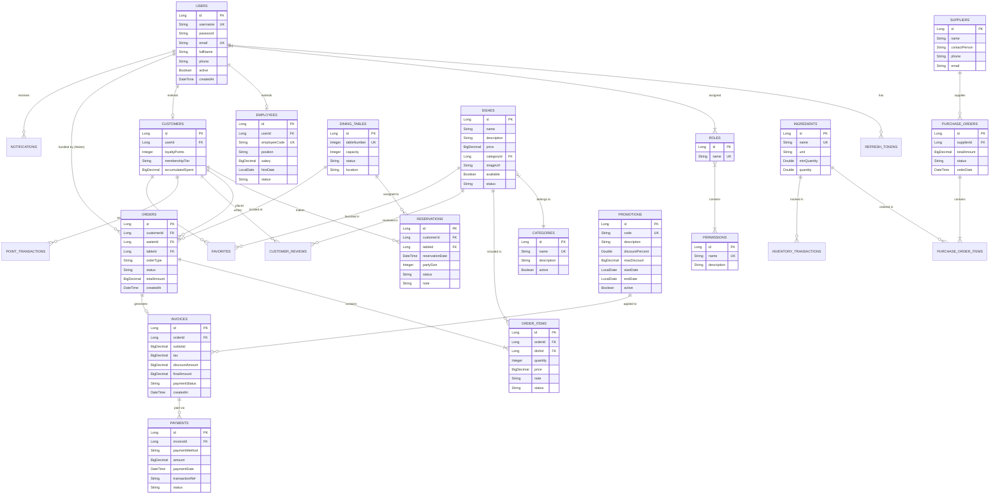

---

### 2.2 Sơ đồ Use Case

#### 2.2.1 Bảng mô tả chi tiết các Tác nhân và Nhóm Use Case

| Tác nhân (Actor) | Diễn giải Vai trò | Danh sách Use Cases phụ trách | Phạm vi thao tác chính |
| :--- | :--- | :--- | :--- |
| **Khách Vãng Lai (`GUEST`)** | Người dùng truy cập chưa đăng nhập | Xem thực đơn, tìm kiếm món ăn, đăng ký/đăng nhập | Trang công khai Public Pages |
| **Khách Hàng (`CUSTOMER`)** | Khách hàng thành viên nhà hàng | Đặt bàn online, chọn món giỏ hàng, viết đánh giá, xem điểm tích lũy | Phân hệ Customer Portal |
| **Nhân viên Phục vụ (`WAITER`)** | Nhân viên phục vụ tại bàn ăn | Xem sơ đồ bàn, tạo đơn tại bàn, chuyển bếp, nhận thông báo món ready | Phân hệ Waiter POS Module |
| **Đầu bếp / KDS (`CHEF`)** | Nhân viên bếp chế biến món ăn | Xem màn hình hàng đợi KDS, đổi trạng thái nấu/xong, báo hết món | Phân hệ Chef KDS Module |
| **Thu ngân POS (`CASHIER`)** | Nhân viên quầy thanh toán | Xử lý thanh toán POS, áp mã giảm giá, quét QR VNPay/Thẻ, in hóa đơn | Phân hệ Cashier POS Module |
| **Quản lý (`MANAGER`)** | Quản lý kinh doanh nhà hàng | Quản lý thực đơn, tồn kho nguyên liệu, nhà cung cấp, nhân sự, xem báo cáo | Phân hệ Manager Dashboard |
| **Quản trị viên (`ADMIN`)** | Quản trị viên hệ thống | Quản lý toàn bộ tài khoản user, phân vai trò Role & quyền Permission RBAC | Phân hệ Admin Dashboard |

#### 2.2.2 Sơ đồ Use Case đồ họa (Use Case Diagram)

```mermaid
graph TD
    subgraph System Boundary: Restaurant Management System
        %% Auth
        UC_Auth[Đăng nhập / Đăng ký / JWT]
        UC_Profile[Quản lý thông tin cá nhân]
        
        %% Customer
        UC_CustMenu[Xem Thực đơn & Tìm kiếm Món]
        UC_CustReserve[Đặt bàn Trực tuyến]
        UC_CustOrder[Đặt món Giỏ hàng & Gọi món]
        UC_CustReview[Đánh giá Món ăn & Phản hồi]
        UC_CustLoyalty[Tích điểm & Hạng thành viên]
        
        %% Waiter
        UC_WaitTable[Quản lý Trạng thái Bàn ăn]
        UC_WaitOrder[Tạo & Thêm món tại bàn]
        UC_WaitNotify[Nhận Thông báo Món sẵn sàng]
        
        %% Chef
        UC_ChefKDS[Xem Hàng đợi Chế biến KDS]
        UC_ChefStatus[Cập nhật Trạng thái Chế biến món]
        UC_ChefStock[Báo Hết món / Nguyên liệu]
        
        %% Cashier
        UC_CashierBill[Tính tiền & Tạo Hóa đơn]
        UC_CashierPromo[Áp dụng Mã Giảm giá / Khuyến mãi]
        UC_CashierPay[Thực hiện Thanh toán POS]
        
        %% Manager
        UC_MgrMenu[Quản lý Danh mục & Thực đơn Dish]
        UC_MgrInv[Quản lý Tồn kho & Nhà cung cấp]
        UC_MgrEmp[Quản lý Nhân sự & Lương]
        UC_MgrReport[Báo cáo Doanh thu & Thống kê]
        
        %% Admin
        UC_AdminUser[Quản lý Người dùng System]
        UC_AdminRBAC[Quản lý Vai trò Role & Quyền Permission]
    end

    Actor_Guest((Khách Vãng Lai))
    Actor_Cust((Khách Hàng))
    Actor_Wait((Nhân Viên Phục Vụ))
    Actor_Chef((Đầu Bếp / KDS))
    Actor_Cashier((Thu Ngân POS))
    Actor_Mgr((Quản Lý Nhà Hàng))
    Actor_Admin((Quản Trị Viên Admin))

    Actor_Guest --> UC_Auth
    Actor_Guest --> UC_CustMenu
    
    Actor_Cust --> UC_Auth
    Actor_Cust --> UC_Profile
    Actor_Cust --> UC_CustMenu
    Actor_Cust --> UC_CustReserve
    Actor_Cust --> UC_CustOrder
    Actor_Cust --> UC_CustReview
    Actor_Cust --> UC_CustLoyalty

    Actor_Wait --> UC_Auth
    Actor_Wait --> UC_WaitTable
    Actor_Wait --> UC_WaitOrder
    Actor_Wait --> UC_WaitNotify

    Actor_Chef --> UC_Auth
    Actor_Chef --> UC_ChefKDS
    Actor_Chef --> UC_ChefStatus
    Actor_Chef --> UC_ChefStock

    Actor_Cashier --> UC_Auth
    Actor_Cashier --> UC_CashierBill
    Actor_Cashier --> UC_CashierPromo
    Actor_Cashier --> UC_CashierPay

    Actor_Mgr --> UC_Auth
    Actor_Mgr --> UC_MgrMenu
    Actor_Mgr --> UC_MgrInv
    Actor_Mgr --> UC_MgrEmp
    Actor_Mgr --> UC_MgrReport

    Actor_Admin --> UC_Auth
    Actor_Admin --> UC_AdminUser
    Actor_Admin --> UC_AdminRBAC
```

---

### 2.3 Sơ đồ luồng

#### 2.3.1 Bảng mô tả chi tiết các bước trong Luồng luân chuyển nghiệp vụ cốt lõi

| Bước | Tên bước nghiệp vụ | Tác nhân thực hiện | Chi tiết hành vi & Đầu ra |
| :---: | :--- | :--- | :--- |
| **1** | Tiếp nhận & Chọn bàn | Khách hàng / Phục vụ | Đặt bàn trước hoặc chọn bàn ăn trống khả dụng (`AVAILABLE`) |
| **2** | Ghi nhận Đơn gọi món | Khách hàng / Phục vụ | Tạo `Order` và các `OrderItem` ở trạng thái `PENDING` |
| **3** | Chế biến tại Bếp | Đầu bếp (Chef KDS) | Màn hình KDS tiếp nhận đơn, đổi trạng thái sang `IN_PREPARATION` |
| **4** | Hoàn thành & Phục vụ | Đầu bếp & Phục vụ | Bếp nấu xong (`READY`), phát notification cho Phục vụ mang ra bàn (`SERVED`) |
| **5** | Thanh toán & Thu tiền | Thu ngân (Cashier POS) | Kiểm tra hóa đơn, áp mã giảm giá, thu tiền (`PAID`), giải phóng bàn về `AVAILABLE` |

#### 2.3.2 Sơ đồ luồng luân chuyển nghiệp vụ (Operational Flowchart)

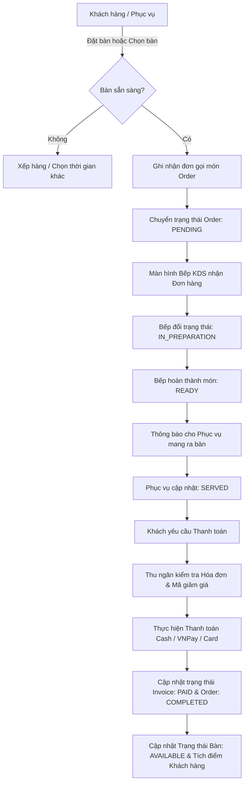

---

### 2.4. Sơ đồ chuyển trạng thái

#### 2.4.1. Sơ đồ chuyển trạng thái Đơn hàng (Order State Diagram)

##### Bảng mô tả chi tiết các Trạng thái Đơn hàng (Order Statuses)
| Trạng thái | Diễn giải nghiệp vụ | Điều kiện chuyển trạng thái |
| :--- | :--- | :--- |
| `PENDING` | Đơn hàng mới khởi tạo | Ngay khi Khách/Phục vụ tạo đơn thành công |
| `CONFIRMED` | Đơn hàng được xác nhận | Phục vụ/Hệ thống duyệt đơn chuyển xuống Bếp |
| `IN_PREPARATION` | Bếp đang chế biến | Đầu bếp nhấn "Bắt đầu nấu" trên KDS |
| `READY` | Món ăn đã nấu xong | Đầu bếp nhấn "Hoàn thành" trên KDS |
| `SERVED` | Món ăn đã mang ra bàn | Phục vụ mang món ra bàn cho khách |
| `COMPLETED` | Đơn hàng hoàn tất | Thu ngân thu tiền thành công và xuất hóa đơn |
| `CANCELLED` | Đơn hàng bị hủy | Hủy bởi Khách/Phục vụ trước khi Bếp nấu |

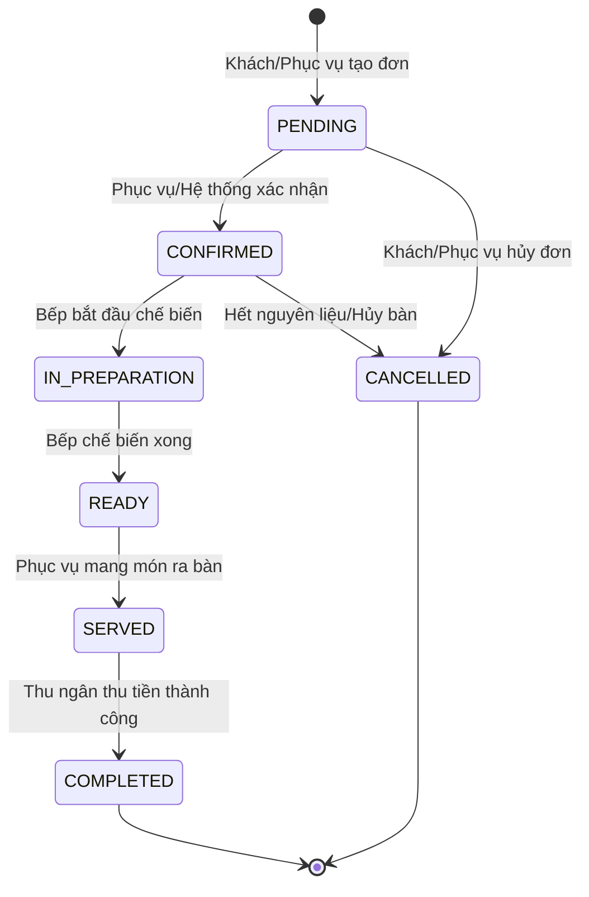

#### 2.4.2. Sơ đồ chuyển trạng thái Bàn ăn (Dining Table State Diagram)

##### Bảng mô tả chi tiết các Trạng thái Bàn ăn (Table Statuses)
| Trạng thái | Diễn giải trạng thái bàn ăn | Điều kiện kích hoạt |
| :--- | :--- | :--- |
| `AVAILABLE` | Bàn trống sẵn sàng phục vụ | Bàn mới dọn xong hoặc khởi tạo |
| `RESERVED` | Bàn đã có khách đặt trước | Có phiếu đặt bàn `CONFIRMED` trong khung giờ |
| `OCCUPIED` | Khách đang ngồi tại bàn | Khách vào nhận bàn và phát sinh đơn hàng |
| `DIRTY` | Bàn ăn cần dọn dẹp | Khách ăn xong thanh toán đứng dậy |
| `CLEANING` | Phục vụ đang vệ sinh bàn | Phục vụ tiến hành dọn bàn |

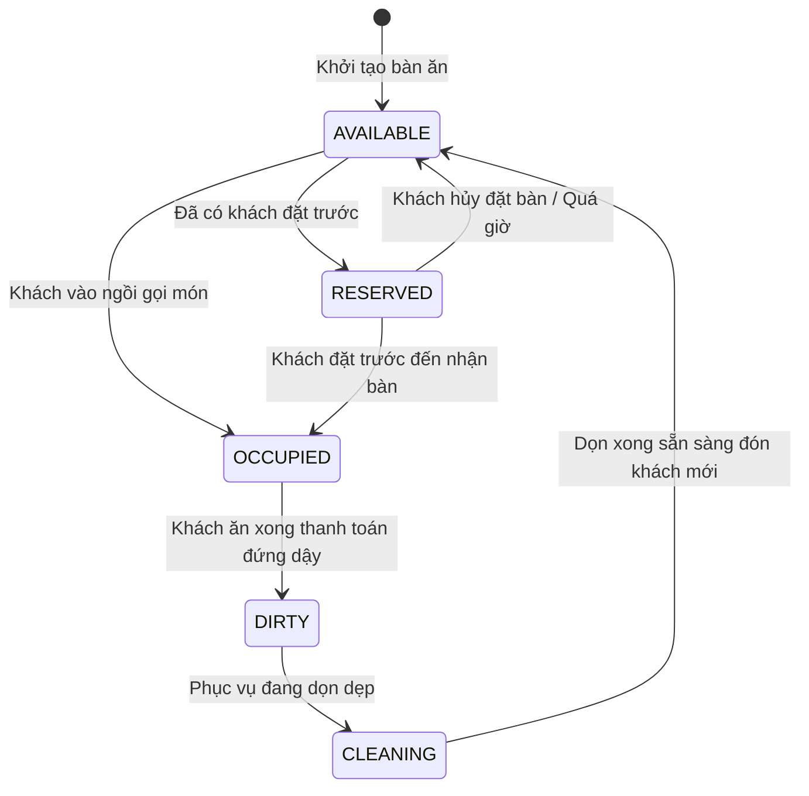

#### 2.4.3. Sơ đồ chuyển trạng thái Đặt bàn (Reservation State Diagram)

##### Bảng mô tả chi tiết các Trạng thái Đặt bàn (Reservation Statuses)
| Trạng thái | Diễn giải phiếu đặt bàn | Điều kiện kích hoạt |
| :--- | :--- | :--- |
| `PENDING` | Khách đăng ký đặt bàn chờ duyệt | Ngay sau khi Khách bấm Đặt bàn online |
| `CONFIRMED` | Đã xác nhận đặt giữ bàn | Lễ tân/Quản lý duyệt phiếu đặt bàn |
| `ARRIVED` | Khách đã đến nhận bàn | Khách đến đúng hẹn và vào bàn ăn |
| `CANCELLED` | Phiếu đặt bàn bị hủy | Khách hoặc Nhà hàng hủy phiếu |
| `EXPIRED` | Phiếu đặt bàn hết hạn | Khách không đến quá 30 phút so với giờ hẹn |

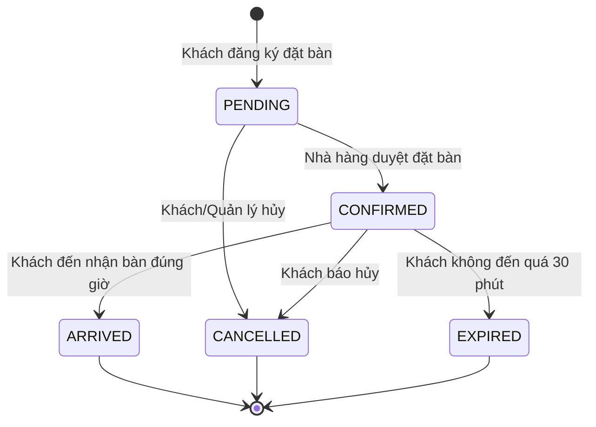

---

### 2.5. Phân quyền

#### 2.5.1. Phân quyền chức năng (Role-Based Access Control Matrix)

| Phân hệ / Chức năng | Khách hàng (`CUSTOMER`) | Phục vụ (`WAITER`) | Đầu bếp (`CHEF`) | Thu ngân (`CASHIER`) | Quản lý (`MANAGER`) | Quản trị (`ADMIN`) |
| :--- | :---: | :---: | :---: | :---: | :---: | :---: |
| **Đăng ký / Đăng nhập / Profile** | **R/W** | **R/W** | **R/W** | **R/W** | **R/W** | **R/W** |
| **Xem Thực đơn & Giá món** | **R** | **R** | **R** | **R** | **R** | **R** |
| **Đặt bàn Trực tuyến** | **R/W** | **R/W** | - | - | **R/W/D** | **R/W/D** |
| **Tạo Đơn món & Gọi món tại bàn** | **R/W** | **R/W** | - | - | **R/W** | **R/W** |
| **Điều hành Màn hình Bếp (KDS)** | - | **R** (Nhận thông báo) | **R/W** | - | **R** | **R** |
| **Xử lý Thanh toán POS & In hóa đơn** | - | - | - | **R/W** | **R/W** | **R/W** |
| **Quản lý Danh mục & Thực đơn** | - | - | - | - | **R/W/D** | **R/W/D** |
| **Quản lý Tồn kho & Nhà cung cấp** | - | - | **R** (Báo hết) | - | **R/W/D** | **R/W/D** |
| **Quản lý Nhân sự & Bảng lương** | - | - | - | - | **R/W/D** | **R/W/D** |
| **Báo cáo Doanh thu & Thống kê** | - | - | - | **R** (Ca trực) | **R/W** | **R/W** |
| **Quản lý User, Role & Permission** | - | - | - | - | - | **FULL** |

*(Ghi chú: **R**: Read - Xem, **W**: Write - Tạo/Sửa, **D**: Delete - Xóa, **FULL**: Toàn quyền cấu hình).*

#### 2.5.2. Phân quyền dữ liệu
1. **Khách hàng (`ROLE_CUSTOMER`)**: Chỉ truy cập được dữ liệu hồ sơ cá nhân, lịch sử đặt bàn, lịch sử hóa đơn và đơn hàng do chính mình tạo ra.
2. **Nhân viên Phục vụ (`ROLE_WAITER`)**: Được xem và thao tác trên danh sách bàn ăn, các đơn hàng đang phục vụ trong ca trực.
3. **Đầu bếp (`ROLE_CHEF`)**: Được tiếp cận các thông tin món ăn trong hàng đợi chế biến (`ORDER_ITEMS`) và số lượng tồn kho nguyên liệu liên quan.
4. **Thu ngân (`ROLE_CASHIER`)**: Được xem các đơn hàng cần thanh toán, dữ liệu khuyến mãi áp dụng và lịch sử hóa đơn trong ca.
5. **Quản lý (`ROLE_MANAGER`)**: Quyền truy cập toàn bộ dữ liệu nghiệp vụ kinh doanh của nhà hàng (Doanh thu, nhân sự, tồn kho, thực đơn).
6. **Quản trị viên (`ROLE_ADMIN`)**: Quyền truy cập và thao tác trên mọi dữ liệu hệ thống, bao gồm bảng cấu hình người dùng, nhật ký và hệ thống phân quyền.

---

### 2.6. Site Map (Sơ đồ cấu trúc trang UI)

#### 2.6.1 Bảng mô tả chi tiết các Phân hệ Màn hình trên Site Map

| Phân hệ Màn hình UI | Tác nhân truy cập | Các Trang chính (Pages) | Chức năng nghiệp vụ chính |
| :--- | :--- | :--- | :--- |
| **Auth Module** | Tất cả người dùng | `Login`, `Register`, `ForgotPassword` | Xác thực JWT, đăng ký tài khoản, khôi phục mật khẩu |
| **Customer Portal** | Khách hàng (`CUSTOMER`) | `CustomerHome`, `CustomerMenuPage`, `CustomerReservationPage`, `CustomerCheckoutPage`, `CustomerOrderHistoryPage` | Tra cứu menu, đặt bàn online, gọi món, thanh toán, xem lịch sử đơn |
| **Waiter Module** | Phục vụ (`WAITER`) | `WaiterDashboard`, `WaiterTableManagement`, `WaiterOrderManagement`, `WaiterReservationPage` | Theo dõi sơ đồ bàn realtime, order món tại bàn, nhận thông báo món ready |
| **Chef Module** | Đầu bếp (`CHEF`) | `ChefDashboard`, `ChefCookingQueuePage`, `ChefOrdersPage`, `ChefCompletedOrdersPage` | Màn hình KDS chế biến, cập nhật trạng thái món, báo hết thực phẩm |
| **Cashier Module** | Thu ngân (`CASHIER`) | `CashierDashboard`, `CashierOrdersPage`, `CashierPaymentsPage`, `CashierInvoicesPage` | Thu tiền POS, quét VNPay/Thẻ, áp mã giảm giá, in hóa đơn bán hàng |
| **Manager Module** | Quản lý (`MANAGER`) | `ManagerDashboard`, `ManagerAnalyticsPage`, `ManagerInventoryPage`, `ManagerSuppliersPage`, `ManagerEmployeesPage` | Thống kê báo cáo doanh thu, quản lý kho nguyên liệu, nhà cung cấp, nhân sự |
| **Admin Module** | Quản trị (`ADMIN`) | `AdminDashboard` | Quản lý toàn bộ tài khoản user, phân vai trò Role & quyền Permission |

#### 2.6.2 Sơ đồ Cấu trúc Trang đồ họa (Site Map Diagram)

```mermaid
graph TD
    App[Trang chủ / Home Web App]
    
    App --> Auth[Xác thực & Tài khoản]
    Auth --> Login[Trang Đăng nhập]
    Auth --> Register[Trang Đăng ký]
    Auth --> ForgotPass[Quên Mật khẩu]
    
    App --> PublicPages[Trang Công khai Khách hàng]
    PublicPages --> CustomerHome[Trang Chủ Khách Hàng]
    PublicPages --> CustomerMenuPage[Trang Thực đơn & Đặt món]
    PublicPages --> CustomerReservationPage[Trang Đặt bàn Online]
    PublicPages --> CustomerReviewsPage[Trang Đánh giá & Phản hồi]
    
    App --> CustPortal[Cổng Khách hàng Cá nhân]
    CustPortal --> CustomerProfilePage[Trang Hồ sơ Khách hàng]
    CustPortal --> CustomerCheckoutPage[Trang Giỏ hàng & Thanh toán]
    CustPortal --> CustomerOrderHistoryPage[Trang Lịch sử Đơn hàng]
    CustPortal --> CustomerFavoritesPage[Trang Món ăn Yêu thích]
    
    App --> StaffPortal[Cổng Nhân viên Operations]
    
    StaffPortal --> WaiterModule[Phân hệ Phục vụ Waiter]
    WaiterModule --> WaiterDashboard[Dashboard Phục vụ]
    WaiterModule --> WaiterTableManagement[Quản lý Bàn ăn]
    WaiterModule --> WaiterOrderManagement[Gọi món & Tạo đơn tại bàn]
    WaiterModule --> WaiterReservationPage[Tiếp nhận Khách đặt bàn]
    WaiterModule --> WaiterNotificationPage[Thông báo Món sẵn sàng]
    
    StaffPortal --> ChefModule[Phân hệ Bếp KDS]
    ChefModule --> ChefDashboard[Dashboard Bếp]
    ChefModule --> ChefCookingQueuePage[Màn hình Hàng đợi Chế biến]
    ChefModule --> ChefOrdersPage[Danh sách Đơn món theo Bàn]
    ChefModule --> ChefCompletedOrdersPage[Lịch sử Món hoàn thành]
    
    StaffPortal --> CashierModule[Phân hệ Thu ngân POS]
    CashierModule --> CashierDashboard[Dashboard Thu ngân]
    CashierModule --> CashierOrdersPage[Danh sách Đơn chờ Thanh toán]
    CashierModule --> CashierPaymentsPage[Giao diện POS Thanh toán & In HD]
    CashierModule --> CashierInvoicesPage[Quản lý Hóa đơn]
    CashierModule --> CashierPromotionsPage[Khuyến mãi & Mã Giảm giá]
    
    StaffPortal --> ManagerModule[Phân hệ Quản lý Manager]
    ManagerModule --> ManagerDashboard[Dashboard Quản lý Tổng quan]
    ManagerModule --> ManagerAnalyticsPage[Phân tích Doanh thu & Thống kê]
    ManagerModule --> ManagerEmployeesPage[Quản lý Nhân sự & Bảng lương]
    ManagerModule --> ManagerInventoryPage[Quản lý Tồn kho Nguyên liệu]
    ManagerModule --> ManagerSuppliersPage[Quản lý Nhà cung cấp]
    ManagerModule --> ManagerPromotionsPage[Thiết lập Chương trình Khuyến mãi]
    
    StaffPortal --> AdminModule[Phân hệ Quản trị Admin]
    AdminModule --> AdminDashboard[Dashboard Quản trị Hệ thống & RBAC]
```

---

## PHẦN 3: CHI TIẾT ĐẶC TẢ & SƠ ĐỒ TUẦN TỰ TẤT CẢ USE CASES

### 3.0 DANH SÁCH TOÀN BỘ USE CASES HỆ THỐNG

| Mã CN | Tên chức năng | Phân hệ | Tác nhân (Actor) | Trạng thái Sơ đồ |
| :---: | :--- | :--- | :--- | :---: |
| **UC_AUTH_01** | Đăng ký & Đăng nhập hệ thống JWT | Auth | Tất cả người dùng | ✅ Có Sơ đồ Tuần tự |
| **UC_AUTH_02** | Quản lý Hồ sơ cá nhân & Đổi mật khẩu | Auth | Tất cả người dùng | ✅ Có Sơ đồ Tuần tự |
| **UC_CUST_01** | Xem thực đơn, tìm kiếm & lọc món | Customer Portal | Khách hàng / Khách vãng lai | ✅ Có Sơ đồ Tuần tự |
| **UC_CUST_02** | Đặt bàn ăn trực tuyến | Customer Portal | Khách hàng | ✅ Có Sơ đồ Tuần tự |
| **UC_CUST_03** | Đặt món Giỏ hàng & Gọi món trực tuyến | Customer Portal | Khách hàng | ✅ Có Sơ đồ Tuần tự |
| **UC_CUST_04** | Viết đánh giá & Phản hồi món ăn | Customer Portal | Khách hàng | ✅ Có Sơ đồ Tuần tự |
| **UC_WAIT_01** | Quản lý sơ đồ bàn & trạng thái bàn ăn | Waiter Module | Nhân viên Phục vụ | ✅ Có Sơ đồ Luồng |
| **UC_WAIT_02** | Tạo đơn hàng & chọn món tại bàn cho khách | Waiter Module | Nhân viên Phục vụ | ✅ Có Sơ đồ Tuần tự |
| **UC_CHEF_01** | Tiếp nhận màn hình hàng đợi chế biến KDS | Chef Module | Đầu bếp | ✅ Có Sơ đồ Tuần tự |
| **UC_CHEF_02** | Cập nhật trạng thái chế biến món ăn | Chef Module | Đầu bếp | ✅ Có Sơ đồ Tuần tự |
| **UC_CASH_01** | Tiếp nhận đơn & Thực hiện thanh toán POS | Cashier Module | Thu ngân | ✅ Có Sơ đồ Tuần tự |
| **UC_CASH_02** | Áp dụng mã giảm giá & Xuất hóa đơn | Cashier Module | Thu ngân | ✅ Có Sơ đồ Tuần tự |
| **UC_MGR_01** | Quản lý danh mục & món ăn Menu Management | Manager Module | Quản lý | ✅ Có Sơ đồ Luồng |
| **UC_MGR_02** | Quản lý kho nguyên vật liệu & Nhà cung cấp | Manager Module | Quản lý | ✅ Có Sơ đồ Tuần tự |
| **UC_MGR_03** | Báo cáo doanh thu & Phân tích kinh doanh | Manager Module | Quản lý | ✅ Có Sơ đồ Tuần tự |
| **UC_ADM_01** | Quản lý người dùng & Phân quyền RBAC | Admin Module | Quản trị viên | ✅ Có Sơ đồ Tuần tự |

---

### 3.1. Đăng ký & Đăng nhập hệ thống JWT (`UC_AUTH_01`)

#### 3.1.1. Đặc tả Use Case
| Thuộc tính | Nội dung chi tiết |
| :--- | :--- |
| **Use Case ID** | **UC_AUTH_01** |
| **Tên Use Case** | Đăng ký & Đăng nhập hệ thống JWT (JWT Register & Authentication) |
| **Mô tả** | Người dùng đăng ký tài khoản mới hoặc đăng nhập bằng Username/Password để nhận Access Token JWT và Refresh Token. |
| **Tác nhân (Actor)** | Tất cả tác nhân (`CUSTOMER`, `WAITER`, `CHEF`, `CASHIER`, `MANAGER`, `ADMIN`) |
| **Mức độ ưu tiên** | High (Cao) |
| **Trigger** | Người dùng bấm "Đăng nhập" hoặc "Đăng ký" tại trang Login/Register. |
| **Luồng cơ bản** | 1. Khách nhập thông tin đăng nhập.<br>2. Backend xác thực credentials với BCrypt.<br>3. Trả về JWT Access Token + Refresh Token.<br>4. Frontend lưu Token vào LocalStorage và chuyển hướng theo Role. |

#### 3.1.2. Bảng mô tả các thành phần tham gia Sơ đồ Tuần tự
| Thành phần (Participant) | Loại thành phần | Vai trò trong sơ đồ |
| :--- | :--- | :--- |
| `User` | Actor | Người dùng nhập thông tin đăng nhập |
| `FE` | Client Interface | Gửi request HTTP API & lưu JWT Token |
| `AuthAPI` | REST Controller | Đón nhận endpoint `/api/auth/login` |
| `AuthSVC` | Business Logic | Kiểm tra mật khẩu mã hóa BCrypt & sinh JWT Token |
| `DB` | Database | Truy vấn bảng `users` & lưu `refresh_tokens` |

#### 3.1.3. Sơ đồ luồng chi tiết (Sequence Diagram)
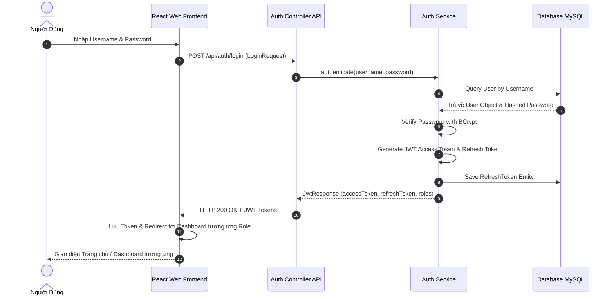

#### 3.1.4. Mô tả chi tiết các trường thông tin
| Tên tiếng Việt | Tên tiếng Anh | Loại dữ liệu | Bắt buộc? | Mô tả & Ràng buộc |
| :--- | :--- | :---: | :---: | :--- |
| Tên đăng nhập | `username` | String | Có | Duy nhất, độ dài 4-50 ký tự |
| Mật khẩu | `password` | String | Có | Độ dài tối thiểu 6 ký tự |
| Token xác thực | `accessToken` | String (JWT) | Có (Hệ thống) | Mã JWT Bearer Token có thời hạn |

#### 3.1.5. Giao diện
> [!NOTE]
> **Hướng dẫn Chụp ảnh Giao diện dành cho Người dùng**:
> - **Tên màn hình**: Màn hình Đăng nhập & Đăng ký (`Login.jsx`, `Register.jsx`).
> - **Vị trí chụp**: Truy cập `/login` hoặc `/register`. Chụp form gồm Username, Password, Nút Đăng nhập và các liên kết chuyển hướng.
> - **Vùng ảnh cần chèn**: [CHÈN HÌNH CỤC BỘ MÀN HÌNH ĐĂNG NHẬP / ĐĂNG KÝ TẠI ĐÂY]

---

### 3.2. Quản lý Hồ sơ cá nhân & Đổi mật khẩu (`UC_AUTH_02`)

#### 3.2.1. Đặc tả Use Case
| Thuộc tính | Nội dung chi tiết |
| :--- | :--- |
| **Use Case ID** | **UC_AUTH_02** |
| **Tên Use Case** | Quản lý Hồ sơ cá nhân & Đổi mật khẩu (UserProfile & Password Change) |
| **Mô tả** | Cho phép người dùng cập nhật Họ tên, Email, Số điện thoại và thay đổi mật khẩu tài khoản. |
| **Tác nhân (Actor)** | Tất cả người dùng đã đăng nhập |
| **Mức độ ưu tiên** | Medium (Trung bình) |

#### 3.2.2. Bảng mô tả các thành phần tham gia Sơ đồ Tuần tự
| Thành phần (Participant) | Loại thành phần | Vai trò trong sơ đồ |
| :--- | :--- | :--- |
| `User` | Actor | Người dùng yêu cầu đổi mật khẩu |
| `FE` | UI | Form thông tin hồ sơ |
| `API` | Controller | Endpoint `/api/users/change-password` |
| `SVC` | Service | Kiểm tra mật khẩu cũ & hash mật khẩu mới |
| `DB` | Database | Cập nhật mật khẩu trong CSDL |

#### 3.2.3. Sơ đồ luồng chi tiết (Sequence Diagram)
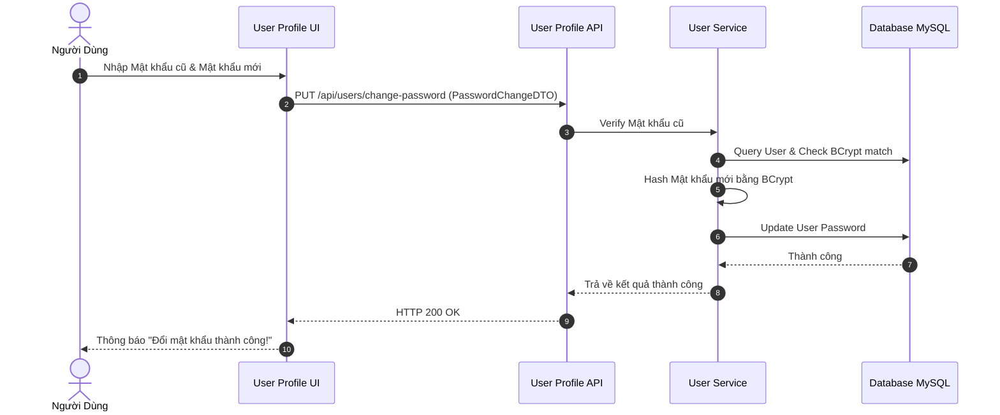

#### 3.2.4. Mô tả chi tiết các trường thông tin
| Tên tiếng Việt | Tên tiếng Anh | Loại dữ liệu | Bắt buộc? | Mô tả & Ràng buộc |
| :--- | :--- | :---: | :---: | :--- |
| Họ và tên | `fullName` | String | Có | Tên đầy đủ người dùng |
| Email | `email` | String | Có | Định dạng email hợp lệ |
| Số điện thoại | `phone` | String | Không | 10 chữ số |

#### 3.2.5. Giao diện
> [!NOTE]
> - **Tên màn hình**: Màn hình Hồ sơ cá nhân (`CustomerProfilePage.jsx`, `WaiterProfilePage.jsx`...).
> - **Vùng ảnh cần chèn**: [CHÈN HÌNH CỤC BỘ MÀN HÌNH PROFILE TẠI ĐÂY]

---

### 3.3. Xem thực đơn, tìm kiếm & lọc món (`UC_CUST_01`)

#### 3.3.1. Đặc tả Use Case
| Thuộc tính | Nội dung chi tiết |
| :--- | :--- |
| **Use Case ID** | **UC_CUST_01** |
| **Tên Use Case** | Xem Thực đơn, Tìm kiếm & Lọc Món ăn (Browse & Search Menu) |
| **Mô tả** | Khách hàng tra cứu thực đơn nhà hàng, tìm kiếm theo tên món, lọc theo danh mục hoặc mức giá. |
| **Tác nhân (Actor)** | Khách hàng, Khách vãng lai |
| **Mức độ ưu tiên** | High (Cao) |

#### 3.3.2. Bảng mô tả các thành phần tham gia Sơ đồ Tuần tự
| Thành phần (Participant) | Loại thành phần | Vai trò trong sơ đồ |
| :--- | :--- | :--- |
| `Cust` | Actor | Khách hàng xem thực đơn |
| `FE` | UI | Trang hiển thị danh sách món ăn |
| `API` | Controller | Endpoint `/api/customer/menu` |
| `SVC` | Service | Thực hiện bộ lọc món ăn theo keyword/danh mục |
| `DB` | Database | Truy vấn danh sách `dishes` khả dụng |

#### 3.3.3. Sơ đồ luồng chi tiết (Sequence Diagram)
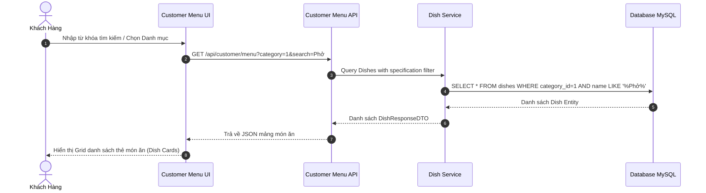

#### 3.3.4. Mô tả chi tiết các trường thông tin
| Tên tiếng Việt | Tên tiếng Anh | Loại dữ liệu | Bắt buộc? | Mô tả & Ràng buộc |
| :--- | :--- | :---: | :---: | :--- |
| Từ khóa | `keyword` | String | Không | Tìm theo tên hoặc mô tả món |
| Mã danh mục | `categoryId` | Long | Không | Lọc theo Khai vị, Món chính, Đồ uống |

#### 3.3.5. Giao diện
> [!NOTE]
> - **Tên màn hình**: Trang Thực đơn Nhà hàng (`CustomerMenuPage.jsx`).
> - **Vùng ảnh cần chèn**: [CHÈN HÌNH CỤC BỘ MÀN HÌNH THỰC ĐƠN TẠI ĐÂY]

---

### 3.4. Đặt bàn ăn trực tuyến (`UC_CUST_02`)

#### 3.4.1. Đặc tả Use Case
| Thuộc tính | Nội dung chi tiết |
| :--- | :--- |
| **Use Case ID** | **UC_CUST_02** |
| **Tên Use Case** | Đặt bàn Trực tuyến (Online Table Reservation) |
| **Mô tả** | Cho phép Khách hàng đăng ký đặt giữ bàn trước theo thời gian, số lượng khách và vị trí mong muốn. |
| **Tác nhân (Actor)** | Khách hàng (`ROLE_CUSTOMER`) |
| **Mức độ ưu tiên** | High (Cao) |

#### 3.4.2. Bảng mô tả các thành phần tham gia Sơ đồ Tuần tự
| Thành phần (Participant) | Loại thành phần | Vai trò trong sơ đồ |
| :--- | :--- | :--- |
| `Cust` | Actor | Khách hàng đăng ký đặt bàn |
| `FE` | UI | Form chọn ngày giờ & vị trí bàn |
| `API` | Controller | Endpoint `/api/customer/reservations` |
| `SVC` | Service | Đặt giữ bàn & kiểm tra bàn trùng |
| `DB` | Database | Lưu bản ghi `reservations` |

#### 3.4.3. Sơ đồ luồng chi tiết (Sequence Diagram)
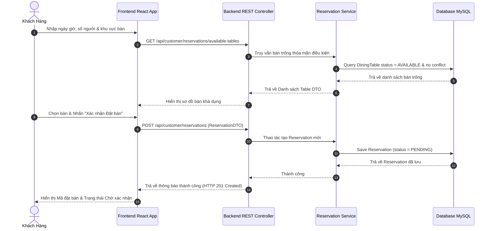

#### 3.4.4. Mô tả chi tiết các trường thông tin
| Tên tiếng Việt | Tên tiếng Anh | Loại dữ liệu | Bắt buộc? | Mô tả & Ràng buộc |
| :--- | :--- | :---: | :---: | :--- |
| Số lượng khách | `partySize` | Integer | Có | Tối thiểu 1 người |
| Ngày giờ đặt bàn | `reservationDate` | LocalDateTime | Có | Phải lớn hơn thời điểm hiện tại |

#### 3.4.5. Giao diện
> [!NOTE]
> - **Tên màn hình**: Giao diện Đặt bàn Trực tuyến của Khách hàng (`CustomerReservationPage.jsx`).
> - **Vùng ảnh cần chèn**: [CHÈN HÌNH CỤC BỘ MÀN HÌNH ĐẶT BÀN TẠI ĐÂY]

---

### 3.5. Đặt món Giỏ hàng & Gọi món trực tuyến (`UC_CUST_03`)

#### 3.5.1. Đặc tả Use Case
| Thuộc tính | Nội dung chi tiết |
| :--- | :--- |
| **Use Case ID** | **UC_CUST_03** |
| **Tên Use Case** | Đặt món Giỏ hàng & Gọi món trực tuyến (Cart & Online Checkout) |
| **Mô tả** | Khách hàng thêm món ăn vào giỏ hàng cá nhân, kiểm tra đơn và thực hiện đặt hàng (Ăn tại chỗ hoặc Mang về). |
| **Tác nhân (Actor)** | Khách hàng (`ROLE_CUSTOMER`) |
| **Mức độ ưu tiên** | High (Cao) |

#### 3.5.2. Bảng mô tả các thành phần tham gia Sơ đồ Tuần tự
| Thành phần (Participant) | Loại thành phần | Vai trò trong sơ đồ |
| :--- | :--- | :--- |
| `Cust` | Actor | Khách hàng thực hiện checkout giỏ hàng |
| `FE` | UI | Màn hình Cart Checkout |
| `API` | Controller | Endpoint `/api/customer/orders` |
| `SVC` | Service | Khởi tạo đơn `Order` và chi tiết món |
| `DB` | Database | Lưu `orders` và `order_items` |

#### 3.5.3. Sơ đồ luồng chi tiết (Sequence Diagram)
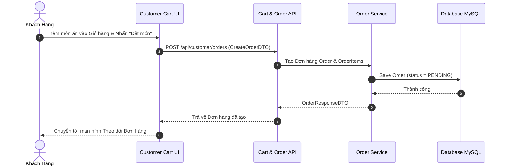

#### 3.5.4. Mô tả chi tiết các trường thông tin
| Tên tiếng Việt | Tên tiếng Anh | Loại dữ liệu | Bắt buộc? | Mô tả & Ràng buộc |
| :--- | :--- | :---: | :---: | :--- |
| Loại đơn hàng | `orderType` | Enum | Có | `DINE_IN` (Tại bàn) hoặc `TAKE_AWAY` (Mang về) |
| Danh sách món | `items` | List<OrderItem> | Có | Ít nhất 1 món ăn trong giỏ |

#### 3.5.5. Giao diện
> [!NOTE]
> - **Tên màn hình**: Màn hình Checkout Giỏ hàng (`CustomerCheckoutPage.jsx`).
> - **Vùng ảnh cần chèn**: [CHÈN HÌNH CỤC BỘ MÀN HÌNH GIỎ HÀNG TẠI ĐÂY]

---

### 3.6. Viết đánh giá & Phản hồi món ăn (`UC_CUST_04`)

#### 3.6.1. Đặc tả Use Case
| Thuộc tính | Nội dung chi tiết |
| :--- | :--- |
| **Use Case ID** | **UC_CUST_04** |
| **Tên Use Case** | Viết đánh giá & Phản hồi món ăn (Dish Review & Rating) |
| **Mô tả** | Cho phép Khách hàng sau khi hoàn tất đơn hàng gửi đánh giá số sao (1-5 sao) và nhận xét chất lượng món ăn. |
| **Tác nhân (Actor)** | Khách hàng (`ROLE_CUSTOMER`) |
| **Mức độ ưu tiên** | Low (Thấp) |

#### 3.6.2. Bảng mô tả các thành phần tham gia Sơ đồ Tuần tự
| Thành phần (Participant) | Loại thành phần | Vai trò trong sơ đồ |
| :--- | :--- | :--- |
| `Cust` | Actor | Khách hàng viết đánh giá |
| `FE` | UI | Trang đánh giá sản phẩm |
| `API` | Controller | Endpoint `/api/customer/reviews` |
| `SVC` | Service | Kiểm tra điều kiện & lưu đánh giá |
| `DB` | Database | Lưu bản ghi `customer_reviews` |

#### 3.6.3. Sơ đồ luồng chi tiết (Sequence Diagram)
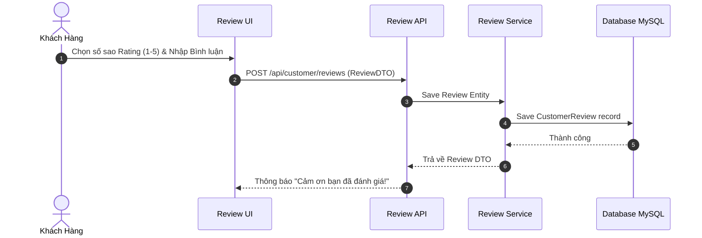

#### 3.6.4. Mô tả chi tiết các trường thông tin
| Tên tiếng Việt | Tên tiếng Anh | Loại dữ liệu | Bắt buộc? | Mô tả & Ràng buộc |
| :--- | :--- | :---: | :---: | :--- |
| Số sao đánh giá | `rating` | Integer | Có | Giá trị từ 1 đến 5 |
| Nội dung nhận xét | `comment` | String | Không | Tối đa 500 ký tự |

#### 3.6.5. Giao diện
> [!NOTE]
> - **Tên màn hình**: Trang Đánh giá Món ăn (`CustomerReviewsPage.jsx`).
> - **Vùng ảnh cần chèn**: [CHÈN HÌNH CỤC BỘ MÀN HÌNH ĐÁNH GIÁ TẠI ĐÂY]

---

### 3.7. Quản lý sơ đồ bàn & trạng thái bàn ăn (`UC_WAIT_01`)

#### 3.7.1. Đặc tả Use Case
| Thuộc tính | Nội dung chi tiết |
| :--- | :--- |
| **Use Case ID** | **UC_WAIT_01** |
| **Tên Use Case** | Quản lý Sơ đồ Bàn & Trạng thái Bàn ăn (Table Layout & Status Mgmt) |
| **Mô tả** | Nhân viên Phục vụ theo dõi sơ đồ bàn theo thời gian thực, đổi trạng thái bàn (`AVAILABLE`, `OCCUPIED`, `CLEANING`). |
| **Tác nhân (Actor)** | Nhân viên Phục vụ (`ROLE_WAITER`) |
| **Mức độ ưu tiên** | High (Cao) |

#### 3.7.2. Bảng mô tả các thành phần tham gia Sơ đồ Luồng
| Thành phần (Component) | Vai trò trong luồng |
| :--- | :--- |
| `ViewTables` | Màn hình hiển thị danh sách các bàn ăn |
| `SelectTable` | Thao tác chọn bàn của nhân viên phục vụ |
| `ChangeStatus` | Đổi trạng thái bàn ăn (`CLEANING`, `AVAILABLE`...) |
| `UpdateDB` | Ghi nhận trạng thái bàn mới vào CSDL |

#### 3.7.3. Sơ đồ luồng chi tiết (Activity Flowchart)
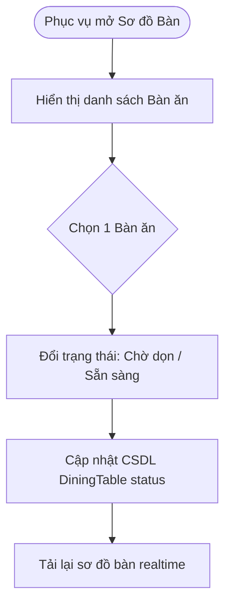

#### 3.7.4. Mô tả chi tiết các trường thông tin
| Tên tiếng Việt | Tên tiếng Anh | Loại dữ liệu | Bắt buộc? | Mô tả & Ràng buộc |
| :--- | :--- | :---: | :---: | :--- |
| Số bàn | `tableNumber` | Integer | Có | Số hiệu bàn ăn |
| Trạng thái bàn | `status` | Enum | Có | `AVAILABLE`, `RESERVED`, `OCCUPIED`, `DIRTY`, `CLEANING` |

#### 3.7.5. Giao diện
> [!NOTE]
> - **Tên màn hình**: Màn hình Quản lý Bàn ăn Phục vụ (`WaiterTableManagement.jsx`).
> - **Vùng ảnh cần chèn**: [CHÈN HÌNH CỤC BỘ MÀN HÌNH SƠ ĐỒ BÀN TẠI ĐÂY]

---

### 3.8. Tạo đơn hàng & chọn món tại bàn cho khách (`UC_WAIT_02`)

#### 3.8.1. Đặc tả Use Case
| Thuộc tính | Nội dung chi tiết |
| :--- | :--- |
| **Use Case ID** | **UC_WAIT_02** |
| **Tên Use Case** | Tạo đơn hàng & Gọi món tại bàn (In-Table Order Management) |
| **Mô tả** | Cho phép Nhân viên phục vụ chọn bàn ăn, xem thực đơn và thêm món ăn vào đơn hàng trực tiếp tại bàn cho khách. |
| **Tác nhân (Actor)** | Nhân viên Phục vụ (`ROLE_WAITER`) |
| **Mức độ ưu tiên** | High (Cao) |

#### 3.8.2. Bảng mô tả các thành phần tham gia Sơ đồ Tuần tự
| Thành phần (Participant) | Loại thành phần | Vai trò trong sơ đồ |
| :--- | :--- | :--- |
| `Waiter` | Actor | Nhân viên Phục vụ gọi món cho khách |
| `FE` | UI | Màn hình Order của Phục vụ |
| `API` | Controller | Endpoint `/api/waiter/orders` |
| `SVC` | Service | Tạo đơn hàng & đẩy tín hiệu Bếp |
| `KDS` | UI Bếp | Màn hình Bếp KDS nhận tín hiệu món mới |

#### 3.8.3. Sơ đồ luồng chi tiết (Sequence Diagram)
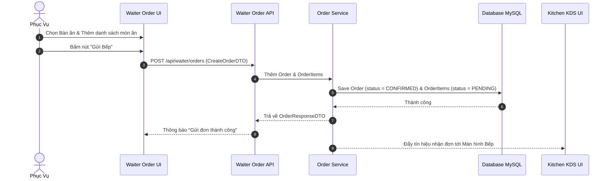

#### 3.8.4. Mô tả chi tiết các trường thông tin
| Tên tiếng Việt | Tên tiếng Anh | Loại dữ liệu | Bắt buộc? | Mô tả & Ràng buộc |
| :--- | :--- | :---: | :---: | :--- |
| Mã bàn | `tableId` | Long | Có | ID Bàn ăn phát sinh đơn |
| Mã món ăn | `dishId` | Long | Có | Món được chọn |

#### 3.8.5. Giao diện
> [!NOTE]
> - **Tên màn hình**: Màn hình Gọi món tại bàn (`WaiterOrderManagement.jsx`).
> - **Vùng ảnh cần chèn**: [CHÈN HÌNH CỤC BỘ MÀN HÌNH PHỤC VỤ GỌI MÓN TẠI ĐÂY]

---

### 3.9. Tiếp nhận màn hình hàng đợi chế biến KDS (`UC_CHEF_01`)

#### 3.9.1. Đặc tả Use Case
| Thuộc tính | Nội dung chi tiết |
| :--- | :--- |
| **Use Case ID** | **UC_CHEF_01** |
| **Tên Use Case** | Tiếp nhận Màn hình Hàng đợi Chế biến KDS (KDS Queue Monitoring) |
| **Mô tả** | Màn hình Bếp hiển thị danh sách các món ăn cần chế biến được gửi xuống từ Phục vụ theo thứ tự ưu tiên thời gian. |
| **Tác nhân (Actor)** | Đầu bếp / Bếp trưởng (`ROLE_CHEF`) |
| **Mức độ ưu tiên** | High (Cao) |

#### 3.9.2. Bảng mô tả các thành phần tham gia Sơ đồ Tuần tự
| Thành phần (Participant) | Loại thành phần | Vai trò trong sơ đồ |
| :--- | :--- | :--- |
| `Chef` | Actor | Đầu bếp xem hàng đợi KDS |
| `KDS` | UI | Màn hình hiển thị hàng đợi món |
| `API` | Controller | Endpoint `/api/chef/queue` |
| `SVC` | Service | Truy vấn danh sách món chờ làm |
| `DB` | Database | Bảng `order_items` status `PENDING` |

#### 3.9.3. Sơ đồ luồng chi tiết (Sequence Diagram)
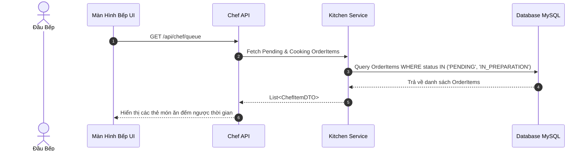

#### 3.9.4. Mô tả chi tiết các trường thông tin
| Tên tiếng Việt | Tên tiếng Anh | Loại dữ liệu | Bắt buộc? | Mô tả & Ràng buộc |
| :--- | :--- | :---: | :---: | :--- |
| Tên món | `dishName` | String | Có | Tên món chế biến |
| Thời gian chờ | `waitTime` | Long | Có | Số phút từ khi phát sinh món |

#### 3.9.5. Giao diện
> [!NOTE]
> - **Tên màn hình**: Màn hình Hàng đợi Bếp (`ChefCookingQueuePage.jsx`).
> - **Vùng ảnh cần chèn**: [CHÈN HÌNH CỤC BỘ MÀN HÌNH KDS QUEUE TẠI ĐÂY]

---

### 3.10. Cập nhật trạng thái chế biến món ăn (`UC_CHEF_02`)

#### 3.10.1. Đặc tả Use Case
| Thuộc tính | Nội dung chi tiết |
| :--- | :--- |
| **Use Case ID** | **UC_CHEF_02** |
| **Tên Use Case** | Cập nhật Trạng thái Chế biến Món ăn tại Bếp (Kitchen Order Processing) |
| **Mô tả** | Cho phép Đầu bếp xem hàng đợi các món cần làm, nhận đơn chế biến và đánh dấu hoàn thành từng món. |
| **Tác nhân (Actor)** | Đầu bếp / Bếp trưởng (`ROLE_CHEF`) |
| **Mức độ ưu tiên** | High (Cao) |

#### 3.10.2. Bảng mô tả các thành phần tham gia Sơ đồ Tuần tự
| Thành phần (Participant) | Loại thành phần | Vai trò trong sơ đồ |
| :--- | :--- | :--- |
| `Chef` | Actor | Đầu bếp đổi trạng thái món |
| `KDS` | UI | Thẻ món ăn trên KDS |
| `API` | Controller | Endpoint `/api/chef/items/{id}/status` |
| `SVC` | Service | Cập nhật trạng thái món & tạo Notification |
| `Waiter` | UI Phục vụ | Nhận thông báo món sẵn sàng mang ra bàn |

#### 3.10.3. Sơ đồ luồng chi tiết (Sequence Diagram)
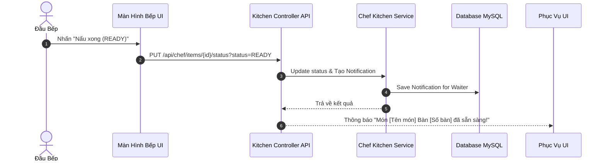

#### 3.10.4. Mô tả chi tiết các trường thông tin
| Tên tiếng Việt | Tên tiếng Anh | Loại dữ liệu | Bắt buộc? | Mô tả & Ràng buộc |
| :--- | :--- | :---: | :---: | :--- |
| Trạng thái mới | `status` | Enum | Có | `IN_PREPARATION`, `READY` |

#### 3.10.5. Giao diện
> [!NOTE]
> - **Tên màn hình**: Màn hình Trạng thái Bếp KDS (`ChefCookingQueuePage.jsx`).
> - **Vùng ảnh cần chèn**: [CHÈN HÌNH CỤC BỘ MÀN HÌNH BẾP TRẠNG THÁI TẠI ĐÂY]

---

### 3.11. Tiếp nhận đơn & Thực hiện thanh toán POS (`UC_CASH_01`)

#### 3.11.1. Đặc tả Use Case
| Thuộc tính | Nội dung chi tiết |
| :--- | :--- |
| **Use Case ID** | **UC_CASH_01** |
| **Tên Use Case** | Thanh toán Đơn hàng & Xuất hóa đơn POS (Cashier POS Checkout) |
| **Mô tả** | Cho phép Thu ngân tiếp nhận yêu cầu thanh toán bàn ăn, áp dụng khuyến mãi/giảm giá, chọn phương thức thanh toán và xuất hóa đơn chính thức. |
| **Tác nhân (Actor)** | Thu ngân (`ROLE_CASHIER`) |
| **Mức độ ưu tiên** | High (Cao) |

#### 3.11.2. Bảng mô tả các thành phần tham gia Sơ đồ Tuần tự
| Thành phần (Participant) | Loại thành phần | Vai trò trong sơ đồ |
| :--- | :--- | :--- |
| `Cashier` | Actor | Thu ngân thanh toán POS |
| `FE` | UI | Màn hình Thu ngân POS |
| `API` | Controller | Endpoint `/api/cashier/invoices/process-payment` |
| `SVC` | Service | Tính toán tổng tiền, VAT, giảm giá & lưu payment |
| `DB` | Database | Cập nhật `invoices`, `orders`, `dining_tables` |

#### 3.11.3. Sơ đồ luồng chi tiết (Sequence Diagram)
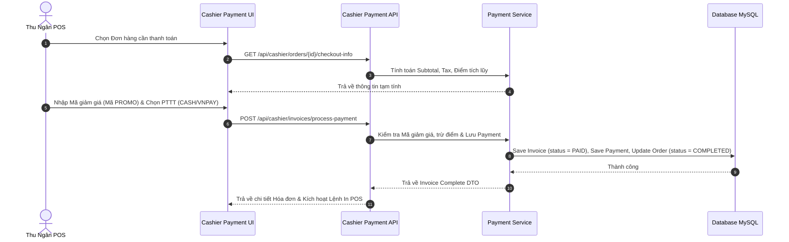

#### 3.11.4. Mô tả chi tiết các trường thông tin
| Tên tiếng Việt | Tên tiếng Anh | Loại dữ liệu | Bắt buộc? | Mô tả & Ràng buộc |
| :--- | :--- | :---: | :---: | :--- |
| Tổng tiền thanh toán | `finalAmount` | BigDecimal | Có | Tiền sau thuế và chiết khấu |

#### 3.11.5. Giao diện
> [!NOTE]
> - **Tên màn hình**: Màn hình POS Thu ngân (`CashierPaymentsPage.jsx`).
> - **Vùng ảnh cần chèn**: [CHÈN HÌNH CỤC BỘ MÀN HÌNH POS THU NGÂN TẠI ĐÂY]

---

### 3.12. Áp dụng mã giảm giá & Xuất hóa đơn (`UC_CASH_02`)

#### 3.12.1. Đặc tả Use Case
| Thuộc tính | Nội dung chi tiết |
| :--- | :--- |
| **Use Case ID** | **UC_CASH_02** |
| **Tên Use Case** | Áp dụng Mã giảm giá & Xuất hóa đơn (Promotion & Invoice Printing) |
| **Mô tả** | Thu ngân kiểm tra mã khuyến mãi hợp lệ, tính số tiền giảm trừ và in hóa đơn bán hàng cho khách. |
| **Tác nhân (Actor)** | Thu ngân (`ROLE_CASHIER`) |
| **Mức độ ưu tiên** | Medium (Trung bình) |

#### 3.12.2. Bảng mô tả các thành phần tham gia Sơ đồ Tuần tự
| Thành phần (Participant) | Loại thành phần | Vai trò trong sơ đồ |
| :--- | :--- | :--- |
| `Cashier` | Actor | Thu ngân nhập mã Voucher |
| `FE` | UI | Ô nhập mã giảm giá |
| `API` | Controller | Endpoint `/api/cashier/promotions/apply` |
| `SVC` | Service | Kiểm tra hạn sử dụng & tính chiết khấu |
| `DB` | Database | Truy vấn mã `promotions` |

#### 3.12.3. Sơ đồ luồng chi tiết (Sequence Diagram)
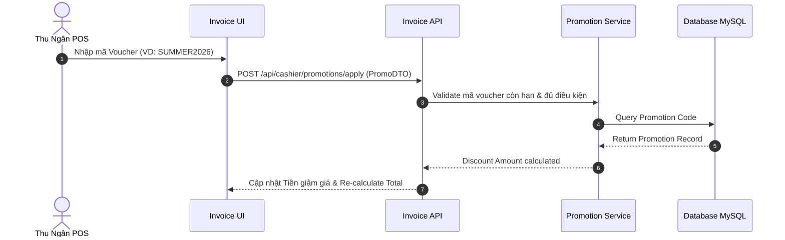

#### 3.12.4. Mô tả chi tiết các trường thông tin
| Tên tiếng Việt | Tên tiếng Anh | Loại dữ liệu | Bắt buộc? | Mô tả & Ràng buộc |
| :--- | :--- | :---: | :---: | :--- |
| Mã khuyến mãi | `code` | String | Không | Mã Voucher viết hoa |
| Tiền chiết khấu | `discountAmount` | BigDecimal | Có (Hệ thống) | Tiền được trừ |

#### 3.12.5. Giao diện
> [!NOTE]
> - **Tên màn hình**: Trang Khuyến mãi & In Hóa đơn POS (`CashierInvoicesPage.jsx`).
> - **Vùng ảnh cần chèn**: [CHÈN HÌNH CỤC BỘ MÀN HÌNH IN HÓA ĐƠN TẠI ĐÂY]

---

### 3.13. Quản lý danh mục & món ăn Menu Management (`UC_MGR_01`)

#### 3.13.1. Đặc tả Use Case
| Thuộc tính | Nội dung chi tiết |
| :--- | :--- |
| **Use Case ID** | **UC_MGR_01** |
| **Tên Use Case** | Quản lý Thực đơn & Món ăn (Dish & Menu Management) |
| **Mô tả** | Cho phép Quản lý thêm mới, chỉnh sửa thông tin món ăn, cập nhật giá bán, hình ảnh và trạng thái ẩn/hiện trên menu. |
| **Tác nhân (Actor)** | Quản lý nhà hàng (`ROLE_MANAGER`), Quản trị viên (`ROLE_ADMIN`) |
| **Mức độ ưu tiên** | Medium (Trung bình) |

#### 3.13.2. Bảng mô tả các thành phần tham gia Sơ đồ Luồng
| Thành phần (Component) | Vai trò trong luồng |
| :--- | :--- |
| `ChooseAction` | Lựa chọn Thêm/Sửa/Ẩn món ăn của Quản lý |
| `ValidateData` | Kiểm tra tính hợp lệ của dữ liệu món ăn (Giá > 0, Tên không trùng) |
| `SaveDB` | Lưu thông tin món ăn cập nhật vào cơ sở dữ liệu `dishes` |

#### 3.13.3. Sơ đồ luồng chi tiết (Activity Diagram)
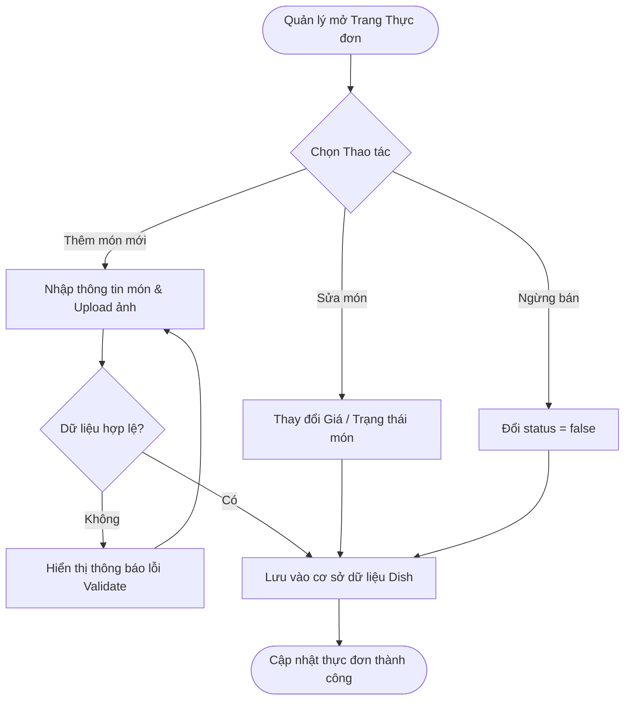

#### 3.13.4. Mô tả chi tiết các trường thông tin
| Tên tiếng Việt | Tên tiếng Anh | Loại dữ liệu | Bắt buộc? | Mô tả & Ràng buộc |
| :--- | :--- | :---: | :---: | :--- |
| Tên món ăn | `name` | String | Có | Không trùng lặp |

#### 3.13.5. Giao diện
> [!NOTE]
> - **Tên màn hình**: Màn hình Quản lý Thực đơn của Quản lý.
> - **Vùng ảnh cần chèn**: [CHÈN HÌNH CỤC BỘ MÀN HÌNH MGR MENU TẠI ĐÂY]

---

### 3.14. Quản lý kho nguyên vật liệu & Nhà cung cấp (`UC_MGR_02`)

#### 3.14.1. Đặc tả Use Case
| Thuộc tính | Nội dung chi tiết |
| :--- | :--- |
| **Use Case ID** | **UC_MGR_02** |
| **Tên Use Case** | Quản lý Kho nguyên vật liệu & Nhà cung cấp (Inventory & Supplier Mgmt) |
| **Mô tả** | Theo dõi số lượng tồn kho thực phẩm, cảnh báo nguyên liệu sắp hết và tạo Đơn nhập hàng (`PurchaseOrder`) từ Nhà cung cấp. |
| **Tác nhân (Actor)** | Quản lý nhà hàng (`ROLE_MANAGER`) |
| **Mức độ ưu tiên** | High (Cao) |

#### 3.14.2. Bảng mô tả các thành phần tham gia Sơ đồ Tuần tự
| Thành phần (Participant) | Loại thành phần | Vai trò trong sơ đồ |
| :--- | :--- | :--- |
| `Manager` | Actor | Quản lý kho nhập thực phẩm |
| `FE` | UI | Form nhập kho |
| `API` | Controller | Endpoint `/api/manager/purchase-orders` |
| `SVC` | Service | Tạo `PurchaseOrder` & tăng số lượng nguyên liệu |
| `DB` | Database | Cập nhật bảng `ingredients` |

#### 3.14.3. Sơ đồ luồng chi tiết (Sequence Diagram)
```mermaid
sequenceDiagram
    autonumber
    actor Manager as Quản Lý Kho
    participant FE as Inventory UI
    participant API as Inventory API
    participant SVC as Inventory Service
    participant DB as Database MySQL

    Manager->>FE: Tạo Đơn nhập kho (PurchaseOrder)
    FE->>API: POST /api/manager/purchase-orders (PO_DTO)
    API->>SVC: Tạo PurchaseOrder & Cộng số lượng tồn kho Ingredients
    SVC->>DB: Save PurchaseOrder & Update Ingredient Quantity
    DB-->>SVC: Thành công
    SVC-->>API: Trả về kết quả
    API-->>FE: Hiển thị "Nhập kho thành công!"
```

#### 3.14.4. Mô tả chi tiết các trường thông tin
| Tên tiếng Việt | Tên tiếng Anh | Loại dữ liệu | Bắt buộc? | Mô tả & Ràng buộc |
| :--- | :--- | :---: | :---: | :--- |
| Tên nguyên liệu | `ingredientName` | String | Có | Tên thực phẩm/nguyên liệu |
| Số lượng tồn | `quantity` | Double | Có | Khối lượng/Số lượng trong kho |
| Ngưỡng tối thiểu | `minQuantity` | Double | Có | Ngưỡng báo động nhập kho |

#### 3.14.5. Giao diện
> [!NOTE]
> - **Tên màn hình**: Màn hình Quản lý Tồn kho nguyên liệu (`ManagerInventoryPage.jsx`).
> - **Vùng ảnh cần chèn**: [CHÈN HÌNH CỤC BỘ MÀN HÌNH QUẢN LÝ KHO TẠI ĐÂY]

---

### 3.15. Báo cáo doanh thu & Phân tích kinh doanh (`UC_MGR_03`)

#### 3.15.1. Đặc tả Use Case
| Thuộc tính | Nội dung chi tiết |
| :--- | :--- |
| **Use Case ID** | **UC_MGR_03** |
| **Tên Use Case** | Báo cáo Doanh thu & Phân tích Kinh doanh (Revenue & Business Analytics) |
| **Mô tả** | Xem biểu đồ doanh thu theo ngày/tháng/năm, danh sách món bán chạy nhất, thống kê lượt khách và lợi nhuận. |
| **Tác nhân (Actor)** | Quản lý nhà hàng (`ROLE_MANAGER`), Quản trị viên (`ROLE_ADMIN`) |
| **Mức độ ưu tiên** | Medium (Trung bình) |

#### 3.15.2. Bảng mô tả các thành phần tham gia Sơ đồ Tuần tự
| Thành phần (Participant) | Loại thành phần | Vai trò trong sơ đồ |
| :--- | :--- | :--- |
| `Mgr` | Actor | Quản lý xem báo cáo |
| `FE` | UI | Dashboard biểu đồ thống kê |
| `API` | Controller | Endpoint `/api/manager/reports/revenue` |
| `SVC` | Service | Thống kê dữ liệu doanh thu từ hóa đơn |
| `DB` | Database | Truy vấn bảng `invoices` status `PAID` |

#### 3.15.3. Sơ đồ luồng chi tiết (Sequence Diagram)
```mermaid
sequenceDiagram
    autonumber
    actor Mgr as Quản Lý
    participant FE as Analytics UI
    participant API as Report API
    participant SVC as Report Service
    participant DB as Database MySQL

    Mgr->>FE: Chọn khoảng thời gian (Từ ngày - Đến ngày)
    FE->>API: GET /api/manager/reports/revenue?startDate=2026-07-01&endDate=2026-07-22
    API->>SVC: Aggregation query doanh thu & món bán chạy
    SVC->>DB: SUM(final_amount) FROM invoices WHERE status='PAID'
    DB-->>SVC: Dữ liệu tổng hợp
    SVC-->>API: RevenueReportDTO
    API-->>FE: Trả về dữ liệu vẽ Biểu đồ Doanh thu (Chart)
```

#### 3.15.4. Mô tả chi tiết các trường thông tin
| Tên tiếng Việt | Tên tiếng Anh | Loại dữ liệu | Bắt buộc? | Mô tả & Ràng buộc |
| :--- | :--- | :---: | :---: | :--- |
| Từ ngày | `startDate` | LocalDate | Có | Ngày bắt đầu báo cáo |
| Đến ngày | `endDate` | LocalDate | Có | Ngày kết thúc báo cáo |
| Tổng doanh thu | `totalRevenue` | BigDecimal | Có (Hệ thống) | Tổng số tiền thu về |

#### 3.15.5. Giao diện
> [!NOTE]
> - **Tên màn hình**: Màn hình Báo cáo & Analytics (`ManagerAnalyticsPage.jsx`).
> - **Vùng ảnh cần chèn**: [CHÈN HÌNH CỤC BỘ MÀN HÌNH BÁO CÁO TẠI ĐÂY]

---

### 3.16. Quản lý người dùng & Phân quyền RBAC (`UC_ADM_01`)

#### 3.16.1. Đặc tả Use Case
| Thuộc tính | Nội dung chi tiết |
| :--- | :--- |
| **Use Case ID** | **UC_ADM_01** |
| **Tên Use Case** | Quản lý Người dùng & Phân quyền RBAC (User & RBAC Management) |
| **Mô tả** | Cho phép Admin quản lý danh sách tài khoản toàn hệ thống, gán vai trò (`Role`) và quyền chi tiết (`Permission`) cho từng tài khoản. |
| **Tác nhân (Actor)** | Quản trị viên (`ROLE_ADMIN`) |
| **Mức độ ưu tiên** | High (Cao) |

#### 3.16.2. Bảng mô tả các thành phần tham gia Sơ đồ Tuần tự
| Thành phần (Participant) | Loại thành phần | Vai trò trong sơ đồ |
| :--- | :--- | :--- |
| `Admin` | Actor | Quản trị viên phân quyền RBAC |
| `FE` | UI | Màn hình Admin Dashboard |
| `API` | Controller | Endpoint `/api/admin/users/{id}/roles` |
| `SVC` | Service | Cập nhật vai trò & vô hiệu hóa token cũ |
| `DB` | Database | Cập nhật bảng `user_roles` |

#### 3.16.3. Sơ đồ luồng chi tiết (Sequence Diagram)
```mermaid
sequenceDiagram
    autonumber
    actor Admin as Quản Trị Viên
    participant FE as Admin Dashboard UI
    participant API as Admin RBAC API
    participant SVC as User Management Service
    participant DB as Database MySQL

    Admin->>FE: Chọn Tài khoản & Gán Role (VD: ROLE_CASHIER)
    FE->>API: PUT /api/admin/users/{id}/roles (RoleDTO)
    API->>SVC: Cập nhật danh sách Role trong User_Roles
    SVC->>DB: Save User_Roles & Revoke Refresh Token
    DB-->>SVC: Thành công
    SVC-->>API: Trả về User DTO đã cập nhật
    API-->>FE: Thông báo "Cập nhật Phân quyền thành công"
```

#### 3.16.4. Mô tả chi tiết các trường thông tin
| Tên tiếng Việt | Tên tiếng Anh | Loại dữ liệu | Bắt buộc? | Mô tả & Ràng buộc |
| :--- | :--- | :---: | :---: | :--- |
| Mã người dùng | `userId` | Long | Có | ID tài khoản được phân quyền |

#### 3.16.5. Giao diện
> [!NOTE]
> - **Tên màn hình**: Màn hình Quản trị RBAC Admin (`AdminDashboard.jsx`).
> - **Vùng ảnh cần chèn**: [CHÈN HÌNH CỤC BỘ MÀN HÌNH ADMIN RBAC TẠI ĐÂY]

---

## PHẦN 4: CÁC COMPONENT, THÔNG BÁO, CẢNH BÁO

Hệ thống Quản lý Nhà hàng quy định các mẫu thông báo, cảnh báo chuẩn định dạng UI/UX cho toàn bộ ứng dụng:

### 1. Bảng Mẫu Thông báo UI/UX Toast & Alert Components
| Mã Cảnh báo | Loại | Thông điệp / Nội dung hiển thị | Hành vi Hệ thống |
| :---: | :---: | :--- | :--- |
| **MSG_SUCCESS_01** | Toast Success | "Đăng nhập thành công! Chào mừng bạn quay trở lại." | Tự động chuyển hướng tới Dashboard tương ứng vai trò. |
| **MSG_SUCCESS_02** | Toast Success | "Đơn hàng của bàn [X] đã được gửi xuống Bếp thành công!" | Tự động xóa giỏ hàng tạm, phát âm thanh báo nhẹ. |
| **MSG_WARN_01** | Modal Cảnh báo | "Món [Tên món] hiện tại kho chỉ còn [Y] suất. Bạn có muốn tiếp tục gọi?" | Hiển thị hộp thoại xác nhận Xác nhận/Hủy. |
| **MSG_WARN_02** | Banner Alert | "CẢNH BÁO TỒN KHO: Nguyên liệu [Tên NL] đã chạm ngưỡng tối thiểu [Z] kg!" | Gửi thông báo đỏ lên Dashboard của Quản lý kho. |
| **MSG_ERR_01** | Toast Error | "Mật khẩu không chính xác hoặc Tài khoản đã bị khóa!" | Giữ nguyên form đăng nhập, highlight đỏ ô mật khẩu. |
| **MSG_ERR_02** | Dialog Alert | "Bàn số [X] đang có khách sử dụng! Không thể chuyển bàn." | Chặn thao tác xếp bàn, yêu cầu chọn bàn trống khác. |

---

## PHẦN 5: LINK ISSUE & LỊCH SỬ DỰ ÁN

Danh sách tiến độ công việc và quản lý các yêu cầu issue trong giai đoạn phát triển từ **08/07/2026** đến **22/07/2026**:

| Mã Task / Issue ID | Tên Yêu cầu / Hạng mục phát triển | Ngày bắt đầu | Ngày hoàn thành | Người thực hiện | Trạng thái |
| :---: | :--- | :---: | :---: | :---: | :---: |
| **ISSUE-01** | Thiết kế CSDL MySQL 24 thực thể & Entity JPA Class | 08/07/2026 | 10/07/2026 | Lê Nhật Linh | CLOSED |
| **ISSUE-02** | Cấu hình Spring Security, JWT Auth & Database Seeder | 10/07/2026 | 12/07/2026 | Lê Nhật Linh | CLOSED |
| **ISSUE-03** | Phát triển API & UI Phân hệ Khách hàng (Menu, Order, Booking) | 12/07/2026 | 15/07/2026 | Lê Nhật Linh | CLOSED |
| **ISSUE-04** | Phát triển Màn hình Bếp KDS & Luồng luân chuyển trạng thái món | 15/07/2026 | 17/07/2026 | Lê Nhật Linh | CLOSED |
| **ISSUE-05** | Xây dựng POS Thu ngân, Áp dụng Khuyến mãi & In Hóa đơn | 17/07/2026 | 19/07/2026 | Lê Nhật Linh | CLOSED |
| **ISSUE-06** | Xây dựng Dashboard Quản lý (Doanh thu, Kho, Nhân sự, Report) | 19/07/2026 | 21/07/2026 | Lê Nhật Linh | CLOSED |
| **ISSUE-07** | Kiểm thử tích hợp (End-to-End Test) & Đóng gói Tài liệu SRS | 21/07/2026 | 22/07/2026 | Lê Nhật Linh | CLOSED |

---

## PHẦN PHỤ LỤC (APPENDIX)

### PHỤ LỤC A: DANH MỤC SƠ ĐỒ ĐỒ HỌA MERMAID
- **Hình A.1**: Sơ đồ Mô hình Quan hệ Thực thể ERD 24 Bảng CSDL (Mục 2.1)
- **Hình A.2**: Sơ đồ Use Case Tổng quan 6 Tác nhân Hệ thống (Mục 2.2)
- **Hình A.3**: Sơ đồ Luồng Luân chuyển Nghiệp vụ Đơn hàng (Mục 2.3)
- **Hình A.4**: Sơ đồ Chuyển Trạng thái Đơn hàng, Bàn ăn & Đặt bàn (Mục 2.4)
- **Hình A.5**: Sơ đồ Cấu trúc Trang Web App - Site Map (Mục 2.6)
- **Hình A.6**: Sơ đồ Tuần tự Chức năng UC_AUTH_01 - Đăng ký & Đăng nhập (Mục 3.1.3)
- **Hình A.7**: Sơ đồ Tuần tự Chức năng UC_AUTH_02 - Đổi mật khẩu (Mục 3.2.3)
- **Hình A.8**: Sơ đồ Tuần tự Chức năng UC_CUST_01 - Xem Thực đơn (Mục 3.3.3)
- **Hình A.9**: Sơ đồ Tuần tự Chức năng UC_CUST_02 - Đặt bàn Trực tuyến (Mục 3.4.3)
- **Hình A.10**: Sơ đồ Tuần tự Chức năng UC_CUST_03 - Đặt món Giỏ hàng (Mục 3.5.3)
- **Hình A.11**: Sơ đồ Tuần tự Chức năng UC_CUST_04 - Viết Đánh giá (Mục 3.6.3)
- **Hình A.12**: Sơ đồ Luồng Chức năng UC_WAIT_01 - Quản lý Bàn ăn (Mục 3.7.3)
- **Hình A.13**: Sơ đồ Tuần tự Chức năng UC_WAIT_02 - Phục vụ Gọi món tại bàn (Mục 3.8.3)
- **Hình A.14**: Sơ đồ Tuần tự Chức năng UC_CHEF_01 - Màn hình Bếp KDS (Mục 3.9.3)
- **Hình A.15**: Sơ đồ Tuần tự Chức năng UC_CHEF_02 - Cập nhật Trạng thái Chế biến (Mục 3.10.3)
- **Hình A.16**: Sơ đồ Tuần tự Chức năng UC_CASH_01 - Thu ngân POS Thanh toán (Mục 3.11.3)
- **Hình A.17**: Sơ đồ Tuần tự Chức năng UC_CASH_02 - Mã Giảm giá & In HD (Mục 3.12.3)
- **Hình A.18**: Sơ đồ Luồng Chức năng UC_MGR_01 - Quản lý Thực đơn (Mục 3.13.3)
- **Hình A.19**: Sơ đồ Tuần tự Chức năng UC_MGR_02 - Quản lý Kho & PO (Mục 3.14.3)
- **Hình A.20**: Sơ đồ Tuần tự Chức năng UC_MGR_03 - Báo cáo Doanh thu (Mục 3.15.3)
- **Hình A.21**: Sơ đồ Tuần tự Chức năng UC_ADM_01 - Phân quyền Admin RBAC (Mục 3.16.3)

### PHỤ LỤC B: DANH MỤC BẢNG DỮ LIỆU & BẢNG ĐẶC TẢ
- **Bảng B.1**: Bảng Kiểm soát Tài liệu & Lịch sử Thay đổi
- **Bảng B.2**: Bảng Danh mục Thuật ngữ Viết tắt IEEE (Mục 1.4)
- **Bảng B.3**: Bảng Bảng Mô tả Chi tiết các Thực thể Dữ liệu ERD (Mục 2.1.1)
- **Bảng B.4**: Bảng Bảng Mô tả Chi tiết các Tác nhân và Nhóm Use Case (Mục 2.2.1)
- **Bảng B.5**: Bảng Bảng Mô tả các Bước trong Luồng Luân chuyển Nghiệp vụ (Mục 2.3.1)
- **Bảng B.6**: Bảng Bảng Mô tả Trạng thái Đơn hàng, Bàn ăn & Đặt bàn (Mục 2.4)
- **Bảng B.7**: Bảng Bảng Mô tả các Phân hệ Màn hình trên Site Map (Mục 2.6.1)
- **Bảng B.8**: Bảng Ma trận Phân quyền Chức năng RBAC (Mục 2.5.1)
- **Bảng B.9**: Bảng Danh sách Chi tiết 16 Use Cases Hệ thống (Mục 3.0)
- **Bảng B.10**: Bảng Mẫu Thông báo UI/UX Toast & Alert Components (Phần 4)
- **Bảng B.11**: Bảng Nhật ký Phát triển Issue & Sprint Timeline (Phần 5)

### PHỤ LỤC C: MA TRẬN API ENDPOINTS & BẢO MẬT

| STT | Phương thức HTTP | Đường dẫn API Endpoint | Vai trò Yêu cầu (Security Role) | Mô tả Chức năng |
| :---: | :---: | :--- | :--- | :--- |
| 1 | `POST` | `/api/auth/login` | PermitAll (Công khai) | Đăng nhập hệ thống & Nhận chuỗi JWT |
| 2 | `POST` | `/api/auth/register` | PermitAll (Công khai) | Đăng ký tài khoản Khách hàng mới |
| 3 | `GET` | `/api/customer/menu` | PermitAll (Công khai) | Xem danh sách món ăn & thực đơn |
| 4 | `POST` | `/api/customer/reservations` | `ROLE_CUSTOMER` | Đặt bàn ăn trực tuyến |
| 5 | `POST` | `/api/waiter/orders` | `ROLE_WAITER`, `ROLE_MANAGER` | Tạo đơn hàng & chọn món tại bàn |
| 6 | `GET` | `/api/chef/queue` | `ROLE_CHEF`, `ROLE_MANAGER` | Lấy danh sách món chờ chế biến KDS |
| 7 | `PUT` | `/api/chef/items/{id}/status` | `ROLE_CHEF` | Cập nhật trạng thái chế biến món ăn |
| 8 | `POST` | `/api/cashier/invoices/process-payment` | `ROLE_CASHIER`, `ROLE_MANAGER` | Xử lý thanh toán POS & Xuất hóa đơn |
| 9 | `POST` | `/api/manager/dishes` | `ROLE_MANAGER`, `ROLE_ADMIN` | Thêm mới món ăn vào thực đơn |
| 10 | `GET` | `/api/manager/reports/revenue` | `ROLE_MANAGER`, `ROLE_ADMIN` | Lấy báo cáo thống kê doanh thu |
| 11 | `PUT` | `/api/admin/users/{id}/roles` | `ROLE_ADMIN` | Gán vai trò Role & Phân quyền RBAC |

---

### PHỤ LỤC D: HƯỚNG DẪN XUẤT FILE SANG WORD (.DOCX) GIỮ NGUYÊN ĐỊNH DẠNG SƠ ĐỒ

Để đảm bảo tất cả các sơ đồ Mermaid trong file Markdown khi chuyển sang file Microsoft Word (`.docx`) **hiển thị nét đẹp, không bị vỡ hình, không bị nén chữ hay lỗi tràn khung**, bạn thực hiện theo 1 trong các cách chuẩn nhất sau:

#### Cách 1: Chuyển đổi trực tiếp bằng Extension VS Code (Khuyên dùng - Đơn giản nhất)
1. Mở file `BAO_CAO_SRS_HE_THONG_NHA_HANG.md` trong VS Code.
2. Cài đặt Extension **Markdown Preview Enhanced** (của Yihui Xi) hoặc **Markdown All in One**.
3. Nhấp chuột phải vào file Markdown -> Chọn **Markdown Preview Enhanced: Open Preview** (hoặc nhấn `Ctrl + K V`).
4. Nhấp chuột phải tại cửa sổ Preview bên cạnh -> Chọn **Export** -> **Pandoc** hoặc **HTML (cdn host)**.
5. Nếu chọn **HTML (cdn host)**, mở file HTML bằng trình duyệt Web -> Nhấn `Ctrl + A` -> `Ctrl + C` -> Mở Word paste sang `Ctrl + V`. Tất cả sơ đồ Mermaid sẽ tự động biến thành hình ảnh vector nét cao trong Word.

#### Cách 2: Sử dụng công cụ Chuyển đổi Typora / MarkText (Tự động chuyển Mermaid sang Hình ảnh trong Word)
1. Tải và mở file `.md` bằng phần mềm **Typora** hoặc **MarkText**.
2. Chọn menu **File** -> **Export** -> **Word (.docx)**.
3. Phần mềm sẽ tự động render các khối mã Mermaid thành các hình ảnh định dạng PNG/SVG sắc nét nhúng sẵn vào file Word mà không bị lệch hay vỡ dòng.

#### Cách 3: Xuất bằng Pandoc Command Line (Dành cho Devs)
Chạy lệnh Pandoc kèm filter render Mermaid:
```bash
pandoc BAO_CAO_SRS_HE_THONG_NHA_HANG.md -F mermaid-filter -o BAO_CAO_SRS_HE_THONG_NHA_HANG.docx
```
