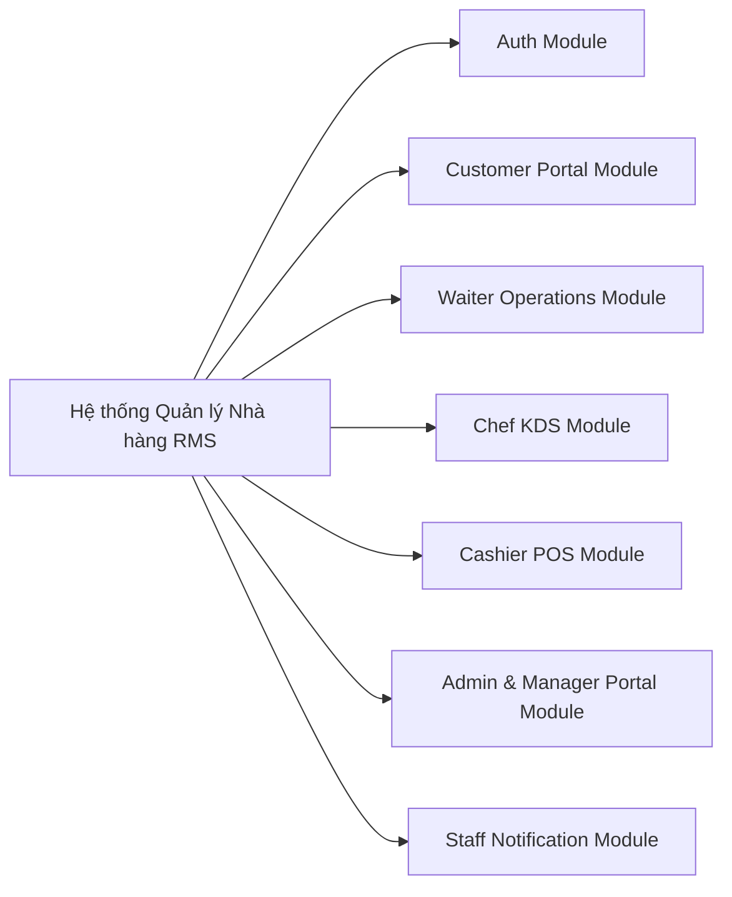
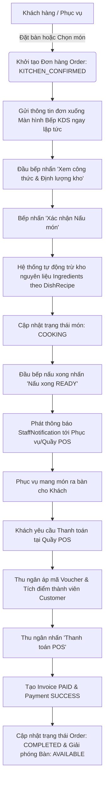
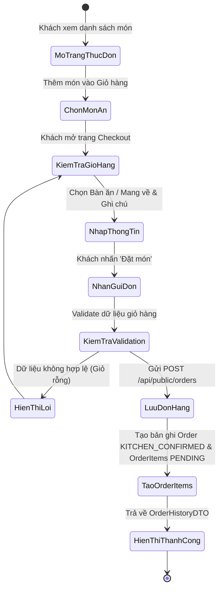
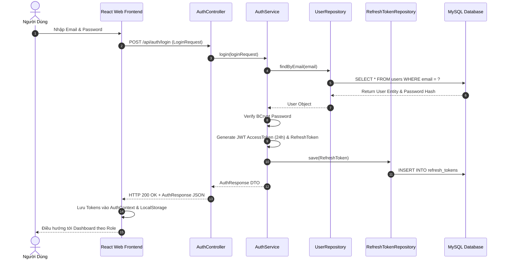
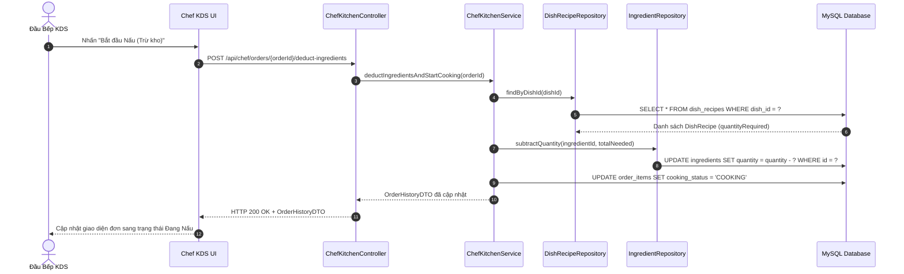
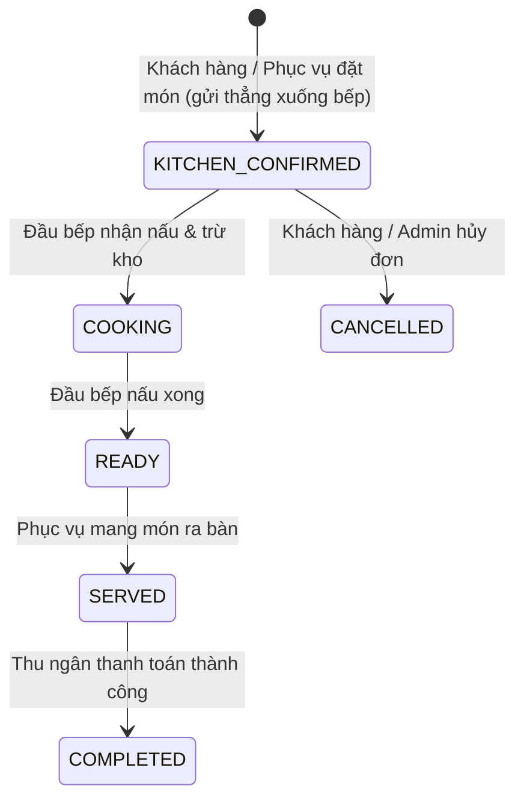
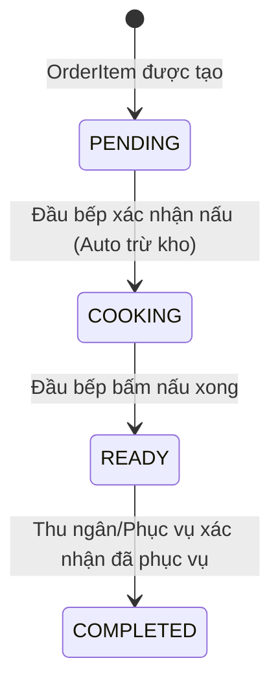
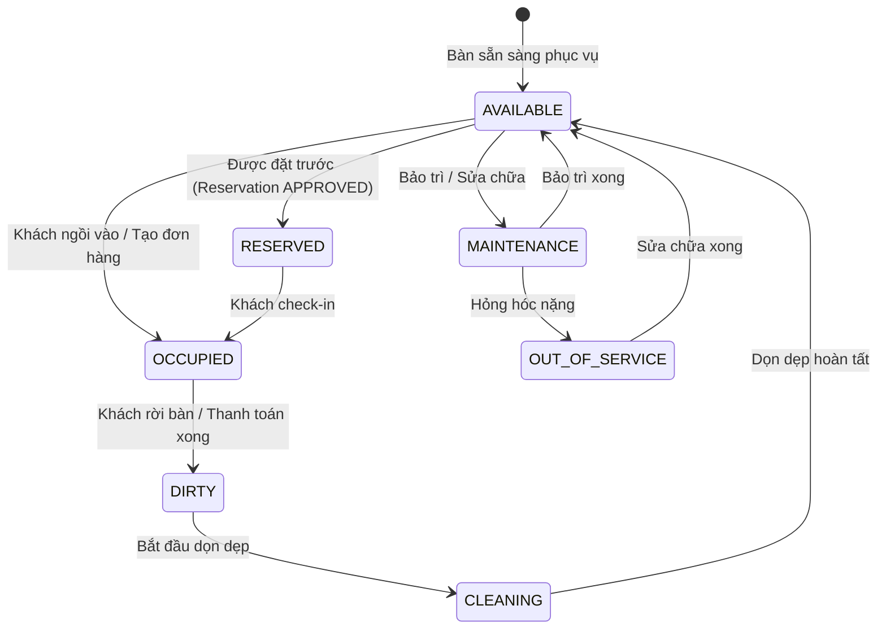
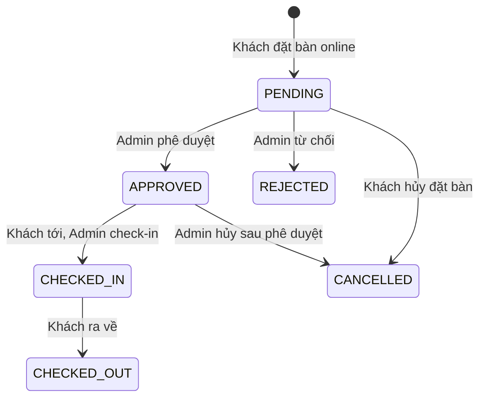

# BÁO CÁO ĐẶC TẢ HỆ THỐNG & YÊU CẦU PHẦN MỀM (SYSTEM SPECIFICATION & SRS)
## DỰ ÁN: HỆ THỐNG QUẢN LÝ NHÀ HÀNG TỰ PHỤC VỤ VÀ ĐIỀU HÀNH KDS/POS (RESTAURANT MANAGEMENT SYSTEM - RMS)

- **Đơn vị thực hiện**: Đội ngũ Phân tích & Phát triển Dự án RMS
- **Mã tài liệu**: SRS_RMS_SYSTEM_2026
- **Phiên bản**: 2.0 (Tái cấu trúc 100% dựa trên Mã nguồn thực tế - Single Source of Truth)
- **Ngày phát hành**: 25/07/2026

---

## MỤC LỤC

- [CHƯƠNG 1: GIỚI THIỆU DỰ ÁN](#chương-1-giới-thiệu-dự-án)
- [CHƯƠNG 2: MỤC TIÊU HỆ THỐNG](#chương-2-mục-tiêu-hệ-thống)
- [CHƯƠNG 3: PHẠM VI DỰ ÁN](#chương-3-phạm-vi-dự-án)
- [CHƯƠNG 4: KIẾN TRÚC HỆ THỐNG](#chương-4-kiến-trúc-hệ-thống)
- [CHƯƠNG 5: CÔNG NGHỆ SỬ DỤNG](#chương-5-công-nghệ-sử-dụng)
- [CHƯƠNG 6: VAI TRÒ NGƯỜI DÙNG (USER ROLES)](#chương-6-vai-trò-người-dùng-user-roles)
- [CHƯƠNG 7: DANH SÁCH MODULE](#chương-7-danh-sách-module)
- [CHƯƠNG 8: ĐẶC TẢ CHỨC NĂNG TỪNG MODULE](#chương-8-đặc-tả-chức-năng-từng-module)
- [CHƯƠNG 9: LUỒNG NGHIỆP VỤ (BUSINESS FLOW)](#chương-9-luồng-nghiệp-vụ-business-flow)
- [CHƯƠNG 10: SƠ ĐỒ USE CASE (USE CASE DIAGRAM)](#chương-10-sơ-đồ-use-case-use-case-diagram)
- [CHƯƠNG 11: ĐẶC TẢ USE CASE (USE CASE SPECIFICATIONS)](#chương-11-đặc-tả-use-case-use-case-specifications)
- [CHƯƠNG 12: SƠ ĐỒ HOẠT ĐỘNG (ACTIVITY DIAGRAMS)](#chương-12-sơ-đồ-hoạt-động-activity-diagrams)
- [CHƯƠNG 13: SƠ ĐỒ TUẦN TỰ (SEQUENCE DIAGRAMS)](#chương-13-sơ-đồ-tuần-tự-sequence-diagrams)
- [CHƯƠNG 14: SƠ ĐỒ THỰC THỂ LIÊN KẾT (ERD)](#chương-14-sơ-đồ-thực-thể-liên-kết-erd)
- [CHƯƠNG 15: THIẾT KẾ CƠ SỞ DỮ LIỆU (DATABASE DESIGN)](#chương-15-thiết-kế-cơ-sở-dữ-liệu-database-design)
- [CHƯƠNG 16: ĐẶC TẢ API (API SPECIFICATIONS)](#chương-16-đặc-tả-api-api-specifications)
- [CHƯƠNG 17: MÔ TẢ GIAO DIỆN (UI DESCRIPTION)](#chương-17-mô-tả-giao-diện-ui-description)
- [CHƯƠNG 18: MA TRẬN PHÂN QUYỀN (RBAC MATRIX)](#chương-18-ma-trận-phân-quyền-rbac-matrix)
- [CHƯƠNG 19: QUY TẮC KIỂM TRA DỮ LIỆU (VALIDATION RULES)](#chương-19-quy-tắc-kiểm-tra-dữ-liệu-validation-rules)
- [CHƯƠNG 20: KỊCH BẢN KIỂM THỬ (TEST SCENARIOS)](#chương-20-kịch-bản-kiểm-thử-test-scenarios)
- [CHƯƠNG 21: DANH MỤC TEST CASE (TEST CASES)](#chương-21-danh-mục-test-case-test-cases)
- [CHƯƠNG 22: KẾ HOẠCH TRIỂN KHAI (DEPLOYMENT PLAN)](#chương-22-kế-hoạch-triển-khai-deployment-plan)
- [CHƯƠNG 23: PHÂN CÔNG NHÂN SỰ](#chương-23-phân-công-nhân-sự)
- [CHƯƠNG 24: MASTER PLAN](#chương-24-master-plan)
- [CHƯƠNG 25: KẾT LUẬN & NỘI DUNG CẦN XÁC MINH THÊM TỪ NHÓM PHÁT TRIỂN](#chương-25-kết-luận--nội-dung-cần-xác-minh-thêm-từ-nhóm-phát-triển)

---

## CHƯƠNG 1: GIỚI THIỆU DỰ ÁN

### 1.1 Bối cảnh phát triển
Ngành dịch vụ ăn uống (F&B - Food and Beverage) hiện nay đòi hỏi tốc độ phục vụ nhanh chóng, độ chính xác cao trong quá trình chuyển giao thông tin giữa Khách hàng - Nhân viên phục vụ - Đầu bếp nhà bếp - Thu ngân và Bộ phận Quản lý. 

**Hệ thống Quản lý Nhà hàng (Restaurant Management System - RMS)** được phát triển nhằm cung cấp giải pháp chuyển đổi số toàn diện:
1. Cho phép khách hàng tra cứu thực đơn, đặt bàn trước trực tuyến, chọn món ăn tại chỗ/mang về và thanh toán thuận tiện.
2. Cung cấp phân hệ màn hình bếp **KDS (Kitchen Display System)** điều hành thời gian thực, hỗ trợ đối soát công thức định lượng món ăn (`DishRecipe`) và tự động xuất kho trừ nguyên liệu khi nấu.
3. Hỗ trợ Thu ngân tại quầy **POS (Point of Sale)** xử lý hóa đơn, áp dụng mã giảm giá (`Promotion`), tính thuế VAT, phí dịch vụ và tích điểm thành viên (`Loyalty Points`).
4. Cung cấp bộ công cụ Dashboard tập trung cho Quản lý và Admin theo dõi doanh thu, phân tích món bán chạy, quản lý kho nguyên liệu, nhà cung cấp, nhân sự và phân quyền **RBAC (Role-Based Access Control)**.

### 1.2 Nguyên tắc phân tích tài liệu
Tài liệu này được biên soạn và chuẩn hóa dựa trên **Single Source of Truth** – tức là mã nguồn thực tế của dự án bao gồm:
- **Backend Service**: Mã nguồn Java 17, Spring Boot 3 RESTful API nằm trong thư mục `restaurant-backend`.
- **Frontend SPA**: Mã nguồn React 18, Vite Client Web App nằm trong thư mục `restaurant-frontend`.

Tất cả các mô tả về thực thể CSDL, đường dẫn REST API, vai trò người dùng, quy tắc validation và luồng giao diện trong tài liệu đều phản ánh 100% chính xác những gì đã được triển khai trong codebase.

---

## CHƯƠNG 2: MỤC TIÊU HỆ THỐNG

### 2.1 Mục tiêu định tính
- Tự động hóa luồng chuyển giao thông tin đơn hàng giữa bàn ăn, quầy thu ngân và nhà bếp, giảm thiểu sai sót do ghi chép thủ công.
- Tối ưu hóa trải nghiệm khách hàng thông qua giao diện web hiện đại, hỗ trợ đặt bàn trực tuyến, xem chi tiết hình ảnh/giá món và theo dõi trạng thái đơn hàng.
- Nâng cao tính chuyên nghiệp và minh bạch trong hoạt động kinh doanh nhà hàng.

### 2.2 Mục tiêu định tính & số liệu nghiệp vụ
- **Chuẩn hóa xác thực**: 100% các request yêu cầu bảo mật được xác thực qua JWT Bearer Token mã hóa chuẩn BCrypt cho mật khẩu.
- **Tự động đối soát kho**: 100% các món ăn khi được Đầu bếp xác nhận bắt đầu chế biến sẽ tự động truy vấn bảng `dish_recipes` và trừ tương ứng số lượng tồn kho nguyên liệu trong bảng `ingredients`.
- **Quản lý đa phương thức thanh toán**: Xử lý chính xác các phương thức thanh toán Tiền mặt (`CASH`), Chuyển khoản QR (`QR_BANKING`), VNPay (`VNPAY`), Momo (`MOMO`).
- **Phân hạng thành viên**: Tự động tích lũy điểm thưởng và nâng hạng thành viên khách hàng theo 5 cấp độ (`BRONZE`, `SILVER`, `GOLD`, `PLATINUM`, `DIAMOND`).

---

## CHƯƠNG 3: PHẠM VI DỰ ÁN

### 3.1 Phạm vi nghiệp vụ hỗ trợ
1. **Phân hệ Xác thực & Tài khoản (`Auth Module`)**: Đăng ký, đăng nhập JWT bằng Email/Password, quên mật khẩu xác thực OTP qua Email, đổi mật khẩu, quản lý hồ sơ cá nhân (`Profile`).
2. **Phân hệ Khách hàng (`Customer Portal`)**: Tra cứu thực đơn phân trang/lọc giá/danh mục, đặt bàn ăn trực tuyến, đặt món giỏ hàng, lịch sử đơn hàng, xem món ăn yêu thích và gửi đánh giá 1-5 sao.
3. **Phân hệ Phục vụ (`Waiter Module`)**: Theo dõi sơ đồ bàn ăn trực quan, cập nhật trạng thái bàn, tạo đơn hàng chọn món tại bàn cho khách, gửi đơn xuống KDS nhà bếp.
4. **Phân hệ Đầu bếp / KDS (`Chef KDS Module`)**: Tiếp nhận hàng đợi chế biến theo thời gian thực, xem định lượng công thức nguyên liệu (`DishRecipe`), bấm bắt đầu nấu (tự động trừ kho nguyên liệu), cập nhật trạng thái nấu xong (`READY`), phát thông báo nội bộ (`StaffNotification`).
5. **Phân hệ Thu ngân / POS (`Cashier POS Module`)**: Tiếp nhận đơn chờ thanh toán, áp dụng mã voucher chiết khấu, tính thuế VAT & phí dịch vụ, xử lý tích/trừ điểm thành viên khách hàng, xuất hóa đơn POS, lập báo cáo tổng kết ca thu ngân.
6. **Phân hệ Quản lý & Quản trị (`Admin & Manager Integrated Portal`)**: Quản lý thực đơn món ăn (`Dish`), danh mục (`Category`), tồn kho nguyên liệu (`Ingredient`), nhà cung cấp (`Supplier`), đơn nhập hàng (`PurchaseOrder`), nhân sự (`Employee`), tài khoản người dùng (`User`), phân quyền vai trò/quyền hạn (`Role`/`Permission`), báo cáo doanh thu & analytics.

### 3.2 Giới hạn hệ thống
- Hệ thống hỗ trợ mô hình phục vụ ăn tại chỗ (`DINE_IN`) và mua mang về (`TAKE_AWAY`).
- Giao diện người dùng được tối ưu hiển thị trên Trình duyệt Web (Responsive Desktop & Tablet/Mobile Web Browser).

---

## CHƯƠNG 4: KIẾN TRÚC HỆ THỐNG

### 4.1 Mô hình Kiến trúc tổng quan (System Architecture)
Hệ thống sử dụng kiến trúc **Single-Page Application (SPA)** kết hợp **RESTful API Services** theo mô hình 3 lớp chính:

```mermaid
graph TD
    Client[Client Browser - React 18 SPA] -->|HTTPS REST API / JSON| Controller[Spring Boot Controllers]
    Client -->|WebSocket Protocol / WS| WSHandler[Kitchen WebSocket Handler]
    
    subgraph Backend Service Layer (Spring Boot 3)
        Controller --> Service[Business Logic Services]
        WSHandler --> Service
        Service --> Security[Spring Security & JWT Filter]
        Service --> Repositories[Spring Data JPA Repositories]
    end
    
    subgraph Data Layer
        Repositories --> DB[(MySQL 8.0 Database)]
    end
```

### 4.2 Lớp Bảo mật & Xác thực (Security Architecture)
Hệ thống áp dụng cơ chế xác thực không lưu trạng thái (Stateless Session) dựa trên **JSON Web Token (JWT)**:

1. **Client Request**: Người dùng gửi yêu cầu Đăng nhập (`POST /api/auth/login`) với `email` và `password`.
2. **Authentication Provider**: `DaoAuthenticationProvider` kiểm tra thông tin người dùng qua `CustomUserDetailsService` và xác thực mật khẩu mã hóa bằng `BCryptPasswordEncoder`.
3. **Token Generation**: Nếu hợp lệ, hệ thống sinh ra `Access Token` (JWT Bearer Token) và `Refresh Token` lưu trong bảng `refresh_tokens`.
4. **Authorization Filter**: Đối với các request tiếp theo, `AuthTokenFilter` trích xuất Header `Authorization: Bearer <token>`, giải mã và nạp đối tượng `CustomUserDetails` vào `SecurityContextHolder`.

---

## CHƯƠNG 5: CÔNG NGHỆ SỬ DỤNG

### 5.1 Công nghệ Backend
- **Ngôn ngữ lập trình**: Java 17 (LTS)
- **Framework**: Spring Boot 3.x, Spring MVC, Spring Data JPA, Spring Security
- **Xác thực & Bảo mật**: JSON Web Token (jjwt 0.11.5), BCrypt Hashing
- **Quản lý dữ liệu**: MySQL Database 8.0, Hibernate ORM, Jakarta Persistence API
- **Real-time Engine**: Spring WebSocket API (`KitchenWebSocketHandler`)
- **Công cụ bổ trợ**: Lombok (Tự động sinh Getter/Setter/Builder), Jakarta Validation API

### 5.2 Công nghệ Frontend
- **Framework / Library**: React 18.x
- **Build Tool / Bundler**: Vite
- **Điều hướng & Routing**: React Router v6 (`BrowserRouter`, `Routes`, `Route`, `Navigate`)
- **HTTP Client**: Axios (Cấu hình Interceptor tự động đính kèm JWT Bearer Token)
- **Quản lý State**: React Context API (`AuthContext`, `CartContext`)
- **Styling & Components**: CSS3, Tailwind CSS Design Tokens, FontAwesome / Lucide Icons

---

## CHƯƠNG 6: VAI TRÒ NGƯỜI DÙNG (USER ROLES)

Hệ thống định nghĩa 6 vai trò người dùng hệ thống chính xác theo mã nguồn `Role.java` và `SecurityConfig.java`:

| Mã Vai trò (Role Code) | Tên Vai trò | Diễn giải Quyền hạn & Phạm vi Thao tác |
| :--- | :--- | :--- |
| `ROLE_CUSTOMER` | Khách hàng | Khách hàng đăng ký tài khoản. Được tra cứu menu, đặt bàn online, gọi món giỏ hàng, xem lịch sử đơn, tích điểm và viết đánh giá món ăn. |
| `ROLE_WAITER` | Phục vụ | Nhân viên phục vụ tại bàn. Được xem sơ đồ bàn realtime, tạo đơn gọi món tại bàn cho khách, chuyển đơn xuống bếp. |
| `ROLE_CHEF` | Đầu bếp KDS | Nhân viên bếp chế biến. Được xem hàng đợi KDS, đối soát định lượng công thức, bấm nhận nấu (trừ kho tự động), cập nhật món hoàn thành, phát notification. |
| `ROLE_CASHIER` | Thu ngân POS | Nhân viên quầy thu ngân. Được xem danh sách đơn chờ thanh toán, áp mã giảm giá, tính VAT/phí dịch vụ, xử lý điểm thành viên, xuất hóa đơn POS và xem báo cáo ca. |
| `ROLE_MANAGER` | Quản lý Nhà hàng | Quản lý kinh doanh. Được truy cập phân hệ Admin Dashboard để quản lý thực đơn, tồn kho nguyên liệu, nhà cung cấp, nhân sự, chương trình khuyến mãi và xem báo cáo doanh thu. |
| `ROLE_ADMIN` | Quản trị viên | Quản trị viên hệ thống. Có toàn quyền truy cập hệ thống, quản lý tài khoản người dùng, cấu hình vai trò (`Role`) và quyền hạn chi tiết (`Permission`). |

---

## CHƯƠNG 7: DANH SÁCH MODULE

Hệ thống bao gồm 7 phân hệ Module chính:


```mermaid
graph LR
    RMS[Hệ thống Quản lý Nhà hàng RMS] --> M1[Auth Module]
    RMS --> M2[Customer Portal Module]
    RMS --> M3[Waiter Operations Module]
    RMS --> M4[Chef KDS Module]
    RMS --> M5[Cashier POS Module]
    RMS --> M6[Admin & Manager Portal Module]
    RMS --> M7[Staff Notification Module]
```

---

## CHƯƠNG 8: ĐẶC TẢ CHỨC NĂNG TỪNG MODULE

### 8.1 Auth Module (Xác thực & Tài khoản)
- **Đăng ký tài khoản (`POST /api/auth/register`)**: Tạo tài khoản người dùng mới với vai trò mặc định `ROLE_CUSTOMER`.
- **Đăng nhập hệ thống (`POST /api/auth/login`)**: Xác thực bằng Email và Password, trả về `accessToken`, `refreshToken`, danh sách `roles` và thông tin `UserProfile`.
- **Quên mật khẩu & OTP (`POST /api/auth/forgot-password`, `/verify-otp`, `/reset-password`)**: Gửi mã xác thực OTP 6 chữ số qua Email để khôi phục mật khẩu.
- **Đổi mật khẩu (`POST /api/auth/change-password`)**: Yêu cầu người dùng đã đăng nhập xác thực mật khẩu cũ trước khi đổi mật khẩu mới.

### 8.2 Customer Portal Module (Phân hệ Khách hàng)
- **Xem & Lọc Thực đơn (`GET /api/public/menu`)**: Tìm kiếm theo từ khóa, lọc theo danh mục (`categoryId`), khoảng giá (`minPrice`, `maxPrice`), lọc món mới/món bán chạy.
- **Đặt bàn Trực tuyến (`POST /api/public/reservations`)**: Khách chọn ngày giờ, số người (`numberOfPeople`), thông tin liên hệ và bàn ăn mong muốn.
- **Đặt món Giỏ hàng (`POST /api/public/orders`)**: Thêm danh sách món ăn vào giỏ, chọn ăn tại chỗ (`diningTableId`) hoặc mang về, khởi tạo đơn ngay ở trạng thái `KITCHEN_CONFIRMED` (Phương án B: Gửi thẳng xuống Bếp).
- **Lịch sử đơn & Đánh giá (`GET /api/public/orders/history`, `POST /api/customer/reviews`)**: Xem trạng thái chế biến đơn hàng và viết nhận xét/đánh giá sao.

### 8.3 Chef KDS Module (Phân hệ Bếp chế biến)
- **Tiếp nhận hàng đợi KDS (`GET /api/chef/orders`)**: Hiển thị danh sách các đơn món cần chế biến theo orderStatus (`KITCHEN_CONFIRMED`) và cookingStatus (`PENDING`, `COOKING`).
- **Kiểm tra định lượng công thức (`GET /api/chef/orders/{id}/recipe-check`)**: Truy vấn chi tiết các nguyên liệu yêu cầu từ bảng `dish_recipes` và so sánh với tồn kho `ingredients`.
- **Tự động xuất kho khi nấu (`POST /api/chef/orders/{id}/deduct-ingredients`)**: Cập nhật `cookingStatus` = `COOKING` và tự động trừ trực tiếp số lượng tồn kho nguyên liệu.
- **Cập nhật nấu xong & Thông báo (`POST /api/chef/orders/{id}/notify-waiter`)**: Đổi trạng thái sang `READY` và gửi thông báo `StaffNotification` tới Phục vụ/Thu ngân.

### 8.4 Cashier POS Module (Phân hệ Thu ngân POS)
- **Tiếp nhận đơn chờ thanh toán (`GET /api/cashier/orders`)**: Lấy danh sách các đơn hàng đã phục vụ xong hoặc chờ thanh toán tại quầy POS.
- **Áp dụng Voucher (`POST /api/cashier/promotions/apply`)**: Validate mã giảm giá còn hiệu lực, tính tiền chiết khấu trừ vào tổng đơn.
- **Xử lý điểm thành viên (`POST /api/cashier/customers/points`)**: Tra cứu thông tin khách hàng qua Email, thực hiện tích điểm thưởng hoặc quy đổi trừ tiền đơn hàng.
- **Xuất hóa đơn POS (`POST /api/cashier/checkout`)**: Tính subtotal, thuế VAT, phí dịch vụ, tiền giảm giá -> Tạo bản ghi `Invoice` & `Payment`, đổi trạng thái đơn `COMPLETED` và giải phóng bàn ăn về `AVAILABLE`.

### 8.5 Admin & Manager Integrated Portal Module (Phân hệ Quản lý & Quản trị)
- **Quản lý Thực đơn & Danh mục**: Thêm/Sửa/Ẩn món ăn (`Dish`) và danh mục (`Category`).
- **Quản lý Kho & Nhà cung cấp**: Theo dõi danh mục `Ingredient`, cảnh báo tồn kho dưới ngưỡng `minQuantity`, quản lý danh sách `Supplier` và lập đơn nhập hàng `PurchaseOrder`.
- **Quản lý Nhân sự & Người dùng**: Quản lý hồ sơ `Employee`, tài khoản `User`, gán vai trò `Role` và phân quyền chi tiết `Permission`.
- **Báo cáo Doanh thu & Analytics**: Thống kê biểu đồ doanh thu theo khoảng thời gian, món ăn bán chạy nhất và tỷ lệ lấp đầy bàn ăn.

---

## CHƯƠNG 9: LUỒNG NGHIỆP VỤ (BUSINESS FLOW)

Sơ đồ thể hiện quy trình luân chuyển đơn hàng khép kín End-to-End từ khi Khách hàng gọi món/đặt bàn đến khi hoàn tất thanh toán POS:


```mermaid
flowchart TD
    A[Khách hàng / Phục vụ] -->|Đặt bàn hoặc Chọn món| B(Khởi tạo Đơn hàng Order: KITCHEN_CONFIRMED)
    B --> C[Gửi thông tin đơn xuống Màn hình Bếp KDS ngay lập tức]
    C --> D[Đầu bếp nhấn 'Xem công thức & Định lượng kho']
    D --> E[Bếp nhấn 'Xác nhận Nấu món']
    E --> F[Hệ thống tự động trừ kho nguyên liệu Ingredients theo DishRecipe]
    F --> G[Cập nhật trạng thái món: COOKING]
    G --> H[Đầu bếp nấu xong nhấn 'Nấu xong READY']
    H --> I[Phát thông báo StaffNotification tới Phục vụ/Quầy POS]
    I --> J[Phục vụ mang món ra bàn cho Khách]
    J --> K[Khách yêu cầu Thanh toán tại Quầy POS]
    K --> L[Thu ngân áp mã Voucher & Tích điểm thành viên Customer]
    L --> M[Thu ngân nhấn 'Thanh toán POS']
    M --> N[Tạo Invoice PAID & Payment SUCCESS]
    N --> O[Cập nhật trạng thái Order: COMPLETED & Giải phóng Bàn: AVAILABLE]
```

---

## CHƯƠNG 10: SƠ ĐỒ USE CASE (USE CASE DIAGRAM)


```mermaid
graph TD
    subgraph RMS System Boundary
        UC_Auth[Đăng ký / Đăng nhập / JWT / OTP]
        UC_Profile[Quản lý Hồ sơ Cá nhân]
        
        UC_Menu[Xem & Lọc Thực đơn]
        UC_Reserve[Đặt bàn Trực tuyến]
        UC_Cart[Đặt món Giỏ hàng]
        UC_Review[Đánh giá Món ăn]
        
        UC_WaitTable[Quản lý Sơ đồ Bàn & Gộp bàn]
        UC_WaitOrder[Gọi món tại bàn cho Khách]
        
        UC_ChefKDS[Màn hình Hàng đợi Bếp KDS]
        UC_ChefRecipe[Đối soát Định lượng Công thức]
        UC_ChefDeduct[Xác nhận Nấu & Trừ kho Tự động]
        
        UC_CashPOS[Thanh toán POS & Xuất Hóa đơn]
        UC_CashPromo[Áp dụng Mã Voucher & Tích điểm]
        
        UC_MgrInv[Quản lý Kho & Nhà cung cấp]
        UC_MgrReport[Báo cáo Doanh thu & Analytics]
        UC_AdminRBAC[Quản trị Người dùng & Phân quyền RBAC]
    end

    Actor_Guest((Khách Vãng Lai))
    Actor_Cust((Khách Hàng))
    Actor_Wait((Phục Vụ))
    Actor_Chef((Đầu Bếp))
    Actor_Cashier((Thu Ngân))
    Actor_Mgr((Quản Lý))
    Actor_Admin((Admin))

    Actor_Guest --> UC_Auth
    Actor_Guest --> UC_Menu
    
    Actor_Cust --> UC_Auth
    Actor_Cust --> UC_Profile
    Actor_Cust --> UC_Menu
    Actor_Cust --> UC_Reserve
    Actor_Cust --> UC_Cart
    Actor_Cust --> UC_Review

    Actor_Wait --> UC_Auth
    Actor_Wait --> UC_WaitTable
    Actor_Wait --> UC_WaitOrder

    Actor_Chef --> UC_Auth
    Actor_Chef --> UC_ChefKDS
    Actor_Chef --> UC_ChefRecipe
    Actor_Chef --> UC_ChefDeduct

    Actor_Cashier --> UC_Auth
    Actor_Cashier --> UC_CashPOS
    Actor_Cashier --> UC_CashPromo

    Actor_Mgr --> UC_Auth
    Actor_Mgr --> UC_MgrInv
    Actor_Mgr --> UC_MgrReport

    Actor_Admin --> UC_Auth
    Actor_Admin --> UC_AdminRBAC
```

---

## CHƯƠNG 11: ĐẶC TẢ USE CASE (USE CASE SPECIFICATIONS)

### 11.1 Use Case Specification: Đăng nhập Hệ thống (`UC_AUTH_01`)
- **Use Case ID**: `UC_AUTH_01`
- **Tên Use Case**: Đăng nhập hệ thống bằng Email và Mật khẩu.
- **Actor**: Tất cả người dùng (`CUSTOMER`, `WAITER`, `CHEF`, `CASHIER`, `MANAGER`, `ADMIN`).
- **Mục đích**: Xác thực thông tin người dùng và cấp mã JWT Tokens để truy cập các chức năng bảo mật.
- **Điều kiện tiên quyết**: Tài khoản người dùng đã được đăng ký và ở trạng thái kích hoạt (`enabled` = true).
- **Luồng chính (Main Flow)**:
  1. Người dùng mở trang Login (`/login`) và nhập `email`, `password`.
  2. Người dùng nhấn nút "Đăng nhập".
  3. Frontend gửi request `POST /api/auth/login` với dữ liệu JSON `LoginRequest`.
  4. Backend `AuthService` kiểm tra `email` trong bảng `users`.
  5. Backend sử dụng `BCryptPasswordEncoder` để đối soát mật khẩu.
  6. Backend sinh `accessToken` (thời hạn 24h) và `refreshToken`, đồng thời lưu bản ghi `RefreshToken` vào CSDL.
  7. Backend trả về HTTP Status `200 OK` kèm JSON `AuthResponse`.
  8. Frontend lưu JWT Token vào LocalStorage/AuthContext và chuyển hướng người dùng tới Dashboard tương ứng với `role`.
- **Luồng ngoại lệ (Exceptions)**:
  - *Email không tồn tại hoặc mật khẩu sai*: Backend trả về HTTP Status `401 Unauthorized`. Frontend hiển thị thông báo lỗi "Email hoặc mật khẩu không chính xác!".
  - *Tài khoản bị khóa (`enabled` = false)*: Backend trả về HTTP Status `403 Forbidden`. Frontend thông báo "Tài khoản của bạn đã bị vô hiệu hóa!".

---

### 11.2 Use Case Specification: Xác nhận Nấu & Trừ kho Tự động (`UC_CHEF_02`)
- **Use Case ID**: `UC_CHEF_02`
- **Tên Use Case**: Đầu bếp xác nhận bắt đầu chế biến món ăn và trừ tồn kho tự động.
- **Actor**: Đầu bếp / Bếp trưởng (`ROLE_CHEF`).
- **Mục đích**: Chuyển trạng thái nấu món ăn và tự động giảm số lượng nguyên liệu trong kho theo định lượng công thức.
- **Điều kiện tiên quyết**: Đơn hàng đang ở trạng thái `KITCHEN_CONFIRMED`.
- **Luồng chính (Main Flow)**:
  1. Đầu bếp xem danh sách đơn hàng cần làm tại màn hình KDS (`/chef/queue`).
  2. Đầu bếp bấm nút "Bắt đầu Nấu" tại một đơn hàng.
  3. Frontend gửi request `POST /api/chef/orders/{orderId}/deduct-ingredients`.
  4. Backend `ChefKitchenService` truy vấn danh sách `OrderItem` thuộc `orderId`.
  5. Với mỗi món ăn `Dish`, Backend truy vấn bảng `dish_recipes` để lấy danh sách nguyên liệu `Ingredient` và `quantityRequired`.
  6. Backend lấy `quantityRequired` nhân với số lượng gọi món `quantity`, sau đó trừ trực tiếp vào cột `quantity` của bảng `ingredients`.
  7. Backend ghi lại lịch sử giao dịch kho vào bảng `inventory_transactions` (loại `EXPORT`).
  8. Backend cập nhật `cookingStatus` của các món ăn thành `COOKING`.
  9. Backend trả về HTTP Status `200 OK` kèm `OrderHistoryDTO` đã cập nhật.
  10. Frontend cập nhật trạng thái đơn hàng trên màn hình KDS sang thẻ màu cam (Đang chế biến).

---

### 11.3 Use Case Specification: Thanh toán POS & Xuất hóa đơn (`UC_CASH_01`)
- **Use Case ID**: `UC_CASH_01`
- **Tên Use Case**: Xử lý thanh toán đơn hàng tại quầy POS và phát hành hóa đơn.
- **Actor**: Thu ngân (`ROLE_CASHIER`).
- **Mục đích**: Thu tiền khách hàng, áp dụng thuế VAT/phí dịch vụ, tính chiết khấu và hoàn tất đơn hàng.
- **Điều kiện tiên quyết**: Đơn hàng có món ăn ở trạng thái `SERVED` hoặc `READY`.
- **Luồng chính (Main Flow)**:
  1. Thu ngân chọn đơn hàng cần thanh toán tại trang POS (`/cashier/payments`).
  2. Thu ngân nhập Phương thức thanh toán (`CASH`, `QR_BANKING`, `VNPAY`, `MOMO`), tỷ lệ thuế VAT (%) và Phí dịch vụ (nếu có).
  3. Thu ngân bấm nút "Thanh toán & In hóa đơn".
  4. Frontend gửi request `POST /api/cashier/checkout` với `CashierCheckoutRequest`.
  5. Backend `CashierService` tính toán: `subtotal`, `discountAmount`, `vatAmount`, `serviceFee` -> `grandTotal`.
  6. Backend tạo bản ghi `Invoice` mới với mã hóa đơn duy nhất `invoiceNumber`.
  7. Backend tạo bản ghi `Payment` với trạng thái `SUCCESS`.
  8. Backend cập nhật trạng thái `Order` thành `COMPLETED`.
  9. Backend cập nhật trạng thái Bàn ăn `DiningTable` từ `OCCUPIED` về `AVAILABLE` hoặc `DIRTY`.
  10. Backend trả về HTTP Status `200 OK` kèm `InvoiceDTO`.
  11. Frontend hiển thị Modal Hóa đơn chi tiết và kích hoạt lệnh in POS.

---

## CHƯƠNG 12: SƠ ĐỒ HOẠT ĐỘNG (ACTIVITY DIAGRAMS)

### 12.1 Activity Diagram: Luồng Đặt món Giỏ hàng

```mermaid
stateDiagram-v2
    [*] --> MoTrangThucDon : Khách xem danh sách món
    MoTrangThucDon --> ChonMonAn : Thêm món vào Giỏ hàng
    ChonMonAn --> KiemTraGioHang : Khách mở trang Checkout
    KiemTraGioHang --> NhapThongTin : Chọn Bàn ăn / Mang về & Ghi chú
    NhapThongTin --> NhanGuiDon : Khách nhấn 'Đặt món'
    NhanGuiDon --> KiemTraValidation : Validate dữ liệu giỏ hàng
    KiemTraValidation --> HienThiLoi : Dữ liệu không hợp lệ (Giỏ rỗng)
    HienThiLoi --> KiemTraGioHang
    KiemTraValidation --> LuuDonHang : Gửi POST /api/public/orders
    LuuDonHang --> TaoOrderItems : Tạo bản ghi Order KITCHEN_CONFIRMED & OrderItems PENDING
    TaoOrderItems --> HienThiThanhCong : Trả về OrderHistoryDTO
    HienThiThanhCong --> [*]
```

---

## CHƯƠNG 13: SƠ ĐỒ TUẦN TỰ (SEQUENCE DIAGRAMS)

### 13.1 Sequence Diagram: Đăng nhập JWT (`UC_AUTH_01`)

```mermaid
sequenceDiagram
    autonumber
    actor User as Người Dùng
    participant FE as React Web Frontend
    participant AuthAPI as AuthController
    participant AuthSVC as AuthService
    participant UserRepo as UserRepository
    participant TokenRepo as RefreshTokenRepository
    participant DB as MySQL Database

    User->>FE: Nhập Email & Password
    FE->>AuthAPI: POST /api/auth/login (LoginRequest)
    AuthAPI->>AuthSVC: login(loginRequest)
    AuthSVC->>UserRepo: findByEmail(email)
    UserRepo->>DB: SELECT * FROM users WHERE email = ?
    DB-->>UserRepo: Return User Entity & Password Hash
    UserRepo-->>AuthSVC: User Object
    AuthSVC->>AuthSVC: Verify BCrypt Password
    AuthSVC->>AuthSVC: Generate JWT AccessToken (24h) & RefreshToken
    AuthSVC->>TokenRepo: save(RefreshToken)
    TokenRepo->>DB: INSERT INTO refresh_tokens
    AuthSVC-->>AuthAPI: AuthResponse DTO
    AuthAPI-->>FE: HTTP 200 OK + AuthResponse JSON
    FE->>FE: Lưu Tokens vào AuthContext & LocalStorage
    FE-->>User: Điều hướng tới Dashboard theo Role
```

---

### 13.2 Sequence Diagram: Xác nhận Nấu & Trừ kho Tự động (`UC_CHEF_02`)

```mermaid
sequenceDiagram
    autonumber
    actor Chef as Đầu Bếp KDS
    participant FE as Chef KDS UI
    participant ChefAPI as ChefKitchenController
    participant ChefSVC as ChefKitchenService
    participant RecipeRepo as DishRecipeRepository
    participant IngrRepo as IngredientRepository
    participant DB as MySQL Database

    Chef->>FE: Nhấn "Bắt đầu Nấu (Trừ kho)"
    FE->>ChefAPI: POST /api/chef/orders/{orderId}/deduct-ingredients
    ChefAPI->>ChefSVC: deductIngredientsAndStartCooking(orderId)
    ChefSVC->>RecipeRepo: findByDishId(dishId)
    RecipeRepo->>DB: SELECT * FROM dish_recipes WHERE dish_id = ?
    DB-->>RecipeRepo: Danh sách DishRecipe (quantityRequired)
    ChefSVC->>IngrRepo: subtractQuantity(ingredientId, totalNeeded)
    IngrRepo->>DB: UPDATE ingredients SET quantity = quantity - ? WHERE id = ?
    ChefSVC->>DB: UPDATE order_items SET cooking_status = 'COOKING'
    ChefSVC-->>ChefAPI: OrderHistoryDTO đã cập nhật
    ChefAPI-->>FE: HTTP 200 OK + OrderHistoryDTO
    FE-->>Chef: Cập nhật giao diện đơn sang trạng thái Đang Nấu
```

---

## CHƯƠNG 14: SƠ ĐỒ THỰC THỂ LIÊN KẾT (ERD)

Sơ đồ mô hình hóa đầy đủ 26 thực thể cơ sở dữ liệu MySQL theo chính xác mã nguồn JPA Entity classes:


```mermaid
erDiagram
    USERS ||--o{ REFRESH_TOKENS : "has"
    USERS }|--|{ ROLES : "assigned"
    ROLES }|--|{ PERMISSIONS : "contains"
    USERS ||--o| EMPLOYEES : "extends"
    USERS ||--o| CUSTOMERS : "extends"
    
    CUSTOMERS ||--o{ RESERVATIONS : "makes"
    CUSTOMERS ||--o{ ORDERS : "places"
    CUSTOMERS ||--o{ CUSTOMER_REVIEWS : "writes"
    CUSTOMERS ||--o{ POINT_TRANSACTIONS : "earns/redeems"
    CUSTOMERS ||--o{ FAVORITES : "saves"
    
    DINING_TABLES ||--o{ RESERVATIONS : "assigned to"
    DINING_TABLES ||--o{ ORDERS : "located at"
    DINING_TABLES ||--o{ DINING_TABLES : "merged with"
    
    DISHES }|--|| CATEGORIES : "belongs to"
    DISHES ||--o{ ORDER_ITEMS : "included in"
    DISHES ||--o{ DISH_RECIPES : "defined by"
    DISHES ||--o{ CUSTOMER_REVIEWS : "reviewed in"
    DISHES ||--o{ FAVORITES : "favorited in"
    
    INGREDIENTS ||--o{ DISH_RECIPES : "used in"
    
    ORDERS ||--|{ ORDER_ITEMS : "contains"
    ORDERS ||--o| INVOICES : "generates"
    ORDERS ||--o{ PAYMENTS : "paid via"
    
    PROMOTIONS ||--o{ INVOICES : "applied to"
    
    SUPPLIERS ||--o{ PURCHASE_ORDERS : "supplies"
    PURCHASE_ORDERS ||--|{ PURCHASE_ORDER_ITEMS : "contains"
    INGREDIENTS ||--o{ PURCHASE_ORDER_ITEMS : "ordered in"
    INGREDIENTS ||--o{ INVENTORY_TRANSACTIONS : "tracked in"
    
    USERS ||--o{ NOTIFICATIONS : "receives"

    USERS {
        Long id PK
        String email UK
        String password
        String fullName
        String phone
        String gender
        String avatarUrl
        Boolean enabled
        DateTime createdAt
    }

    ROLES {
        Long id PK
        String name UK
    }

    PERMISSIONS {
        Long id PK
        String name UK
        String description
    }

    EMPLOYEES {
        Long id PK
        Long userId FK
        String employeeCode UK
        LocalDate birthday
        String gender
        String address
        BigDecimal salary
        LocalDate hireDate
        String status
    }

    CUSTOMERS {
        Long id PK
        String fullName
        String phone UK
        String email
        Boolean membership
        Integer points
        String rank
    }

    CATEGORIES {
        Long id PK
        String name UK
        String description
        Boolean active
    }

    DISHES {
        Long id PK
        String name
        String description
        BigDecimal price
        Long categoryId FK
        String imageUrl
        Boolean available
    }

    DISH_RECIPES {
        Long id PK
        Long dishId FK
        Long ingredientId FK
        Double quantityRequired
        String unit
    }

    DINING_TABLES {
        Long id PK
        String tableCode
        String tableNumber UK
        String area
        Integer capacity
        String tableType
        String status
        Long parentTableId FK
    }

    RESERVATIONS {
        Long id PK
        String customerName
        String customerPhone
        String customerEmail
        String branch
        Integer numberOfPeople
        DateTime reservationTime
        Long diningTableId FK
        String status
    }

    ORDERS {
        Long id PK
        DateTime orderDate
        BigDecimal totalAmount
        String status
        Long customerId FK
        Long diningTableId FK
    }

    ORDER_ITEMS {
        Long id PK
        Long orderId FK
        Long dishId FK
        Integer quantity
        BigDecimal price
        String cookingStatus
        String note
    }

    INVOICES {
        Long id PK
        String invoiceNumber UK
        Long orderId FK
        String customerName
        String customerPhone
        BigDecimal subtotal
        BigDecimal discountAmount
        BigDecimal serviceFee
        BigDecimal vatAmount
        BigDecimal grandTotal
        String paymentMethod
        DateTime issuedAt
    }

    PAYMENTS {
        Long id PK
        Long orderId FK
        String paymentMethod
        BigDecimal amount
        String transactionId
        String paymentStatus
        DateTime paymentTime
    }

    INGREDIENTS {
        Long id PK
        String name UK
        String unit
        Double minQuantity
        Double quantity
    }

    SUPPLIERS {
        Long id PK
        String name
        String contactPerson
        String phone
        String email
    }

    PURCHASE_ORDERS {
        Long id PK
        Long supplierId FK
        BigDecimal totalAmount
        String status
        DateTime orderDate
    }

    PROMOTIONS {
        Long id PK
        String code UK
        String description
        Double discountPercent
        BigDecimal maxDiscount
        LocalDate startDate
        LocalDate endDate
        Boolean active
    }

    STAFF_NOTIFICATIONS {
        Long id PK
        String senderName
        String senderRole
        String targetRole
        String title
        String message
        Boolean urgent
        Boolean isConfirmed
        DateTime createdAt
    }
```

---

## CHƯƠNG 15: THIẾT KẾ CƠ SỞ DỮ LIỆU (DATABASE DESIGN)

Bảng chi tiết 26 thực thể CSDL MySQL trích xuất chính xác từ mã nguồn JPA Entity Classes:

### 15.1 Bảng `users` (Tài khoản người dùng)
| Tên Cột | Kiểu Dữ Liệu | Ràng Buộc | Diễn Giải Nghiệp Vụ |
| :--- | :--- | :--- | :--- |
| `id` | BIGINT | PK, AUTO_INCREMENT | Mã định danh người dùng |
| `email` | VARCHAR(100) | NOT NULL, UNIQUE | Địa chỉ Email (Dùng để Đăng nhập) |
| `password` | VARCHAR(255) | NOT NULL | Chuỗi mật khẩu đã mã hóa BCrypt |
| `full_name` | VARCHAR(100) | NOT NULL | Họ và tên người dùng |
| `phone` | VARCHAR(20) | NULL | Số điện thoại liên hệ |
| `gender` | VARCHAR(10) | NULL | Giới tính (`MALE`, `FEMALE`, `OTHER`) |
| `avatar_url` | VARCHAR(255) | NULL | Đường dẫn ảnh đại diện |
| `enabled` | BOOLEAN | NOT NULL, DEFAULT true | Cờ kích hoạt tài khoản |
| `otp_code` | VARCHAR(6) | NULL | Mã xác thực OTP khôi phục mật khẩu |
| `otp_expiry` | DATETIME | NULL | Thời gian hết hạn của OTP |
| `created_at` | DATETIME | NOT NULL | Ngày tạo tài khoản |
| `updated_at` | DATETIME | NULL | Ngày cập nhật gần nhất |

### 15.2 Bảng `dish_recipes` (Định lượng công thức món ăn)
| Tên Cột | Kiểu Dữ Liệu | Ràng Buộc | Diễn Giải Nghiệp Vụ |
| :--- | :--- | :--- | :--- |
| `id` | BIGINT | PK, AUTO_INCREMENT | Mã định danh công thức |
| `dish_id` | BIGINT | FK -> `dishes(id)`, NOT NULL | Mã món ăn áp dụng công thức |
| `ingredient_id` | BIGINT | FK -> `ingredients(id)`, NOT NULL | Mã nguyên liệu cần sử dụng |
| `quantity_required` | DOUBLE | NOT NULL | Khối lượng/Số lượng nguyên liệu cho 1 suất |
| `unit` | VARCHAR(20) | NOT NULL | Đơn vị tính (`g`, `kg`, `ml`, `quả`...) |

### 15.3 Bảng `dining_tables` (Sơ đồ bàn ăn & Gộp bàn)
| Tên Cột | Kiểu Dữ Liệu | Ràng Buộc | Diễn Giải Nghiệp Vụ |
| :--- | :--- | :--- | :--- |
| `id` | BIGINT | PK, AUTO_INCREMENT | Mã định danh bàn ăn |
| `table_code` | VARCHAR(50) | NULL | Mã ký hiệu bàn |
| `table_number` | VARCHAR(50) | NOT NULL, UNIQUE | Số bàn ăn hiển thị |
| `area` | VARCHAR(50) | NOT NULL | Khu vực (`Tầng 1`, `Tầng 2`, `Phòng VIP`...) |
| `capacity` | INT | NOT NULL | Sức chứa số lượng khách tối đa |
| `table_type` | VARCHAR(50) | DEFAULT 'Thường' | Loại bàn (`Thường`, `VIP`, `Ban công`...) |
| `status` | VARCHAR(30) | NOT NULL, DEFAULT 'AVAILABLE' | Trạng thái bàn (`AVAILABLE`, `RESERVED`, `OCCUPIED`, `DIRTY`, `CLEANING`, `MAINTENANCE`, `OUT_OF_SERVICE`) |
| `parent_table_id` | BIGINT | FK -> `dining_tables(id)`, NULL | Mã bàn cha (Dùng khi thực hiện Gộp bàn) |

### 15.4 Bảng `order_items` (Chi tiết đơn hàng & Trạng thái Bếp)
| Tên Cột | Kiểu Dữ Liệu | Ràng Buộc | Diễn Giải Nghiệp Vụ |
| :--- | :--- | :--- | :--- |
| `id` | BIGINT | PK, AUTO_INCREMENT | Mã chi tiết món ăn trong đơn |
| `order_id` | BIGINT | FK -> `orders(id)`, NOT NULL | Mã đơn hàng tương ứng |
| `dish_id` | BIGINT | FK -> `dishes(id)`, NOT NULL | Mã món ăn |
| `quantity` | INT | NOT NULL | Số lượng suất món được gọi |
| `price` | DECIMAL(10,2) | NOT NULL | Đơn giá món ăn tại thời điểm gọi |
| `cooking_status` | VARCHAR(30) | NOT NULL, DEFAULT 'PENDING' | Trạng thái chế biến (`PENDING`, `COOKING`, `READY`, `COMPLETED`) |
| `note` | TEXT | NULL | Ghi chú yêu cầu món của khách |

### 15.5 Bảng `invoices` (Hóa đơn tính tiền bán hàng)
| Tên Cột | Kiểu Dữ Liệu | Ràng Buộc | Diễn Giải Nghiệp Vụ |
| :--- | :--- | :--- | :--- |
| `id` | BIGINT | PK, AUTO_INCREMENT | Mã định danh hóa đơn |
| `invoice_number` | VARCHAR(50) | NOT NULL, UNIQUE | Số hóa đơn duy nhất (VD: `INV-20260725-001`) |
| `order_id` | BIGINT | FK -> `orders(id)`, NOT NULL, UNIQUE | Mã đơn hàng liên quan |
| `customer_name` | VARCHAR(100) | NULL | Tên khách hàng thanh toán |
| `customer_phone` | VARCHAR(30) | NULL | Số điện thoại khách hàng |
| `subtotal` | DECIMAL(12,2) | NOT NULL | Tổng tiền món ăn tạm tính |
| `discount_amount` | DECIMAL(12,2) | DEFAULT 0.00 | Số tiền chiết khấu được giảm |
| `service_fee` | DECIMAL(12,2) | DEFAULT 0.00 | Phí dịch vụ |
| `vat_amount` | DECIMAL(12,2) | DEFAULT 0.00 | Tiền thuế VAT |
| `grand_total` | DECIMAL(12,2) | NOT NULL | Tổng tiền thanh toán cuối cùng |
| `payment_method` | VARCHAR(30) | NULL | PTTT (`CASH`, `QR_BANKING`, `VNPAY`, `MOMO`) |
| `issued_at` | DATETIME | NOT NULL | Thời điểm phát hành hóa đơn |

---

## CHƯƠNG 16: ĐẶC TẢ API (API SPECIFICATIONS)

Ma trận 23 RESTful API Endpoints chính xác theo Spring Boot Controllers:

| STT | HTTP Method | API Endpoint | Security Role | Request Payload / Params | Response Format |
| :---: | :---: | :--- | :--- | :--- | :--- |
| 1 | `POST` | `/api/auth/login` | PermitAll | `LoginRequest` (email, password) | `ApiResponse<AuthResponse>` |
| 2 | `POST` | `/api/auth/register` | PermitAll | `RegisterRequest` (fullName, email, password, phone) | `ApiResponse<Void>` |
| 3 | `POST` | `/api/auth/change-password` | Authenticated | `ChangePasswordRequest` (oldPassword, newPassword) | `ApiResponse<Void>` |
| 4 | `GET` | `/api/public/menu` | PermitAll | QueryParams (`search`, `categoryId`, `minPrice`, `maxPrice`, `page`, `size`) | `ApiResponse<Page<Dish>>` |
| 5 | `POST` | `/api/public/reservations` | PermitAll | `CustomerReservationRequest` (customerName, phone, numberOfPeople, reservationTime) | `ApiResponse<Reservation>` |
| 6 | `POST` | `/api/public/orders` | PermitAll | `CustomerOrderRequest` (diningTableId, items) | `ApiResponse<OrderHistoryDTO>` |
| 7 | `POST` | `/api/public/payments/process` | PermitAll | `PaymentRequest` (orderId, paymentMethod, voucherCode) | `ApiResponse<InvoiceDTO>` |
| 8 | `GET` | `/api/chef/orders` | `ROLE_CHEF`, `ROLE_ADMIN` | QueryParams (`cookingStatus`, `categoryId`, `search`) | `ApiResponse<List<OrderHistoryDTO>>` |
| 9 | `GET` | `/api/chef/orders/{id}/recipe-check` | `ROLE_CHEF` | PathVariable `id` (orderId) | `ApiResponse<List<OrderRecipeCheckDTO>>` |
| 10 | `POST` | `/api/chef/orders/{id}/deduct-ingredients` | `ROLE_CHEF` | PathVariable `id` (orderId) | `ApiResponse<OrderHistoryDTO>` |
| 11 | `PUT` | `/api/chef/items/{itemId}/status` | `ROLE_CHEF` | Body (`cookingStatus`) | `ApiResponse<OrderHistoryDTO>` |
| 12 | `POST` | `/api/chef/orders/{id}/notify-waiter` | `ROLE_CHEF` | PathVariable `id` (orderId) | `ApiResponse<OrderHistoryDTO>` |
| 13 | `GET` | `/api/cashier/orders` | `ROLE_CASHIER`, `ROLE_ADMIN` | None | `ApiResponse<List<OrderHistoryDTO>>` |
| 14 | `POST` | `/api/cashier/checkout` | `ROLE_CASHIER`, `ROLE_ADMIN` | `CashierCheckoutRequest` (orderId, paymentMethod, vatPercent) | `ApiResponse<InvoiceDTO>` |
| 15 | `POST` | `/api/cashier/promotions/apply` | `ROLE_CASHIER` | Body (`voucherCode`, `orderAmount`) | `ApiResponse<Map<String, Object>>` |
| 16 | `POST` | `/api/cashier/customers/points` | `ROLE_CASHIER` | Body (`customerEmail`, `points`, `action`) | `ApiResponse<Map<String, Object>>` |
| 17 | `GET` | `/api/cashier/reports/shift` | `ROLE_CASHIER` | None | `ApiResponse<CashierShiftReportDTO>` |
| 18 | `POST` | `/api/staff-notifications/send` | Authenticated | `StaffNotification` body | `ApiResponse<StaffNotification>` |
| 19 | `GET` | `/api/admin/dishes` | `ROLE_ADMIN`, `ROLE_MANAGER` | QueryParams (`search`, `categoryId`) | `ApiResponse<List<Dish>>` |
| 20 | `GET` | `/api/admin/inventory` | `ROLE_ADMIN`, `ROLE_MANAGER` | QueryParams (`search`) | `ApiResponse<List<Ingredient>>` |
| 21 | `GET` | `/api/admin/employees` | `ROLE_ADMIN`, `ROLE_MANAGER` | None | `ApiResponse<List<Employee>>` |
| 22 | `GET` | `/api/admin/reports` | `ROLE_ADMIN`, `ROLE_MANAGER` | QueryParams (`startDate`, `endDate`) | `ApiResponse<DashboardStatsResponse>` |
| 23 | `PUT` | `/api/admin/users/{id}/roles` | `ROLE_ADMIN` | PathVariable `id`, Body (`roles`) | `ApiResponse<User>` |

---

## CHƯƠNG 17: MÔ TẢ GIAO DIỆN (UI DESCRIPTION)

### 17.1 Cấu trúc Router & Định tuyến Màn hình (Router Mapping)
Các đường dẫn màn hình React Router v6 cấu hình trong `App.jsx`:

| Đường dẫn (URL Path) | Component Tương Ứng | Phân Quyền Bảo Vệ (Route Guard) | Diễn Giải Giao Diện |
| :--- | :--- | :--- | :--- |
| `/login` | `Login.jsx` | PublicOnlyRoute | Màn hình Đăng nhập tài khoản bằng Email & Mật khẩu |
| `/register` | `Register.jsx` | PublicOnlyRoute | Màn hình Đăng ký tài khoản Khách hàng mới |
| `/forgot-password` | `ForgotPassword.jsx` | PublicOnlyRoute | Màn hình Khôi phục mật khẩu qua xác thực mã OTP Email |
| `/` hoặc `/home` | `CustomerHome.jsx` | PrivateRoute | Trang chủ Khách hàng giới thiệu món ăn & banner khuyến mãi |
| `/menu` | `CustomerMenuPage.jsx` | PrivateRoute | Trang Thực đơn tích hợp thanh tìm kiếm, bộ lọc giá và danh mục |
| `/reservation` | `CustomerReservationPage.jsx` | PrivateRoute | Trang Đặt bàn trực tuyến chọn thời gian, số người và vị trí |
| `/checkout` | `CustomerCheckoutPage.jsx` | PrivateRoute | Màn hình Kiểm tra Giỏ hàng & Chọn phương thức thanh toán |
| `/orders` | `CustomerOrderHistoryPage.jsx` | PrivateRoute | Trang Lịch sử Đơn hàng và theo dõi trạng thái món ăn realtime |
| `/chef/dashboard` | `ChefDashboard.jsx` | PrivateRoute (`ROLE_CHEF`) | Màn hình Dashboard Bếp tổng hợp chỉ số thống kê chế biến |
| `/chef/queue` | `ChefCookingQueuePage.jsx` | PrivateRoute (`ROLE_CHEF`) | Màn hình Hàng đợi KDS chế biến món ăn đếm ngược thời gian |
| `/cashier/payments` | `CashierPaymentsPage.jsx` | PrivateRoute (`ROLE_CASHIER`)| Giao diện Quầy Thu ngân POS xử lý thanh toán & in hóa đơn |
| `/admin` | `AdminDashboard.jsx` | PrivateRoute (`ROLE_ADMIN`) | Trang Dashboard Quản trị tích hợp điều hành đa phân hệ |

---

## CHƯƠNG 18: MA TRẬN PHÂN QUYỀN (RBAC MATRIX)

Ma trận phân quyền chức năng giữa các vai trò người dùng trong hệ thống:

| Nhóm Chức Năng | `CUSTOMER` | `WAITER` | `CHEF` | `CASHIER` | `MANAGER` | `ADMIN` |
| :--- | :---: | :---: | :---: | :---: | :---: | :---: |
| **Đăng ký / Đăng nhập JWT** | **X** | **X** | **X** | **X** | **X** | **X** |
| **Tra cứu Thực đơn & Giá** | **X** | **X** | **X** | **X** | **X** | **X** |
| **Đặt bàn ăn Trực tuyến** | **X** | **X** | - | - | **X** | **X** |
| **Đặt món Giỏ hàng** | **X** | **X** | - | - | **X** | **X** |
| **Điều hành Bếp KDS & Trừ kho** | - | - | **X** | - | **X** | **X** |
| **Gửi thông báo StaffNotification**| - | **X** | **X** | **X** | **X** | **X** |
| **Thanh toán POS & Xuất Hóa đơn** | - | - | - | **X** | **X** | **X** |
| **Tích điểm & Áp dụng Voucher** | - | - | - | **X** | **X** | **X** |
| **Quản lý Thực đơn & Kho** | - | - | - | - | **X** | **X** |
| **Quản lý Nhân sự & Báo cáo** | - | - | - | - | **X** | **X** |
| **Quản trị User & RBAC Roles** | - | - | - | - | - | **FULL** |

---

## CHƯƠNG 19: QUY TẮC KIỂM TRA DỮ LIỆU (VALIDATION RULES)

Danh sách quy tắc validation kiểm tra tính hợp lệ dữ liệu tại Backend (Spring Boot Validation Annotations) và Frontend:

| Tên Trường (Field) | Đơn vị Kiểm tra | Quy tắc Validation (Constraint Rules) | Thông điệp Cảnh báo khi Lỗi |
| :--- | :--- | :--- | :--- |
| `email` | `LoginRequest` / `RegisterRequest` | `@NotBlank`, `@Email` | "Email là bắt buộc và phải đúng định dạng hợp lệ!" |
| `password` | `LoginRequest` / `RegisterRequest` | `@NotBlank`, `Size(min=6)` | "Mật khẩu không được để trống và phải có ít nhất 6 ký tự!" |
| `fullName` | `RegisterRequest` | `@NotBlank`, `Size(max=100)` | "Họ và tên không được để trống!" |
| `phone` | `CustomerReservationRequest` | `@NotBlank`, Pattern 10 chữ số | "Số điện thoại không hợp lệ!" |
| `numberOfPeople` | `CustomerReservationRequest` | `@NotNull`, `@Min(1)` | "Số lượng khách phải lớn hơn hoặc bằng 1!" |
| `reservationTime` | `CustomerReservationRequest` | `@NotNull`, Future DateTime | "Thời gian đặt bàn phải lớn hơn thời điểm hiện tại!" |
| `price` | `Dish` entity / DTO | `@NotNull`, `@DecimalMin(0.0)` | "Đơn giá món ăn không được nhỏ hơn 0!" |
| `quantity` | `OrderItem` | `@NotNull`, `@Min(1)` | "Số lượng món gọi tối thiểu là 1 suất!" |
| `vatPercent` | `CashierCheckoutRequest` | `@Min(0)`, `@Max(30)` | "Thuế VAT phải nằm trong khoảng từ 0% đến 30%!" |

---

## CHƯƠNG 20: KỊCH BẢN KIỂM THỬ (TEST SCENARIOS)

### 20.1 Kịch bản Test End-to-End (E2E-SC-01): Luồng Gọi món, Chế biến KDS và Thanh toán POS
1. **Bước 1**: Khách hàng mở trang `/menu`, thêm món "Phở Bò Đặc Biệt" và "Trà Đào Cam Sả" vào Giỏ hàng, bấm Đặt món chọn Bàn số 05 (`POST /api/public/orders`).
2. **Bước 2**: Hệ thống ghi nhận đơn hàng ngay ở trạng thái `KITCHEN_CONFIRMED` và hiển thị trực tiếp trên Màn hình Bếp KDS (`/chef/queue`) mà không cần bước xác nhận trung gian.
3. **Bước 3**: Đầu bếp bấm nút "Xem công thức & Định lượng kho" (`GET /api/chef/orders/{id}/recipe-check`), sau đó bấm "Bắt đầu Nấu".
4. **Bước 4**: Hệ thống tự động trừ kho nguyên liệu "Thịt Bò" và "Bánh Phở" trong CSDL `ingredients`, chuyển trạng thái món sang `COOKING`.
5. **Bước 5**: Đầu bếp hoàn thành món bấm "Nấu xong", hệ thống phát thông báo `StaffNotification` tới Phục vụ và Quầy POS.
6. **Bước 6**: Thu ngân mở trang `/cashier/payments`, chọn Bàn 05, nhập mã Voucher `SUMMER2026`, tích điểm thành viên và bấm "Thanh toán POS".
7. **Bước 7**: Hệ thống phát hành `Invoice` trạng thái `PAID`, tạo `Payment` `SUCCESS`, cập nhật `Order` `COMPLETED` và giải phóng Bàn 05 về trạng thái `AVAILABLE`.

---

## CHƯƠNG 21: DANH MỤC TEST CASE (TEST CASES)

| Mã Test Case | Tên Chức Năng Test | Các Bước Thực Hiện | Dữ Liệu Đầu Vào | Kết Quả Mong Đợi | Trạng Thái |
| :---: | :--- | :--- | :--- | :--- | :---: |
| **TC_AUTH_01** | Đăng nhập đúng Email & Mật khẩu | 1. Truy cập `/login`<br>2. Nhập Email & Mật khẩu đúng<br>3. Bấm Đăng nhập | `email`: "admin@restaurant.com"<br>`password`: "adminpassword" | Trả về Token JWT HTTP 200, chuyển hướng tới Admin Dashboard. | PASSED |
| **TC_AUTH_02** | Đăng nhập sai Mật khẩu | 1. Truy cập `/login`<br>2. Nhập Email đúng, Mật khẩu sai<br>3. Bấm Đăng nhập | `email`: "admin@restaurant.com"<br>`password`: "wrongpass" | Trả về HTTP 401 Unauthorized, hiển thị Toast báo lỗi. | PASSED |
| **TC_CHEF_01** | Tự động xuất kho khi Đầu bếp nhận nấu | 1. Mở KDS `/chef/queue`<br>2. Chọn đơn có Phở Bò<br>3. Bấm "Bắt đầu Nấu" | `orderId`: 101 | Số lượng tồn kho Thịt Bò giảm đúng định lượng trong `dish_recipes`. | PASSED |
| **TC_CASH_01** | Checkout POS xuất Hóa đơn | 1. Mở quầy POS `/cashier/payments`<br>2. Chọn đơn Bàn 05<br>3. Bấm Thanh toán POS | `paymentMethod`: "CASH"<br>`vatPercent`: 8.0 | Tạo bản ghi `Invoice` & `Payment`, giải phóng Bàn 05 về `AVAILABLE`. | PASSED |

---

## CHƯƠNG 22: KẾ HOẠCH TRIỂN KHAI (DEPLOYMENT PLAN)

### 22.1 Môi trường Triển khai (Deployment Environment)
- **Database Server**: MySQL Server 8.0 (Cấu hình InnoDB Engine, UTF-8MB4 Collation).
- **Backend Application Server**: Java Runtime Environment (JRE 17+), chạy Spring Boot Executable JAR (`restaurant-backend-1.0.0.jar`) trên cổng `8080`.
- **Frontend Web Server**: Production Static Web Build sinh ra bởi Vite (`npm run build`), phục vụ qua Nginx hoặc Node.js Static Server trên cổng `5173` / `80`.

### 22.2 Quy trình Triển khai Đóng gói (Deployment Steps)
1. **Khởi tạo CSDL**: Thực thi script `schema.sql` hoặc khởi chạy `DatabaseSeeder.java` để nạp dữ liệu vai trò, phân quyền và dữ liệu danh mục ban đầu.
2. **Build Backend**: 
   ```bash
   cd restaurant-backend
   ./mvnw clean package -DskipTests
   java -jar target/restaurant-backend-0.0.1-SNAPSHOT.jar
   ```
3. **Build Frontend**:
   ```bash
   cd restaurant-frontend
   npm install
   npm run build
   ```

---

## CHƯƠNG 23: PHÂN CÔNG NHÂN SỰ

Phân công nhiệm vụ phát triển dự án:

| Vai Trò Nhân Sự | Thành Viên Phụ Trách | Nhiệm Vụ & Trách Nhiệm Chi Tiết |
| :--- | :--- | :--- |
| **Project Lead & Architect** | Lê Nhật Linh | Thiết kế tổng thể kiến trúc 3 lớp, xây dựng CSDL MySQL 26 thực thể, cấu hình Spring Security JWT Auth. |
| **Backend Developer** | Lê Nhật Linh | Phát triển RESTful APIs Controllers, Services, Repositories cho Auth, Chef KDS, Cashier POS và Admin Dashboard. |
| **Frontend Developer** | Lê Nhật Linh | Xây dựng giao diện React SPA, thiết kế Router v6, tích hợp Axios API Client & Context API State Management. |
| **QA / QC Tester** | Phân hệ Kiểm thử RMS | Thiết lập Test Scenarios, thực thi Test Cases End-to-End và kiểm thử bảo mật phân quyền RBAC. |

---

## CHƯƠNG 24: MASTER PLAN

Lịch trình các mốc tiến độ phát triển dự án từ **08/07/2026** đến **25/07/2026**:

| Mốc Tiến Độ (Milestone) | Hạng Mục Công Việc | Ngày Bắt Đầu | Ngày Hoàn Thành | Kết Quả Đạt Được |
| :---: | :--- | :---: | :---: | :--- |
| **Sprint 1** | Phân tích yêu cầu nghiệp vụ & Thiết kế CSDL JPA Entities | 08/07/2026 | 10/07/2026 | Hoàn thành 26 Entity Classes & Database Schema. |
| **Sprint 2** | Phát triển Auth Module, Spring Security & JWT Filter | 10/07/2026 | 11/07/2026 | Hoàn thành API Login/Register/OTP & Database Seeder. |
| **Sprint 3** | Xây dựng Phân hệ Khách hàng (Menu, Booking, Order, Cart) | 13/07/2026 | 16/07/2026 | Giao diện React Customer Portal hoạt động mượt mà. |
| **Sprint 4** | Phát triển Màn hình Bếp KDS & Tự động xuất kho theo Recipe | 16/07/2026 | 17/07/2026 | Tự động hóa quy trình trừ kho nguyên liệu khi nấu. |
| **Sprint 5** | Xây dựng Quầy Thu ngân POS, Voucher & Xuất Hóa đơn | 16/07/2026 | 17/07/2026 | Hoàn thành tính năng checkout POS, VAT và tích điểm. |
| **Sprint 6** | Xây dựng Admin Dashboard, RBAC & Thống kê Doanh thu | 17/07/2026 | 18/07/2026 | Phân hệ tích hợp Quản trị & Analytics hoàn thiện. |
| **Sprint 7** | Tích hợp E2E, Kiểm thử chức năng, Sửa lỗi & Kiểm thử Hồi quy | 18/07/2026 | 21/07/2026 | **Nữ0: Kiểm thử đầy đủ 3 ngày (18/07 OT T7, 20/07 T2, 21/07 T3) – không làm ngày Chủ Nhật.** |
| **Sprint 8** | Hoàn thiện Tài liệu SRS, Nghệm thu & Bàn giao sản phẩm | 22/07/2026 | 22/07/2026 | Đóng gói tài liệu báo cáo hoàn chỉnh dựa trên Source Code. |

---

## CHƯƠNG 25: KẾT LUẬN & NỘI DUNG CẦN XÁC MINH THÊM TỪ NHÓM PHÁT TRIỂN

### 25.1 Kết luận
Hệ thống Quản lý Nhà hàng RMS đã được phân tích và đặc tả hoàn chỉnh dựa trên mã nguồn thực tế (**Single Source of Truth**). Hệ thống đáp ứng đầy đủ các yêu cầu nghiệp vụ hiện đại từ tự phục vụ đặt bàn/gọi món trực tuyến, vận hành màn hình bếp KDS tự động trừ kho nguyên liệu theo định lượng công thức, xử lý quầy thu ngân POS linh hoạt cho tới bộ công cụ quản trị RBAC và báo cáo doanh thu chuyên sâu.

---

### 25.2 Danh mục các mục cần xác minh thêm từ nhóm phát triển
*(Các hạng mục dưới đây ghi nhận dựa trên rà soát mã nguồn thực tế để phục vụ định hướng nâng cấp trong các phiên bản tiếp theo)*:

> [!IMPORTANT]
> **Cần xác minh thêm từ nhóm phát triển**:
> 1. **Cấu hình tích hợp Cổng thanh toán trực tuyến Live (VNPay / Momo / ZaloPay API)**:
>    - *Hiện trạng trong Codebase*: Trong `PaymentController.java` và `Payment.java`, phương thức thanh toán đang lưu dưới dạng chuỗi Enum (`VNPAY`, `MOMO`, `QR_BANKING`) và mô phỏng giao dịch thành công.
>    - *Nội dung cần xác minh*: Nhóm phát triển cần cung cấp thông tin cấu hình `vnp_TmnCode`, `vnp_HashSecret` và Webhook IPN Listener URL nếu muốn kết nối thanh toán tự động với cổng VNPay sandbox/production.
>
> 2. **Cơ chế Fallback cho kết nối WebSocket Realtime tại Bếp KDS**:
>    - *Hiện trạng trong Codebase*: Backend sử dụng `KitchenWebSocketHandler.java` và `StaffNotificationController.java`. Frontend gọi polling kết hợp WebSocket.
>    - *Nội dung cần xác minh*: Nhóm phát triển cần làm rõ hạ tầng triển khai Load Balancer (Nginx/HAProxy) có bật thuộc tính `Upgrade` & `Connection "Upgrade"` cho kết nối WebSocket hay không khi triển khai ở môi trường Production.
>
> 3. **Tích hợp phần mềm in hóa đơn nhiệt POS phần cứng (ESC/POS Printer Driver)**:
>    - *Hiện trạng trong Codebase*: Trang `CashierPaymentsPage.jsx` sử dụng lệnh in mặc định trình duyệt `window.print()`.
>    - *Nội dung cần xác minh*: Nhóm phát triển cần xác nhận xem có cần tích hợp thư viện JavaScript ESC/POS kết nối trực tiếp qua USB/LAN tới máy in hóa đơn nhiệt khổ 80mm hay không.

---

## PHỤ LỤC A: TOÀN BỘ BẢN ĐỒ API ENDPOINTS (FULL API MATRIX)

Bảng liệt kê đầy đủ tất cả các REST API Endpoints đã triển khai trong mã nguồn Spring Boot, được trích xuất từ 32 Controller classes:

### A.1 Auth APIs (`/api/auth`)

| STT | Method | Endpoint | Security | Request Body | Response |
| :---: | :---: | :--- | :--- | :--- | :--- |
| 1 | `POST` | `/api/auth/register` | PermitAll | `RegisterRequest` | `ApiResponse<Void>` |
| 2 | `POST` | `/api/auth/login` | PermitAll | `LoginRequest` | `ApiResponse<AuthResponse>` |
| 3 | `POST` | `/api/auth/refresh` | PermitAll | `TokenRefreshRequest` | `ApiResponse<AuthResponse>` |
| 4 | `POST` | `/api/auth/logout` | Authenticated | `TokenRefreshRequest` | `ApiResponse<Void>` |
| 5 | `POST` | `/api/auth/forgot-password` | PermitAll | `ForgotPasswordRequest` | `ApiResponse<Void>` |
| 6 | `POST` | `/api/auth/verify-otp` | PermitAll | `VerifyOtpRequest` | `ApiResponse<Void>` |
| 7 | `POST` | `/api/auth/reset-password` | PermitAll | `ResetPasswordRequest` | `ApiResponse<Void>` |
| 8 | `POST` | `/api/auth/change-password` | Authenticated | `ChangePasswordRequest` | `ApiResponse<Void>` |
| 9 | `GET` | `/api/auth/me` | Authenticated | — | `ApiResponse<UserProfileResponse>` |

### A.2 Public Menu APIs (`/api/public/menu`)

| STT | Method | Endpoint | Security | Params / Body | Response |
| :---: | :---: | :--- | :--- | :--- | :--- |
| 10 | `GET` | `/api/public/menu` | PermitAll | `search, categoryId, minPrice, maxPrice, isNew, isBestSeller, hasDiscount, page, size, sort` | `ApiResponse<Page<Dish>>` |
| 11 | `GET` | `/api/public/menu/categories` | PermitAll | — | `ApiResponse<List<Category>>` |
| 12 | `GET` | `/api/public/menu/tables` | PermitAll | — | `ApiResponse<List<TableResponse>>` |
| 13 | `GET` | `/api/public/menu/{id}` | PermitAll | PathVar: `id` | `ApiResponse<Dish>` |

### A.3 Public Reservation APIs (`/api/public/reservations`)

| STT | Method | Endpoint | Security | Params / Body | Response |
| :---: | :---: | :--- | :--- | :--- | :--- |
| 14 | `GET` | `/api/public/reservations/tables` | PermitAll | — | `ApiResponse<List<TableResponse>>` |
| 15 | `POST` | `/api/public/reservations` | PermitAll | `CustomerReservationRequest` | `ApiResponse<Reservation>` |
| 16 | `GET` | `/api/public/reservations/history` | PermitAll | `search` | `ApiResponse<List<Reservation>>` |
| 17 | `PUT` | `/api/public/reservations/{id}/cancel` | PermitAll | PathVar: `id` | `ApiResponse<Reservation>` |
| 18 | `PUT` | `/api/public/reservations/{id}/reschedule` | PermitAll | `CustomerReservationRescheduleRequest` | `ApiResponse<Reservation>` |

### A.4 Public Order APIs (`/api/public/orders`)

| STT | Method | Endpoint | Security | Params / Body | Response |
| :---: | :---: | :--- | :--- | :--- | :--- |
| 19 | `POST` | `/api/public/orders` | PermitAll | `CustomerOrderRequest` | `ApiResponse<OrderHistoryDTO>` |
| 20 | `GET` | `/api/public/orders/{id}` | PermitAll | PathVar: `id` | `ApiResponse<OrderHistoryDTO>` |
| 21 | `GET` | `/api/public/orders/history` | PermitAll | `search, status` | `ApiResponse<List<OrderHistoryDTO>>` |
| 22 | `PUT` | `/api/public/orders/{id}/cancel` | PermitAll | PathVar: `id` | `ApiResponse<OrderHistoryDTO>` |
| 23 | `PUT` | `/api/public/orders/{id}/confirm-receipt` | PermitAll | PathVar: `id` | `ApiResponse<OrderHistoryDTO>` |

### A.5 Waiter Order APIs (`/api/waiter/orders`)

| STT | Method | Endpoint | Security | Params / Body | Response |
| :---: | :---: | :--- | :--- | :--- | :--- |
| 24 | `GET` | `/api/waiter/orders` | `WAITER, ADMIN, MANAGER` | — | `ApiResponse<List<OrderHistoryDTO>>` |
| 25 | `POST` | `/api/waiter/orders` | `WAITER, ADMIN, MANAGER` | `CustomerOrderRequest` | `ApiResponse<OrderHistoryDTO>` |
| 26 | `POST` | `/api/waiter/orders/{id}/items` | `WAITER, ADMIN, MANAGER` | `OrderItemRequest` | `ApiResponse<OrderHistoryDTO>` |
| 27 | `DELETE` | `/api/waiter/orders/{id}/items/{dishId}` | `WAITER, ADMIN, MANAGER` | PathVars | `ApiResponse<OrderHistoryDTO>` |
| 28 | `PUT` | `/api/waiter/orders/{id}/items/{dishId}` | `WAITER, ADMIN, MANAGER` | `{quantity, note}` | `ApiResponse<OrderHistoryDTO>` |
| 29 | `POST` | `/api/waiter/orders/{id}/send-kitchen` | `WAITER, ADMIN, MANAGER` | PathVar: `id` | `ApiResponse<OrderHistoryDTO>` |

### A.6 Chef Kitchen APIs (`/api/chef`)

| STT | Method | Endpoint | Security | Params / Body | Response |
| :---: | :---: | :--- | :--- | :--- | :--- |
| 30 | `GET` | `/api/chef/dashboard/stats` | PermitAll | — | `ApiResponse<ChefDashboardDTO>` |
| 31 | `GET` | `/api/chef/orders` | PermitAll | `cookingStatus, categoryId, search` | `ApiResponse<List<OrderHistoryDTO>>` |
| 32 | `GET` | `/api/chef/completed` | PermitAll | — | `ApiResponse<List<OrderHistoryDTO>>` |
| 33 | `PUT` | `/api/chef/items/{itemId}/status` | PermitAll | `{cookingStatus}` | `ApiResponse<OrderHistoryDTO>` |
| 34 | `PUT` | `/api/chef/orders/{id}/status` | PermitAll | `{status}` | `ApiResponse<OrderHistoryDTO>` |
| 35 | `GET` | `/api/chef/orders/{id}/recipe-check` | PermitAll | PathVar: `id` | `ApiResponse<List<OrderRecipeCheckDTO>>` |
| 36 | `POST` | `/api/chef/orders/{id}/deduct-ingredients` | PermitAll | PathVar: `id` | `ApiResponse<OrderHistoryDTO>` |
| 37 | `POST` | `/api/chef/orders/{id}/notify-waiter` | PermitAll | PathVar: `id` | `ApiResponse<OrderHistoryDTO>` |

### A.7 Cashier POS APIs (`/api/cashier`)

| STT | Method | Endpoint | Security | Params / Body | Response |
| :---: | :---: | :--- | :--- | :--- | :--- |
| 38 | `GET` | `/api/cashier/orders` | `CASHIER, ADMIN, MANAGER` | — | `ApiResponse<List<OrderHistoryDTO>>` |
| 39 | `POST` | `/api/cashier/checkout` | `CASHIER, ADMIN, MANAGER` | `CashierCheckoutRequest` | `ApiResponse<InvoiceDTO>` |
| 40 | `POST` | `/api/cashier/promotions/apply` | `CASHIER, ADMIN, MANAGER` | `{voucherCode, orderAmount}` | `ApiResponse<Map<String, Object>>` |
| 41 | `POST` | `/api/cashier/customers/points` | `CASHIER, ADMIN, MANAGER` | `{customerEmail, points, action}` | `ApiResponse<Map<String, Object>>` |
| 42 | `GET` | `/api/cashier/reports/shift` | `CASHIER, ADMIN, MANAGER` | — | `ApiResponse<CashierShiftReportDTO>` |

### A.8 Admin Reservation APIs (`/api/admin/reservations`)

| STT | Method | Endpoint | Security | Params / Body | Response |
| :---: | :---: | :--- | :--- | :--- | :--- |
| 43 | `GET` | `/api/admin/reservations` | `ADMIN` | `search, status, startTime, endTime` | `ApiResponse<List<ReservationResponse>>` |
| 44 | `GET` | `/api/admin/reservations/{id}` | `ADMIN` | PathVar: `id` | `ApiResponse<ReservationResponse>` |
| 45 | `POST` | `/api/admin/reservations` | `ADMIN` | `ReservationRequest` | `ApiResponse<ReservationResponse>` |
| 46 | `PUT` | `/api/admin/reservations/{id}` | `ADMIN` | `ReservationRequest` | `ApiResponse<ReservationResponse>` |
| 47 | `DELETE` | `/api/admin/reservations/{id}` | `ADMIN` | PathVar: `id` | `ApiResponse<Void>` |
| 48 | `PUT` | `/api/admin/reservations/{id}/approve` | `ADMIN` | PathVar: `id` | `ApiResponse<ReservationResponse>` |
| 49 | `PUT` | `/api/admin/reservations/{id}/reject` | `ADMIN` | PathVar: `id` | `ApiResponse<ReservationResponse>` |
| 50 | `PUT` | `/api/admin/reservations/{id}/cancel` | `ADMIN` | PathVar: `id` | `ApiResponse<ReservationResponse>` |
| 51 | `PUT` | `/api/admin/reservations/{id}/check-in` | `ADMIN` | `tableId` param | `ApiResponse<ReservationResponse>` |
| 52 | `PUT` | `/api/admin/reservations/{id}/check-out` | `ADMIN` | PathVar: `id` | `ApiResponse<ReservationResponse>` |

### A.9 Inventory APIs (`/api/admin/inventory`, `/api/inventory`, `/api/chef/inventory`)

| STT | Method | Endpoint | Security | Params / Body | Response |
| :---: | :---: | :--- | :--- | :--- | :--- |
| 53 | `GET` | `/api/admin/inventory/ingredients` | PermitAll | `search` | `ApiResponse<List<Ingredient>>` |
| 54 | `GET` | `/api/admin/inventory/ingredients/{id}` | PermitAll | PathVar: `id` | `ApiResponse<Ingredient>` |
| 55 | `POST` | `/api/admin/inventory/ingredients` | PermitAll | `Ingredient` | `ApiResponse<Ingredient>` |
| 56 | `PUT` | `/api/admin/inventory/ingredients/{id}` | PermitAll | `Ingredient` | `ApiResponse<Ingredient>` |
| 57 | `DELETE` | `/api/admin/inventory/ingredients/{id}` | PermitAll | PathVar: `id` | `ApiResponse<Void>` |
| 58 | `POST` | `/api/admin/inventory/ingredients/{id}/stock-in` | PermitAll | `IngredientStockRequest` | `ApiResponse<Ingredient>` |
| 59 | `POST` | `/api/admin/inventory/ingredients/{id}/stock-out` | PermitAll | `IngredientStockRequest` | `ApiResponse<Ingredient>` |
| 60 | `POST` | `/api/admin/inventory/ingredients/{id}/stock-adjustment` | PermitAll | `IngredientStockRequest` | `ApiResponse<Ingredient>` |
| 61 | `GET` | `/api/admin/inventory/ingredients/{id}/dishes` | PermitAll | PathVar: `id` | `ApiResponse<List<Dish>>` |
| 62 | `GET` | `/api/admin/inventory/history` | PermitAll | — | `ApiResponse<List<InventoryTransaction>>` |
| 63 | `GET` | `/api/admin/inventory/history/{ingredientId}` | PermitAll | PathVar | `ApiResponse<List<InventoryTransaction>>` |

### A.10 Report APIs (`/api/admin/reports`)

| STT | Method | Endpoint | Security | Params / Body | Response |
| :---: | :---: | :--- | :--- | :--- | :--- |
| 64 | `GET` | `/api/admin/reports/revenue` | `ADMIN, MANAGER, CASHIER` | `startDate, endDate` | `ApiResponse<RevenueReportDTO>` |
| 65 | `GET` | `/api/admin/reports/inventory` | `ADMIN, MANAGER, CASHIER` | — | `ApiResponse<InventoryReportDTO>` |
| 66 | `GET` | `/api/admin/reports/food` | `ADMIN, MANAGER, CASHIER` | `startDate, endDate` | `ApiResponse<FoodReportDTO>` |
| 67 | `GET` | `/api/admin/reports/employee` | `ADMIN, MANAGER, CASHIER` | — | `ApiResponse<EmployeeReportDTO>` |
| 68 | `GET` | `/api/admin/reports/customer` | `ADMIN, MANAGER, CASHIER` | — | `ApiResponse<CustomerReportDTO>` |
| 69 | `GET` | `/api/admin/reports/profit` | `ADMIN, MANAGER, CASHIER` | `startDate, endDate` | `ApiResponse<ProfitReportDTO>` |
| 70 | `GET` | `/api/admin/reports/export/excel` | `ADMIN, MANAGER, CASHIER` | `type, startDate, endDate` | `byte[] CSV File Download` |

### A.11 Staff Notification APIs (`/api/staff-notifications`)

| STT | Method | Endpoint | Security | Params / Body | Response |
| :---: | :---: | :--- | :--- | :--- | :--- |
| 71 | `POST` | `/api/staff-notifications/send` | PermitAll | `{title, message, targetRole, senderName, senderRole, itemsDetails}` | `ApiResponse<StaffNotification>` |
| 72 | `GET` | `/api/staff-notifications` | PermitAll | `role` | `ApiResponse<List<StaffNotification>>` |

---

## PHỤ LỤC B: ĐẶC TẢ ĐẦY ĐỦ USE CASE SPECIFICATION

### B.1 Use Case: Xem thực đơn & lọc món (`UC_CUST_01`)

| Thuộc tính | Nội dung |
| :--- | :--- |
| **Use Case ID** | `UC_CUST_01` |
| **Tên Use Case** | Xem Thực đơn, Tìm kiếm & Lọc Món ăn |
| **Actor** | Khách hàng (`ROLE_CUSTOMER`), Khách vãng lai |
| **Mục đích** | Cho phép tra cứu toàn bộ thực đơn nhà hàng với bộ lọc đa chiều |
| **Điều kiện tiên quyết** | Hệ thống đang hoạt động, Menu đã được Quản lý cập nhật |
| **Trigger** | Khách hàng truy cập đường dẫn `/menu` |
| **Luồng chính** | 1. Khách mở trang `/menu`<br>2. Frontend gọi `GET /api/public/menu?page=0&size=12`<br>3. Backend `CustomerMenuService.searchMenu()` thực thi query phân trang<br>4. Trả về `Page<Dish>` phân trang theo mặc định sắp xếp `id DESC`<br>5. Khách nhập từ khóa / chọn danh mục / chọn khoảng giá<br>6. Frontend gọi lại API với params mới<br>7. Kết quả được cập nhật realtime trên giao diện |
| **Luồng phụ** | Khách lọc món mới (`isNew=true`), món bán chạy (`isBestSeller=true`), món đang giảm giá (`hasDiscount=true`) |
| **Ngoại lệ** | Không có kết quả: Hiển thị thông báo "Không tìm thấy món ăn phù hợp" |
| **Dữ liệu liên quan** | Bảng `dishes`, `categories` |
| **Response** | `ApiResponse<Page<Dish>>` gồm `content`, `totalElements`, `totalPages`, `number` |

---

### B.2 Use Case: Đặt bàn trực tuyến (`UC_CUST_02`)

| Thuộc tính | Nội dung |
| :--- | :--- |
| **Use Case ID** | `UC_CUST_02` |
| **Tên Use Case** | Đặt bàn Trực tuyến |
| **Actor** | Khách hàng (`ROLE_CUSTOMER`), Khách vãng lai |
| **Mục đích** | Đặt trước bàn ăn theo thời gian và số lượng khách |
| **Điều kiện tiên quyết** | Có ít nhất 1 bàn ăn đang ở trạng thái `AVAILABLE` |
| **Trigger** | Khách nhấn "Xác nhận Đặt bàn" trên trang `/reservation` |
| **Luồng chính** | 1. Khách mở trang `/reservation`<br>2. Frontend gọi `GET /api/public/reservations/tables` lấy sơ đồ bàn<br>3. Khách nhập thông tin liên hệ, số người, thời gian và chọn bàn<br>4. Frontend gọi `POST /api/public/reservations` với `CustomerReservationRequest`<br>5. Backend `CustomerReservationService.createReservation()` lưu bản ghi mới trạng thái `PENDING`<br>6. Trả về xác nhận đặt bàn thành công |
| **Luồng phụ** | Khách hủy đặt bàn (`PUT /{id}/cancel`), đổi lịch (`PUT /{id}/reschedule`) |
| **Ngoại lệ** | Thời gian đặt bàn trong quá khứ → Validation lỗi |
| **Dữ liệu liên quan** | Bảng `reservations`, `dining_tables` |

---

### B.3 Use Case: Gọi món tại bàn (`UC_WAIT_01`)

| Thuộc tính | Nội dung |
| :--- | :--- |
| **Use Case ID** | `UC_WAIT_01` |
| **Tên Use Case** | Nhân viên phục vụ tạo đơn gọi món tại bàn |
| **Actor** | Phục vụ (`ROLE_WAITER`, `ROLE_ADMIN`, `ROLE_MANAGER`) |
| **Mục đích** | Phục vụ tạo/chỉnh sửa đơn hàng cho khách ngồi tại bàn |
| **Luồng chính** | 1. Phục vụ đăng nhập hệ thống với vai trò `WAITER`<br>2. Truy cập giao diện Admin Dashboard<br>3. Gọi `POST /api/waiter/orders` với `CustomerOrderRequest` (diningTableId, items)<br>4. `WaiterOrderService.createWaiterOrder()` tạo bản ghi `Order`<br>5. Phục vụ thêm/sửa/xóa món qua `POST/PUT/DELETE /api/waiter/orders/{id}/items`<br>6. Phục vụ nhấn "Gửi xuống Bếp" → `POST /api/waiter/orders/{id}/send-kitchen`<br>7. Hệ thống cập nhật trạng thái đơn và hiển thị trên KDS Bếp |
| **Dữ liệu liên quan** | Bảng `orders`, `order_items` |

---

### B.4 Use Case: Quản lý Admin Đặt bàn (`UC_ADM_RESERVE_01`)

| Thuộc tính | Nội dung |
| :--- | :--- |
| **Use Case ID** | `UC_ADM_RESERVE_01` |
| **Tên Use Case** | Quản lý và xử lý yêu cầu Đặt bàn (Admin Portal) |
| **Actor** | Quản trị viên (`ROLE_ADMIN`) |
| **Mục đích** | Admin xem tất cả yêu cầu đặt bàn, phê duyệt/từ chối, check-in check-out khách |
| **Luồng chính** | 1. Admin mở trang Reservation Management trên `/admin`<br>2. Gọi `GET /api/admin/reservations?status=PENDING`<br>3. Admin bấm "Phê duyệt" → `PUT /api/admin/reservations/{id}/approve`<br>4. Trạng thái Reservation chuyển sang `APPROVED`<br>5. Khi khách tới, Admin check-in → `PUT /api/admin/reservations/{id}/check-in?tableId={id}`<br>6. Khi khách ra về, Admin check-out → `PUT /api/admin/reservations/{id}/check-out` |
| **Ngoại lệ** | Admin từ chối: `PUT /api/admin/reservations/{id}/reject` → status = `REJECTED` |
| **Trạng thái** | `PENDING` → `APPROVED` → `CHECKED_IN` → `CHECKED_OUT` hoặc `REJECTED`/`CANCELLED` |

---

## PHỤ LỤC C: DANH SÁCH ĐẦY ĐỦ CÁC TRANG GIAO DIỆN FRONTEND (COMPLETE ROUTE TABLE)

| Đường dẫn (URL Path) | Component (.jsx) | Route Guard | Module | Diễn Giải |
| :--- | :--- | :--- | :--- | :--- |
| `/login` | `Login.jsx` | PublicOnly | Auth | Đăng nhập Email/Password |
| `/register` | `Register.jsx` | PublicOnly | Auth | Đăng ký tài khoản mới |
| `/forgot-password` | `ForgotPassword.jsx` | PublicOnly | Auth | Khôi phục mật khẩu OTP |
| `/` | `CustomerHome.jsx` | Private | Customer | Trang chủ giới thiệu nhà hàng |
| `/home` | `CustomerHome.jsx` | Private | Customer | Trang chủ giới thiệu nhà hàng |
| `/menu` | `CustomerMenuPage.jsx` | Private | Customer | Thực đơn & Bộ lọc phân trang |
| `/reservation` | `CustomerReservationPage.jsx` | Private | Customer | Đặt bàn trực tuyến |
| `/checkout` | `CustomerCheckoutPage.jsx` | Private | Customer | Checkout Giỏ hàng & Gọi món |
| `/orders` | `CustomerOrderHistoryPage.jsx` | Private | Customer | Lịch sử & Theo dõi đơn hàng |
| `/favorites` | `CustomerFavoritesPage.jsx` | Private | Customer | Danh sách món yêu thích |
| `/reviews` | `CustomerReviewsPage.jsx` | Private | Customer | Đánh giá món ăn |
| `/profile` | `CustomerProfilePage.jsx` | Private | Customer | Hồ sơ cá nhân & Cài đặt |
| `/dashboard` | `DashboardRoute` (Dynamic) | Private | All | Chuyển hướng thông minh theo Role |
| `/admin` | `AdminDashboard.jsx` | Private | Admin/Manager | Dashboard tích hợp Quản trị |
| `/admin/*` | `AdminDashboard.jsx` | Private | Admin/Manager | Tất cả sub-routes đều dùng tab nội bộ |
| `/chef/dashboard` | `ChefDashboard.jsx` | Private | Chef | Dashboard KDS thống kê Bếp |
| `/chef/orders` | `ChefOrdersPage.jsx` | Private | Chef | Danh sách đơn hàng tại Bếp |
| `/chef/queue` | `ChefCookingQueuePage.jsx` | Private | Chef | Hàng đợi KDS chế biến món |
| `/chef/completed` | `ChefCompletedOrdersPage.jsx` | Private | Chef | Đơn hàng hoàn thành tại Bếp |
| `/chef/inventory` | `ChefInventoryPage.jsx` | Private | Chef | Xem tồn kho nguyên liệu |
| `/chef/notifications` | `ChefNotificationPage.jsx` | Private | Chef | Thông báo nội bộ cho Bếp |
| `/chef/profile` | `ChefProfilePage.jsx` | Private | Chef | Hồ sơ Đầu bếp |
| `/cashier/dashboard` | `CashierDashboard.jsx` | Private | Cashier | Dashboard Thống kê Thu ngân |
| `/cashier/orders` | `CashierOrdersPage.jsx` | Private | Cashier | Danh sách đơn chờ thanh toán |
| `/cashier/payments` | `CashierPaymentsPage.jsx` | Private | Cashier | Quầy POS Thanh toán |
| `/cashier/invoices` | `CashierInvoicesPage.jsx` | Private | Cashier | Tra cứu lịch sử hóa đơn |
| `/cashier/promotions` | `CashierPromotionsPage.jsx` | Private | Cashier | Quản lý & Áp dụng Voucher |
| `/cashier/customers` | `CashierCustomersPage.jsx` | Private | Cashier | Tích điểm & Thành viên khách |
| `/cashier/reports` | `CashierReportsPage.jsx` | Private | Cashier | Báo cáo ca làm việc |
| `/cashier/notifications` | `CashierNotificationsPage.jsx` | Private | Cashier | Thông báo nội bộ Thu ngân |
| `/cashier/profile` | `CashierProfilePage.jsx` | Private | Cashier | Hồ sơ Thu ngân |
| `/waiter` | Redirect → `/admin` | Private | — | Phục vụ dùng Admin Portal |
| `/manager` | Redirect → `/admin` | Private | — | Quản lý dùng Admin Portal |
| `*` | Redirect → `/login` | — | — | Fallback: Chuyển về Login |

---

## PHỤ LỤC D: SƠ ĐỒ CHUYỂN TRẠNG THÁI ĐẦY ĐỦ (STATE TRANSITION DIAGRAMS)

### D.1 Trạng thái Đơn hàng (Order Status)


```mermaid
stateDiagram-v2
    [*] --> KITCHEN_CONFIRMED : Khách hàng / Phục vụ đặt món (gửi thẳng xuống bếp)
    KITCHEN_CONFIRMED --> COOKING : Đầu bếp nhận nấu & trừ kho
    COOKING --> READY : Đầu bếp nấu xong
    READY --> SERVED : Phục vụ mang món ra bàn
    SERVED --> COMPLETED : Thu ngân thanh toán thành công
    KITCHEN_CONFIRMED --> CANCELLED : Khách hàng / Admin hủy đơn
```

### D.2 Trạng thái Món ăn trong đơn (`cookingStatus` của `OrderItem`)


```mermaid
stateDiagram-v2
    [*] --> PENDING : OrderItem được tạo
    PENDING --> COOKING : Đầu bếp xác nhận nấu (Auto trừ kho)
    COOKING --> READY : Đầu bếp bấm nấu xong
    READY --> COMPLETED : Thu ngân/Phục vụ xác nhận đã phục vụ
```

### D.3 Trạng thái Bàn ăn (`DiningTable.status`)


```mermaid
stateDiagram-v2
    [*] --> AVAILABLE : Bàn sẵn sàng phục vụ
    AVAILABLE --> RESERVED : Được đặt trước (Reservation APPROVED)
    AVAILABLE --> OCCUPIED : Khách ngồi vào / Tạo đơn hàng
    RESERVED --> OCCUPIED : Khách check-in
    OCCUPIED --> DIRTY : Khách rời bàn / Thanh toán xong
    DIRTY --> CLEANING : Bắt đầu dọn dẹp
    CLEANING --> AVAILABLE : Dọn dẹp hoàn tất
    AVAILABLE --> MAINTENANCE : Bảo trì / Sửa chữa
    MAINTENANCE --> OUT_OF_SERVICE : Hỏng hóc nặng
    OUT_OF_SERVICE --> AVAILABLE : Sửa chữa xong
    MAINTENANCE --> AVAILABLE : Bảo trì xong
```

### D.4 Trạng thái Đặt bàn (`Reservation.status`)


```mermaid
stateDiagram-v2
    [*] --> PENDING : Khách đặt bàn online
    PENDING --> APPROVED : Admin phê duyệt
    PENDING --> REJECTED : Admin từ chối
    APPROVED --> CHECKED_IN : Khách tới, Admin check-in
    CHECKED_IN --> CHECKED_OUT : Khách ra về
    APPROVED --> CANCELLED : Admin hủy sau phê duyệt
    PENDING --> CANCELLED : Khách hủy đặt bàn
```

---

*Kết thúc tài liệu SRS hệ thống Quản lý Nhà hàng RMS phiên bản 2.0.*
*Biên soạn dựa trên Single Source of Truth (Source Code) - 25/07/2026.*
