# TÀI LIỆU ĐẶC TẢ NGHIỆP VỤ

## HỆ THỐNG QUẢN LÝ NHÀ HÀNG TỰ PHỤC VỤ & ĐIỀU HÀNH KDS/POS

## DỰ ÁN: RESTAURANT MANAGEMENT SYSTEM (RMS)

---

| Thông tin | Nội dung |
| :--- | :--- |
| **Người thực hiện** | Lê Nhật Linh |
| **Ngày ban hành** | 27/07/2026 |
| **Mã tài liệu** | SRS_RMS_NGHIEPVU_2026 |
| **Phiên bản** | 1.0 |

---

## TRẠNG THÁI TÀI LIỆU

| Hạng mục | Nội dung |
| :--- | :--- |
| **Trạng thái tài liệu** | DRAFT |
| **Người viết** | Lê Nhật Linh |
| **Người review** | *(Chưa chỉ định)* |
| **Người phê duyệt** | *(Chưa chỉ định)* |
| **QA** | *(Chưa chỉ định)* |
| **Phiên bản** | 1.0 |
| **Ngày phát hành** | 27/07/2026 |

---

## KIỂM SOÁT TÀI LIỆU

### Thông tin kiểm soát

| Ngày | Người lập | Người kiểm tra / Kết quả | Người phê duyệt / Kết quả |
| :--- | :--- | :--- | :--- |
| 27/07/2026 | Lê Nhật Linh | | |

### Thông tin lịch sử

| Ngày | Người thực hiện | Phiên bản | Nội dung |
| :--- | :--- | :--- | :--- |
| 27/07/2026 | Lê Nhật Linh | 1.0 | Khởi tạo tài liệu đặc tả nghiệp vụ dựa trên mã nguồn thực tế |

### Tài liệu liên quan, tham khảo

| Ngày | Tên tài liệu | Nguồn |
| :--- | :--- | :--- |
| 25/07/2026 | BÁO CÁO SRS HỆ THỐNG NHÀ HÀNG (`BAO_CAO_SRS_HE_THONG_NHA_HANG.md`) | Dự án RMS - Mã nguồn |
| 27/07/2026 | BẢNG BÁO GIÁ VÀ CHI PHÍ (`BANG_BAO_GIA_VA_CHI_PHI_RMS.md`) | Dự án RMS |

---

## MỤC LỤC

- [PHẦN 1: GIỚI THIỆU](#phần-1-giới-thiệu)
  - [1.1 Mục đích tài liệu](#11-mục-đích-tài-liệu)
  - [1.2 Phạm vi tài liệu](#12-phạm-vi-tài-liệu)
  - [1.3 Tổng quan ứng dụng](#13-tổng-quan-ứng-dụng)
  - [1.4 Thuật ngữ viết tắt](#14-thuật-ngữ-viết-tắt)
- [PHẦN 2: YÊU CẦU TỔNG THỂ](#phần-2-yêu-cầu-tổng-thể)
  - [2.1 Sơ đồ quan hệ đối tượng](#21-sơ-đồ-quan-hệ-đối-tượng)
  - [2.2 Sơ đồ Use Case](#22-sơ-đồ-use-case)
  - [2.3 Sơ đồ luồng](#23-sơ-đồ-luồng)
  - [2.4 Sơ đồ chuyển trạng thái](#24-sơ-đồ-chuyển-trạng-thái)
  - [2.5 Phân quyền](#25-phân-quyền)
  - [2.6 Site Map](#26-site-map)
- [PHẦN 3: CHỨC NĂNG](#phần-3-chức-năng)
  - [3.1 Đăng ký Tài khoản](#31-đăng-ký-tài-khoản)
  - [3.2 Đăng nhập Hệ thống](#32-đăng-nhập-hệ-thống)
  - [3.3 Quên mật khẩu & Xác thực OTP](#33-quên-mật-khẩu--xác-thực-otp)
  - [3.4 Đổi mật khẩu](#34-đổi-mật-khẩu)
  - [3.5 Xem & Lọc Thực đơn](#35-xem--lọc-thực-đơn)
  - [3.6 Đặt bàn Trực tuyến](#36-đặt-bàn-trực-tuyến)
  - [3.7 Đặt món Giỏ hàng](#37-đặt-món-giỏ-hàng)
  - [3.8 Xem lịch sử Đơn hàng](#38-xem-lịch-sử-đơn-hàng)
  - [3.9 Đánh giá Món ăn](#39-đánh-giá-món-ăn)
  - [3.10 Gọi món tại bàn (Phục vụ)](#310-gọi-món-tại-bàn-phục-vụ)
  - [3.11 Quản lý Sơ đồ Bàn ăn](#311-quản-lý-sơ-đồ-bàn-ăn)
  - [3.12 Màn hình Hàng đợi Bếp KDS](#312-màn-hình-hàng-đợi-bếp-kds)
  - [3.13 Xác nhận Nấu & Trừ kho Tự động](#313-xác-nhận-nấu--trừ-kho-tự-động)
  - [3.14 Thông báo Nấu xong](#314-thông-báo-nấu-xong)
  - [3.15 Thanh toán POS & Xuất hóa đơn](#315-thanh-toán-pos--xuất-hóa-đơn)
  - [3.16 Áp dụng Mã Voucher](#316-áp-dụng-mã-voucher)
  - [3.17 Tích điểm Thành viên](#317-tích-điểm-thành-viên)
  - [3.18 Quản lý Thực đơn & Danh mục (Admin)](#318-quản-lý-thực-đơn--danh-mục-admin)
  - [3.19 Quản lý Kho Nguyên liệu](#319-quản-lý-kho-nguyên-liệu)
  - [3.20 Quản lý Nhà cung cấp](#320-quản-lý-nhà-cung-cấp)
  - [3.21 Quản lý Nhân sự](#321-quản-lý-nhân-sự)
  - [3.22 Quản trị Tài khoản & RBAC](#322-quản-trị-tài-khoản--rbac)
  - [3.23 Báo cáo Doanh thu & Analytics](#323-báo-cáo-doanh-thu--analytics)
  - [3.24 Quản lý Đặt bàn (Admin)](#324-quản-lý-đặt-bàn-admin)
- [PHẦN 4: CÁC COMPONENT, THÔNG BÁO, CẢNH BÁO](#phần-4-các-component-thông-báo-cảnh-báo)
- [PHẦN 5: LINK ISSUE](#phần-5-link-issue)
- [PHỤ LỤC A: DANH MỤC BẢNG BIỂU](#phụ-lục-a-danh-mục-bảng-biểu)
- [PHỤ LỤC B: DANH MỤC SƠ ĐỒ & HÌNH ẢNH](#phụ-lục-b-danh-mục-sơ-đồ--hình-ảnh)
- [PHỤ LỤC C: DANH MỤC TOÀN BỘ API ENDPOINTS](#phụ-lục-c-danh-mục-toàn-bộ-api-endpoints)
- [PHỤ LỤC D: THIẾT KẾ CƠ SỞ DỮ LIỆU CHI TIẾT](#phụ-lục-d-thiết-kế-cơ-sở-dữ-liệu-chi-tiết)

---

## PHẦN 1: GIỚI THIỆU

### 1.1 Mục đích tài liệu

Tài liệu này được biên soạn nhằm mô tả chi tiết và đầy đủ các yêu cầu nghiệp vụ, các chức năng hệ thống, luồng xử lý và đặc tả Use Case của **Hệ thống Quản lý Nhà hàng Tự phục vụ & Điều hành KDS/POS (Restaurant Management System - RMS)**.

Tài liệu phục vụ cho các đối tượng:
- **Đội ngũ phát triển (Dev Team)**: Hiểu rõ logic nghiệp vụ để triển khai đúng yêu cầu.
- **Đội ngũ kiểm thử (QA/QC)**: Xây dựng test case và kịch bản kiểm thử dựa trên đặc tả.
- **Quản lý dự án (PM)**: Theo dõi phạm vi, tiến độ và phân công công việc.
- **Khách hàng / Bên nghiệm thu**: Đối soát sản phẩm đầu ra với yêu cầu ban đầu.

Toàn bộ nội dung đặc tả trong tài liệu được trích xuất và chắt lọc từ **mã nguồn thực tế (Single Source of Truth)** bao gồm:
- **Backend**: Java 17, Spring Boot 3, 32 Controller classes, 26 Entity classes, 62 Service classes.
- **Frontend**: React 18, Vite, 48 Page components, 32 Component modules.

### 1.2 Phạm vi tài liệu

Tài liệu bao phủ toàn bộ **24 chức năng chính** thuộc 7 phân hệ (Module) của hệ thống RMS:

| STT | Phân hệ (Module) | Số chức năng | Tác nhân chính |
| :---: | :--- | :---: | :--- |
| 1 | Auth Module (Xác thực & Tài khoản) | 4 | Tất cả người dùng |
| 2 | Customer Portal (Cổng Khách hàng) | 5 | Khách hàng, Khách vãng lai |
| 3 | Waiter Operations (Phục vụ bàn) | 2 | Phục vụ |
| 4 | Chef KDS Module (Bếp chế biến) | 3 | Đầu bếp |
| 5 | Cashier POS Module (Thu ngân POS) | 3 | Thu ngân |
| 6 | Admin & Manager Portal (Quản trị) | 7 | Quản lý, Admin |
| 7 | Staff Notification Module (Thông báo) | *(Tích hợp)* | Tất cả nhân viên |

### 1.3 Tổng quan ứng dụng

**Hệ thống Quản lý Nhà hàng RMS** là giải pháp chuyển đổi số toàn diện dành cho ngành dịch vụ ăn uống (F&B), cung cấp:

1. **Cổng Khách hàng Trực tuyến**: Cho phép khách hàng tra cứu thực đơn, đặt bàn, chọn món giỏ hàng, theo dõi đơn hàng và đánh giá món ăn.
2. **Hệ thống Màn hình Bếp KDS (Kitchen Display System)**: Đầu bếp tiếp nhận hàng đợi chế biến theo thời gian thực, đối soát công thức nguyên liệu và tự động trừ kho khi nấu.
3. **Quầy Thu ngân POS (Point of Sale)**: Xử lý thanh toán đa phương thức, áp dụng voucher, tính thuế VAT, phí dịch vụ và tích điểm thành viên.
4. **Cổng Quản trị Admin/Manager**: Quản lý thực đơn, danh mục, kho nguyên liệu, nhà cung cấp, nhân sự, phân quyền RBAC và báo cáo doanh thu.

**Kiến trúc kỹ thuật**:
- **Backend**: Java 17 + Spring Boot 3 RESTful API + Spring Security JWT + MySQL 8.0
- **Frontend**: React 18 SPA + Vite + React Router v6 + Axios + Context API
- **Real-time**: Spring WebSocket cho thông báo KDS

### 1.4 Thuật ngữ viết tắt

| STT | Từ viết tắt | Diễn giải |
| :---: | :--- | :--- |
| 1 | RMS | Restaurant Management System – Hệ thống Quản lý Nhà hàng |
| 2 | KDS | Kitchen Display System – Màn hình Hiển thị Bếp |
| 3 | POS | Point of Sale – Điểm bán hàng / Quầy thu ngân |
| 4 | SPA | Single-Page Application – Ứng dụng Trang đơn |
| 5 | JWT | JSON Web Token – Mã xác thực không trạng thái |
| 6 | RBAC | Role-Based Access Control – Điều khiển truy cập theo vai trò |
| 7 | OTP | One-Time Password – Mã xác thực một lần |
| 8 | API | Application Programming Interface – Giao diện lập trình ứng dụng |
| 9 | ERD | Entity Relationship Diagram – Sơ đồ thực thể liên kết |
| 10 | CRUD | Create, Read, Update, Delete – Tạo, Đọc, Sửa, Xóa |
| 11 | DTO | Data Transfer Object – Đối tượng truyền dữ liệu |
| 12 | VAT | Value Added Tax – Thuế giá trị gia tăng |
| 13 | UC | Use Case – Trường hợp sử dụng |
| 14 | F&B | Food & Beverage – Dịch vụ ăn uống |
| 15 | CSDL | Cơ sở dữ liệu |

---

## PHẦN 2: YÊU CẦU TỔNG THỂ

### 2.1 Sơ đồ quan hệ đối tượng

> **📸 Ghi chú Giao diện**: Chụp ảnh từ sơ đồ ERD bên dưới (render từ Mermaid) hoặc sử dụng công cụ ERD vẽ lại.

**Bảng mô tả quan hệ giữa các đối tượng chính:**

| STT | Đối tượng A | Quan hệ | Đối tượng B | Mô tả nghiệp vụ |
| :---: | :--- | :---: | :--- | :--- |
| 1 | `User` | 1 — N | `RefreshToken` | Một người dùng có thể có nhiều phiên đăng nhập |
| 2 | `User` | N — N | `Role` | Một người dùng được gán nhiều vai trò (qua bảng `user_roles`) |
| 3 | `Role` | N — N | `Permission` | Một vai trò bao gồm nhiều quyền hạn (qua bảng `role_permissions`) |
| 4 | `User` | 1 — 0..1 | `Employee` | Nhân viên liên kết 1:1 với tài khoản người dùng |
| 5 | `Customer` | 1 — N | `Reservation` | Một khách hàng có thể đặt nhiều bàn |
| 6 | `Customer` | 1 — N | `Order` | Một khách hàng có thể đặt nhiều đơn hàng |
| 7 | `Customer` | 1 — N | `CustomerReview` | Một khách hàng viết nhiều đánh giá |
| 8 | `Customer` | 1 — N | `PointTransaction` | Một khách hàng có nhiều giao dịch tích/trừ điểm |
| 9 | `Customer` | 1 — N | `Favorite` | Một khách hàng lưu nhiều món yêu thích |
| 10 | `DiningTable` | 1 — N | `Reservation` | Một bàn được đặt trước nhiều lần |
| 11 | `DiningTable` | 1 — N | `Order` | Một bàn phục vụ nhiều đơn hàng |
| 12 | `DiningTable` | 1 — N | `DiningTable` | Bàn cha gộp nhiều bàn con |
| 13 | `Category` | 1 — N | `Dish` | Một danh mục chứa nhiều món ăn |
| 14 | `Dish` | 1 — N | `OrderItem` | Một món ăn thuộc nhiều chi tiết đơn hàng |
| 15 | `Dish` | 1 — N | `DishRecipe` | Một món ăn có nhiều công thức nguyên liệu |
| 16 | `Dish` | 1 — N | `CustomerReview` | Một món ăn nhận nhiều đánh giá |
| 17 | `Dish` | 1 — N | `Favorite` | Một món ăn được nhiều khách yêu thích |
| 18 | `Ingredient` | 1 — N | `DishRecipe` | Một nguyên liệu dùng trong nhiều công thức |
| 19 | `Order` | 1 — N | `OrderItem` | Một đơn hàng chứa nhiều món |
| 20 | `Order` | 1 — 0..1 | `Invoice` | Một đơn hàng sinh một hóa đơn |
| 21 | `Order` | 1 — N | `Payment` | Một đơn hàng có nhiều giao dịch thanh toán |
| 22 | `Promotion` | 1 — N | `Invoice` | Một mã khuyến mãi áp dụng cho nhiều hóa đơn |
| 23 | `Supplier` | 1 — N | `PurchaseOrder` | Một nhà cung cấp có nhiều đơn nhập hàng |
| 24 | `PurchaseOrder` | 1 — N | `PurchaseOrderItem` | Một đơn nhập chứa nhiều chi tiết nguyên liệu |
| 25 | `Ingredient` | 1 — N | `InventoryTransaction` | Một nguyên liệu có nhiều giao dịch kho |
| 26 | `User` | 1 — N | `Notification` | Một người dùng nhận nhiều thông báo |

**Sơ đồ ERD (Entity Relationship Diagram):**

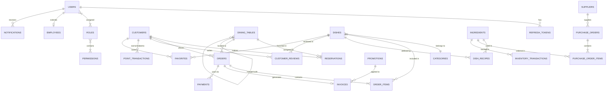

---

### 2.2 Sơ đồ Use Case

> **📸 Ghi chú Giao diện**: Chụp ảnh từ sơ đồ Use Case Diagram bên dưới (render từ Mermaid).

**Bảng mô tả tổng quan Use Case:**

| STT | Mã UC | Tên Use Case | Tác nhân (Actor) | Phân hệ |
| :---: | :--- | :--- | :--- | :--- |
| 1 | UC_AUTH_01 | Đăng ký Tài khoản | Khách vãng lai | Auth |
| 2 | UC_AUTH_02 | Đăng nhập Hệ thống | Tất cả người dùng | Auth |
| 3 | UC_AUTH_03 | Quên mật khẩu & OTP | Tất cả người dùng | Auth |
| 4 | UC_AUTH_04 | Đổi mật khẩu | Tất cả người dùng (đã đăng nhập) | Auth |
| 5 | UC_CUST_01 | Xem & Lọc Thực đơn | Khách hàng, Khách vãng lai | Customer |
| 6 | UC_CUST_02 | Đặt bàn Trực tuyến | Khách hàng, Khách vãng lai | Customer |
| 7 | UC_CUST_03 | Đặt món Giỏ hàng | Khách hàng | Customer |
| 8 | UC_CUST_04 | Xem lịch sử Đơn hàng | Khách hàng | Customer |
| 9 | UC_CUST_05 | Đánh giá Món ăn | Khách hàng | Customer |
| 10 | UC_WAIT_01 | Gọi món tại bàn | Phục vụ, Admin, Manager | Waiter |
| 11 | UC_WAIT_02 | Quản lý Sơ đồ Bàn ăn | Phục vụ, Admin, Manager | Waiter |
| 12 | UC_CHEF_01 | Màn hình Hàng đợi Bếp KDS | Đầu bếp | Chef KDS |
| 13 | UC_CHEF_02 | Xác nhận Nấu & Trừ kho Tự động | Đầu bếp | Chef KDS |
| 14 | UC_CHEF_03 | Thông báo Nấu xong | Đầu bếp | Chef KDS |
| 15 | UC_CASH_01 | Thanh toán POS & Xuất hóa đơn | Thu ngân | Cashier POS |
| 16 | UC_CASH_02 | Áp dụng Mã Voucher | Thu ngân | Cashier POS |
| 17 | UC_CASH_03 | Tích điểm Thành viên | Thu ngân | Cashier POS |
| 18 | UC_ADM_01 | Quản lý Thực đơn & Danh mục | Admin, Manager | Admin |
| 19 | UC_ADM_02 | Quản lý Kho Nguyên liệu | Admin, Manager | Admin |
| 20 | UC_ADM_03 | Quản lý Nhà cung cấp | Admin, Manager | Admin |
| 21 | UC_ADM_04 | Quản lý Nhân sự | Admin, Manager | Admin |
| 22 | UC_ADM_05 | Quản trị Tài khoản & RBAC | Admin | Admin |
| 23 | UC_ADM_06 | Báo cáo Doanh thu & Analytics | Admin, Manager, Cashier | Admin |
| 24 | UC_ADM_07 | Quản lý Đặt bàn (Admin) | Admin | Admin |

**Sơ đồ Use Case tổng thể:**

```mermaid
graph TD
    subgraph "RMS System Boundary"
        UC_Register["UC_AUTH_01: Đăng ký Tài khoản"]
        UC_Login["UC_AUTH_02: Đăng nhập JWT"]
        UC_ForgotPW["UC_AUTH_03: Quên mật khẩu OTP"]
        UC_ChangePW["UC_AUTH_04: Đổi mật khẩu"]

        UC_Menu["UC_CUST_01: Xem & Lọc Thực đơn"]
        UC_Reserve["UC_CUST_02: Đặt bàn Trực tuyến"]
        UC_Cart["UC_CUST_03: Đặt món Giỏ hàng"]
        UC_History["UC_CUST_04: Xem lịch sử Đơn hàng"]
        UC_Review["UC_CUST_05: Đánh giá Món ăn"]

        UC_WaitOrder["UC_WAIT_01: Gọi món tại bàn"]
        UC_WaitTable["UC_WAIT_02: Quản lý Sơ đồ Bàn"]

        UC_ChefKDS["UC_CHEF_01: Hàng đợi Bếp KDS"]
        UC_ChefDeduct["UC_CHEF_02: Xác nhận Nấu & Trừ kho"]
        UC_ChefNotify["UC_CHEF_03: Thông báo Nấu xong"]

        UC_CashPOS["UC_CASH_01: Thanh toán POS & Hóa đơn"]
        UC_CashPromo["UC_CASH_02: Áp dụng Mã Voucher"]
        UC_CashPoint["UC_CASH_03: Tích điểm Thành viên"]

        UC_AdmMenu["UC_ADM_01: Quản lý Thực đơn"]
        UC_AdmInv["UC_ADM_02: Quản lý Kho"]
        UC_AdmSup["UC_ADM_03: Quản lý NCC"]
        UC_AdmEmp["UC_ADM_04: Quản lý Nhân sự"]
        UC_AdmRBAC["UC_ADM_05: RBAC Tài khoản"]
        UC_AdmReport["UC_ADM_06: Báo cáo Doanh thu"]
        UC_AdmReserve["UC_ADM_07: Quản lý Đặt bàn"]
    end

    Guest((Khách Vãng Lai))
    Cust((Khách Hàng))
    Wait((Phục Vụ))
    Chef((Đầu Bếp))
    Cashier((Thu Ngân))
    Mgr((Quản Lý))
    Admin((Admin))

    Guest --> UC_Register
    Guest --> UC_Menu
    Guest --> UC_Reserve

    Cust --> UC_Login
    Cust --> UC_ForgotPW
    Cust --> UC_ChangePW
    Cust --> UC_Menu
    Cust --> UC_Reserve
    Cust --> UC_Cart
    Cust --> UC_History
    Cust --> UC_Review

    Wait --> UC_Login
    Wait --> UC_WaitOrder
    Wait --> UC_WaitTable

    Chef --> UC_Login
    Chef --> UC_ChefKDS
    Chef --> UC_ChefDeduct
    Chef --> UC_ChefNotify

    Cashier --> UC_Login
    Cashier --> UC_CashPOS
    Cashier --> UC_CashPromo
    Cashier --> UC_CashPoint

    Mgr --> UC_Login
    Mgr --> UC_AdmMenu
    Mgr --> UC_AdmInv
    Mgr --> UC_AdmReport

    Admin --> UC_Login
    Admin --> UC_AdmMenu
    Admin --> UC_AdmInv
    Admin --> UC_AdmSup
    Admin --> UC_AdmEmp
    Admin --> UC_AdmRBAC
    Admin --> UC_AdmReport
    Admin --> UC_AdmReserve
```

---

### 2.3 Sơ đồ luồng

> **📸 Ghi chú Giao diện**: Chụp ảnh từ sơ đồ luồng nghiệp vụ bên dưới (render từ Mermaid).

**Bảng mô tả luồng nghiệp vụ chính (End-to-End Business Flow):**

| Bước | Tác nhân | Hành động | Kết quả / Trạng thái |
| :---: | :--- | :--- | :--- |
| 1 | Khách hàng / Phục vụ | Đặt bàn hoặc Chọn món | Đơn hàng `Order` được tạo: `KITCHEN_CONFIRMED` (PA B) |
| 2 | Hệ thống | Gửi đơn xuống Bếp KDS | Đơn hiển thị trên màn hình KDS |
| 3 | Đầu bếp | Xem công thức & Định lượng | Tra cứu `DishRecipe` & `Ingredient` |
| 4 | Đầu bếp | Nhấn "Xác nhận Nấu" | Tự động trừ kho, `cookingStatus` = `COOKING` |
| 5 | Đầu bếp | Nhấn "Nấu xong" | `cookingStatus` = `READY` |
| 6 | Hệ thống | Phát thông báo `StaffNotification` | Thông báo tới Phục vụ / Thu ngân |
| 7 | Phục vụ | Mang món ra bàn | Món ăn phục vụ tới khách |
| 8 | Thu ngân | Áp mã Voucher & Tích điểm | Tính toán chiết khấu & điểm thưởng |
| 9 | Thu ngân | Nhấn "Thanh toán POS" | Tạo `Invoice` PAID & `Payment` SUCCESS |
| 10 | Hệ thống | Cập nhật trạng thái | `Order` = `COMPLETED`, Bàn = `AVAILABLE` |

**Sơ đồ luồng nghiệp vụ End-to-End:**

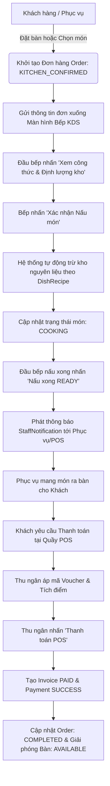

---

### 2.4. Sơ đồ chuyển trạng thái

> **📸 Ghi chú Giao diện**: Chụp ảnh từ 4 sơ đồ trạng thái bên dưới.

**Bảng mô tả trạng thái Đơn hàng (Order Status):**

| STT | Trạng thái | Diễn giải | Chuyển tiếp sang |
| :---: | :--- | :--- | :--- |
| 1 | `PENDING` | (Trạng thái dự phòng/lưu nháp) | `KITCHEN_CONFIRMED`, `CANCELLED` |
| 2 | `KITCHEN_CONFIRMED` | Khách / Phục vụ đặt món (Gửi thẳng bếp) | `COOKING`, `CANCELLED` |
| 3 | `COOKING` | Đầu bếp nhận nấu & trừ kho | `READY` |
| 4 | `READY` | Đầu bếp nấu xong | `SERVED` |
| 5 | `SERVED` | Phục vụ mang món ra bàn | `COMPLETED` |
| 6 | `COMPLETED` | Thu ngân thanh toán thành công | *(Kết thúc)* |
| 7 | `CANCELLED` | Khách / Admin hủy đơn | *(Kết thúc)* |

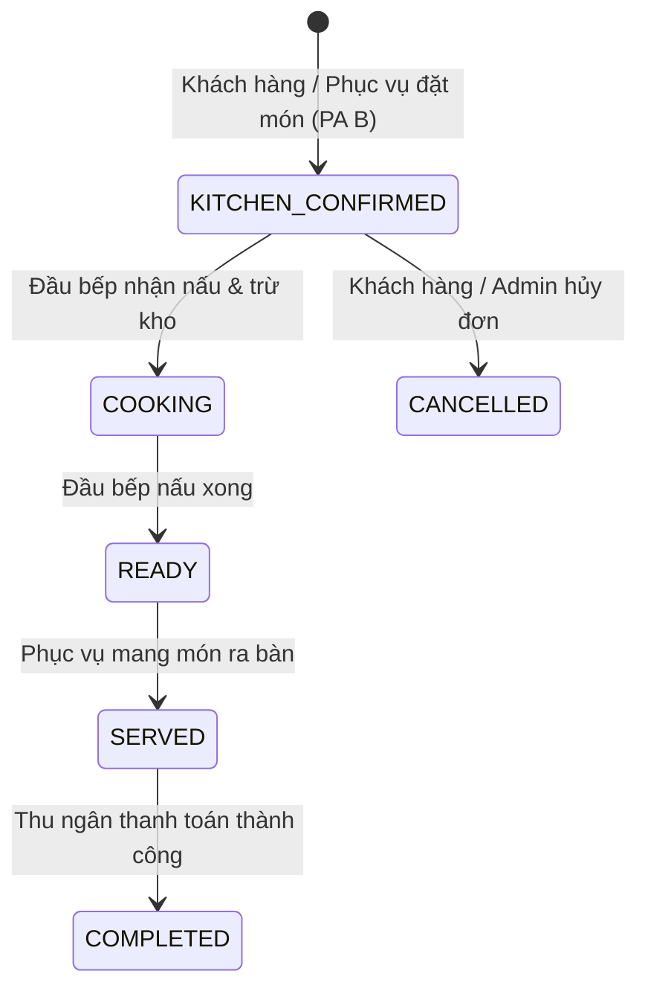

**Bảng mô tả trạng thái Món ăn (OrderItem cookingStatus):**

| STT | Trạng thái | Diễn giải | Chuyển tiếp sang |
| :---: | :--- | :--- | :--- |
| 1 | `PENDING` | Món vừa được thêm vào đơn | `COOKING` |
| 2 | `COOKING` | Đầu bếp xác nhận nấu (Auto trừ kho) | `READY` |
| 3 | `READY` | Đầu bếp bấm nấu xong | `COMPLETED` |
| 4 | `COMPLETED` | Thu ngân / Phục vụ xác nhận phục vụ | *(Kết thúc)* |

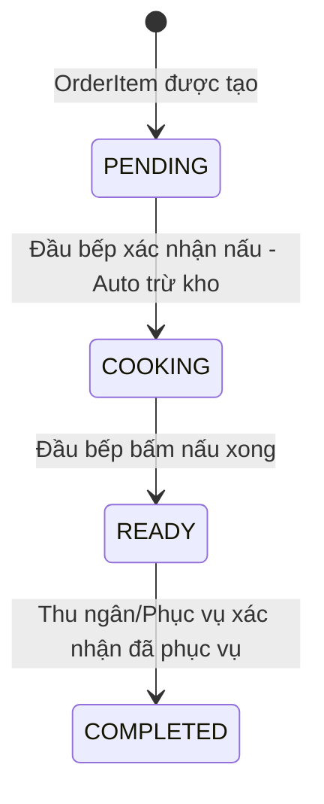

**Bảng mô tả trạng thái Bàn ăn (DiningTable status):**

| STT | Trạng thái | Diễn giải | Chuyển tiếp sang |
| :---: | :--- | :--- | :--- |
| 1 | `AVAILABLE` | Bàn sẵn sàng phục vụ | `RESERVED`, `OCCUPIED`, `MAINTENANCE` |
| 2 | `RESERVED` | Đã đặt trước qua Reservation | `OCCUPIED` |
| 3 | `OCCUPIED` | Khách đang ngồi / Đang có đơn | `DIRTY` |
| 4 | `DIRTY` | Khách rời bàn, cần dọn dẹp | `CLEANING` |
| 5 | `CLEANING` | Đang được dọn dẹp | `AVAILABLE` |
| 6 | `MAINTENANCE` | Đang bảo trì / sửa chữa | `AVAILABLE`, `OUT_OF_SERVICE` |
| 7 | `OUT_OF_SERVICE` | Ngưng phục vụ do hỏng | `AVAILABLE` |

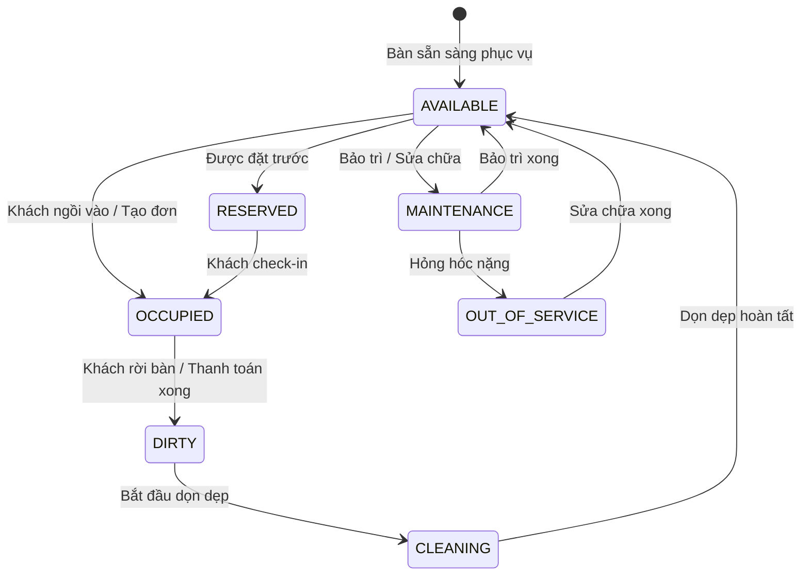

**Bảng mô tả trạng thái Đặt bàn (Reservation status):**

| STT | Trạng thái | Diễn giải | Chuyển tiếp sang |
| :---: | :--- | :--- | :--- |
| 1 | `PENDING` | Khách đặt bàn online | `APPROVED`, `REJECTED`, `CANCELLED` |
| 2 | `APPROVED` | Admin phê duyệt | `CHECKED_IN`, `CANCELLED` |
| 3 | `REJECTED` | Admin từ chối | *(Kết thúc)* |
| 4 | `CHECKED_IN` | Khách tới, Admin check-in | `CHECKED_OUT` |
| 5 | `CHECKED_OUT` | Khách ra về | *(Kết thúc)* |
| 6 | `CANCELLED` | Khách / Admin hủy | *(Kết thúc)* |

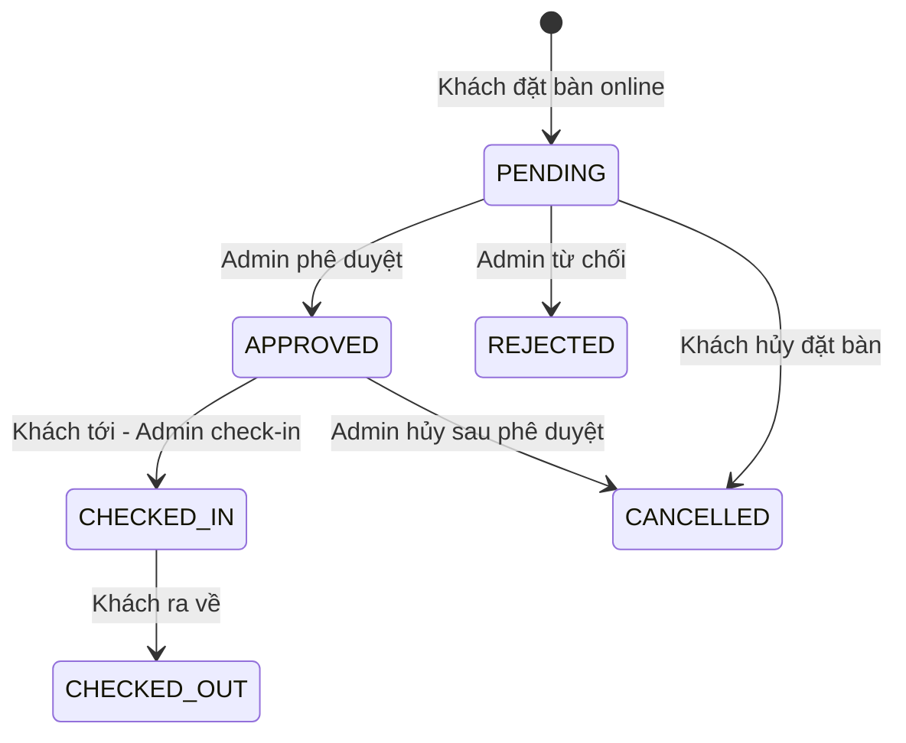

---

### 2.5. Phân quyền

#### 2.5.1. Phân quyền chức năng

**Hệ thống định nghĩa 6 vai trò chính (Role):**

| Mã Vai trò | Tên hiển thị | Mô tả ngắn |
| :--- | :--- | :--- |
| `ROLE_CUSTOMER` | Khách hàng | Đăng ký, đặt bàn, gọi món, xem lịch sử, đánh giá |
| `ROLE_WAITER` | Phục vụ | Quản lý sơ đồ bàn, tạo đơn tại bàn, gửi bếp |
| `ROLE_CHEF` | Đầu bếp KDS | Xem KDS, đối soát công thức, nấu & trừ kho |
| `ROLE_CASHIER` | Thu ngân POS | Thanh toán, voucher, tích điểm, xuất hóa đơn |
| `ROLE_MANAGER` | Quản lý | Quản lý thực đơn, kho, NCC, báo cáo |
| `ROLE_ADMIN` | Quản trị viên | Toàn quyền hệ thống, RBAC, quản trị user |

**Ma trận phân quyền chức năng chi tiết:**

| Nhóm Chức Năng | `CUSTOMER` | `WAITER` | `CHEF` | `CASHIER` | `MANAGER` | `ADMIN` |
| :--- | :---: | :---: | :---: | :---: | :---: | :---: |
| Đăng ký / Đăng nhập JWT | ✅ | ✅ | ✅ | ✅ | ✅ | ✅ |
| Quên MK / Đổi MK / Hồ sơ | ✅ | ✅ | ✅ | ✅ | ✅ | ✅ |
| Tra cứu Thực đơn & Giá | ✅ | ✅ | ✅ | ✅ | ✅ | ✅ |
| Đặt bàn ăn Trực tuyến | ✅ | ✅ | — | — | ✅ | ✅ |
| Đặt món Giỏ hàng | ✅ | ✅ | — | — | ✅ | ✅ |
| Xem lịch sử Đơn hàng | ✅ | — | — | — | ✅ | ✅ |
| Đánh giá Món ăn | ✅ | — | — | — | — | ✅ |
| Quản lý Sơ đồ Bàn & Gộp bàn | — | ✅ | — | — | ✅ | ✅ |
| Gọi món tại bàn cho Khách | — | ✅ | — | — | ✅ | ✅ |
| Điều hành Bếp KDS & Trừ kho | — | — | ✅ | — | ✅ | ✅ |
| Gửi thông báo StaffNotification | — | ✅ | ✅ | ✅ | ✅ | ✅ |
| Thanh toán POS & Xuất Hóa đơn | — | — | — | ✅ | ✅ | ✅ |
| Áp dụng Voucher & Tích điểm | — | — | — | ✅ | ✅ | ✅ |
| Quản lý Thực đơn Món ăn & Danh mục | — | — | — | — | ✅ | ✅ |
| Quản lý Kho Nguyên liệu | — | — | — | — | ✅ | ✅ |
| Quản lý Nhà cung cấp | — | — | — | — | ✅ | ✅ |
| Quản lý Nhân sự & Lương | — | — | — | — | ✅ | ✅ |
| Báo cáo Doanh thu & Analytics | — | — | — | ✅ | ✅ | ✅ |
| Quản lý Đặt bàn (Phê duyệt/Check-in) | — | — | — | — | — | ✅ |
| Quản trị User, Roles & Permissions | — | — | — | — | — | **FULL** |

#### 2.5.2. Phân quyền dữ liệu

| Vai trò | Phạm vi dữ liệu truy cập |
| :--- | :--- |
| `CUSTOMER` | Chỉ xem dữ liệu của chính mình (đơn hàng, đặt bàn, đánh giá, yêu thích cá nhân) |
| `WAITER` | Xem tất cả bàn ăn và đơn hàng tại bàn được phụ trách |
| `CHEF` | Xem tất cả đơn hàng trong hàng đợi bếp KDS, tồn kho nguyên liệu |
| `CASHIER` | Xem tất cả đơn chờ thanh toán, hóa đơn, thông tin khách hàng (tra cứu điểm) |
| `MANAGER` | Xem toàn bộ dữ liệu quản lý (thực đơn, kho, NCC, nhân sự, báo cáo) |
| `ADMIN` | Truy cập toàn bộ dữ liệu hệ thống không giới hạn |

---

### 2.6. Site Map

> **📸 Ghi chú Giao diện**: Chụp ảnh từ sơ đồ Site Map bên dưới.

```mermaid
graph TD
    ROOT["RMS System"] --> AUTH["Auth Module"]
    ROOT --> CUST["Customer Portal"]
    ROOT --> WAIT["Waiter Portal"]
    ROOT --> CHEF_M["Chef KDS Portal"]
    ROOT --> CASH_M["Cashier POS Portal"]
    ROOT --> ADMIN_M["Admin/Manager Portal"]

    AUTH --> LOGIN["/login - Đăng nhập"]
    AUTH --> REG["/register - Đăng ký"]
    AUTH --> FORGOT["/forgot-password - Quên MK"]

    CUST --> HOME["/ , /home - Trang chủ"]
    CUST --> MENU["/menu - Thực đơn"]
    CUST --> RESV["/reservation - Đặt bàn"]
    CUST --> CHECKOUT["/checkout - Giỏ hàng"]
    CUST --> ORDERS["/orders - Lịch sử đơn"]
    CUST --> FAV["/favorites - Yêu thích"]
    CUST --> REV["/reviews - Đánh giá"]
    CUST --> PROF["/profile - Hồ sơ"]

    WAIT --> WAIT_REDIR["/waiter → /admin"]

    CHEF_M --> C_DASH["/chef/dashboard"]
    CHEF_M --> C_ORD["/chef/orders"]
    CHEF_M --> C_QUEUE["/chef/queue"]
    CHEF_M --> C_COMP["/chef/completed"]
    CHEF_M --> C_INV["/chef/inventory"]
    CHEF_M --> C_NOTI["/chef/notifications"]
    CHEF_M --> C_PROF["/chef/profile"]

    CASH_M --> CA_DASH["/cashier/dashboard"]
    CASH_M --> CA_ORD["/cashier/orders"]
    CASH_M --> CA_PAY["/cashier/payments"]
    CASH_M --> CA_INV_P["/cashier/invoices"]
    CASH_M --> CA_PROMO["/cashier/promotions"]
    CASH_M --> CA_CUST["/cashier/customers"]
    CASH_M --> CA_RPT["/cashier/reports"]
    CASH_M --> CA_NOTI["/cashier/notifications"]
    CASH_M --> CA_PROF["/cashier/profile"]

    ADMIN_M --> AD_DASH["/admin - Dashboard tích hợp"]
```

---

## PHẦN 3: CHỨC NĂNG

**Danh sách chức năng tổng hợp:**

| STT | Mã | Tên chức năng | Phân hệ | Tác nhân (Actor) |
| :---: | :--- | :--- | :--- | :--- |
| 1 | UC_AUTH_01 | Đăng ký Tài khoản | Auth Module | Khách vãng lai |
| 2 | UC_AUTH_02 | Đăng nhập Hệ thống | Auth Module | Tất cả người dùng |
| 3 | UC_AUTH_03 | Quên mật khẩu & OTP | Auth Module | Tất cả người dùng |
| 4 | UC_AUTH_04 | Đổi mật khẩu | Auth Module | Người dùng đã đăng nhập |
| 5 | UC_CUST_01 | Xem & Lọc Thực đơn | Customer Portal | Khách hàng, Khách vãng lai |
| 6 | UC_CUST_02 | Đặt bàn Trực tuyến | Customer Portal | Khách hàng, Khách vãng lai |
| 7 | UC_CUST_03 | Đặt món Giỏ hàng | Customer Portal | Khách hàng |
| 8 | UC_CUST_04 | Xem lịch sử Đơn hàng | Customer Portal | Khách hàng |
| 9 | UC_CUST_05 | Đánh giá Món ăn | Customer Portal | Khách hàng |
| 10 | UC_WAIT_01 | Gọi món tại bàn | Waiter Operations | Phục vụ, Admin, Manager |
| 11 | UC_WAIT_02 | Quản lý Sơ đồ Bàn ăn | Waiter Operations | Phục vụ, Admin, Manager |
| 12 | UC_CHEF_01 | Màn hình Hàng đợi Bếp KDS | Chef KDS Module | Đầu bếp |
| 13 | UC_CHEF_02 | Xác nhận Nấu & Trừ kho Tự động | Chef KDS Module | Đầu bếp |
| 14 | UC_CHEF_03 | Thông báo Nấu xong | Chef KDS Module | Đầu bếp |
| 15 | UC_CASH_01 | Thanh toán POS & Xuất hóa đơn | Cashier POS Module | Thu ngân |
| 16 | UC_CASH_02 | Áp dụng Mã Voucher | Cashier POS Module | Thu ngân |
| 17 | UC_CASH_03 | Tích điểm Thành viên | Cashier POS Module | Thu ngân |
| 18 | UC_ADM_01 | Quản lý Thực đơn & Danh mục | Admin Portal | Admin, Manager |
| 19 | UC_ADM_02 | Quản lý Kho Nguyên liệu | Admin Portal | Admin, Manager |
| 20 | UC_ADM_03 | Quản lý Nhà cung cấp | Admin Portal | Admin, Manager |
| 21 | UC_ADM_04 | Quản lý Nhân sự | Admin Portal | Admin, Manager |
| 22 | UC_ADM_05 | Quản trị Tài khoản & RBAC | Admin Portal | Admin |
| 23 | UC_ADM_06 | Báo cáo Doanh thu & Analytics | Admin Portal | Admin, Manager, Cashier |
| 24 | UC_ADM_07 | Quản lý Đặt bàn (Admin) | Admin Portal | Admin |

---

### 3.1. Đăng ký Tài khoản

#### 3.1.1. Đặc tả Use Case

| Thuộc tính | Nội dung |
| :--- | :--- |
| **Use Case ID** | `UC_AUTH_01` |
| **Mô tả** | Người dùng mới tạo tài khoản hệ thống với vai trò mặc định Khách hàng |
| **Tác nhân (Actor(s))** | Khách vãng lai (Chưa đăng nhập) |
| **Sự ưu tiên (Priority)** | Cao (High) |
| **Trigger** | Người dùng truy cập trang `/register` và nhấn "Đăng ký" |
| **Điều kiện cần (Pre-Condition)** | 1. Hệ thống hoạt động bình thường. 2. Email chưa được đăng ký trong hệ thống. |
| **Điều kiện sau (Post-Condition(s))** | 1. Bản ghi `User` mới được tạo trong CSDL với `enabled = true`. 2. Vai trò `ROLE_CUSTOMER` được tự động gán. 3. Bản ghi `Customer` mới được tạo liên kết. |
| **Luồng cơ bản (Basic Flow)** | 1. Người dùng mở trang `/register`. 2. Nhập: Họ tên, Email, Mật khẩu, Xác nhận mật khẩu, SĐT. 3. Nhấn nút "Đăng ký". 4. Frontend gửi `POST /api/auth/register` với `RegisterRequest`. 5. Backend `AuthService.register()` kiểm tra Email trùng lặp. 6. Backend mã hóa mật khẩu bằng `BCryptPasswordEncoder`. 7. Backend tạo `User` + gán `ROLE_CUSTOMER` + tạo `Customer`. 8. Trả về `HTTP 200 OK` - thông báo đăng ký thành công. 9. Frontend chuyển hướng về trang `/login`. |
| **Luồng thay thế (Alternative Flow)** | Không có |
| **Luồng ngoại lệ (Exception Flow)** | 1. Email đã tồn tại → `HTTP 400 Bad Request` + "Email đã được sử dụng!". 2. Mật khẩu < 6 ký tự → Validation lỗi phía Frontend. 3. Xác nhận mật khẩu không khớp → Frontend hiển thị lỗi. |
| **Ràng buộc (Business Rules)** | 1. Email phải đúng định dạng `@NotBlank`, `@Email`. 2. Mật khẩu tối thiểu 6 ký tự `@Size(min=6)`. 3. Họ tên không được trống `@NotBlank`. 4. Vai trò mặc định: `ROLE_CUSTOMER`. |
| **Yêu cầu phi chức năng** | 1. Mật khẩu phải được mã hóa BCrypt trước khi lưu. 2. API phản hồi < 2 giây. |

#### 3.1.2. Sơ đồ luồng chi tiết

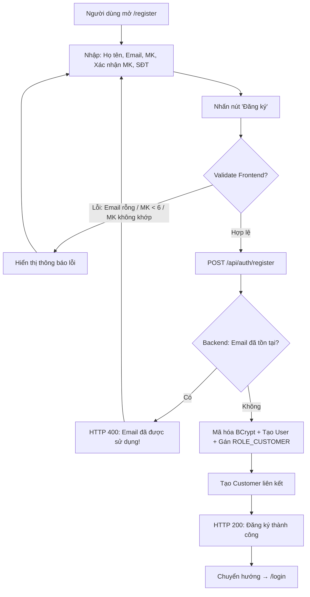

#### 3.1.3. Giao diện

> **📸 Chụp màn hình**: Trang `/register` (`Register.jsx`) - Form đăng ký tài khoản với các trường: Họ tên, Email, Mật khẩu, Xác nhận mật khẩu, Số điện thoại.

#### 3.1.4. Mô tả chi tiết

| Tên tiếng Việt | Tên tiếng Anh | Loại | Bắt buộc? | Mô tả |
| :--- | :--- | :--- | :---: | :--- |
| Họ và tên | `fullName` | VARCHAR(100) | ✅ | Họ tên đầy đủ người dùng |
| Email | `email` | VARCHAR(100) | ✅ | Địa chỉ Email dùng để đăng nhập, định dạng `@Email` |
| Mật khẩu | `password` | VARCHAR(255) | ✅ | Tối thiểu 6 ký tự, lưu dạng BCrypt Hash |
| Xác nhận mật khẩu | `confirmPassword` | — (Frontend only) | ✅ | Phải trùng khớp với Mật khẩu |
| Số điện thoại | `phone` | VARCHAR(20) | ❌ | Số điện thoại liên hệ |

---

### 3.2. Đăng nhập Hệ thống

#### 3.2.1. Đặc tả Use Case

| Thuộc tính | Nội dung |
| :--- | :--- |
| **Use Case ID** | `UC_AUTH_02` |
| **Mô tả** | Người dùng xác thực Email/Mật khẩu để nhận JWT Token truy cập hệ thống |
| **Tác nhân (Actor(s))** | Tất cả người dùng: Customer, Waiter, Chef, Cashier, Manager, Admin |
| **Sự ưu tiên (Priority)** | Rất cao (Critical) |
| **Trigger** | Người dùng truy cập `/login` và nhấn "Đăng nhập" |
| **Điều kiện cần (Pre-Condition)** | 1. Tài khoản đã đăng ký. 2. Tài khoản `enabled = true`. |
| **Điều kiện sau (Post-Condition(s))** | 1. JWT `accessToken` (24h) và `refreshToken` được cấp. 2. `RefreshToken` lưu vào CSDL. 3. Frontend lưu Token vào `AuthContext` & `LocalStorage`. 4. Chuyển hướng tới Dashboard tương ứng Role. |
| **Luồng cơ bản (Basic Flow)** | 1. Người dùng mở `/login`, nhập Email và Password. 2. Nhấn nút "Đăng nhập". 3. Frontend gửi `POST /api/auth/login` với `LoginRequest`. 4. Backend `AuthService.login()` tìm User theo Email. 5. Backend `BCryptPasswordEncoder.matches()` đối soát mật khẩu. 6. Backend sinh `accessToken` JWT (24h) + `refreshToken`. 7. Backend lưu `RefreshToken` vào CSDL. 8. Trả về `HTTP 200` + `AuthResponse` (token, roles, user info). 9. Frontend lưu Token → chuyển hướng theo Role. |
| **Luồng thay thế (Alternative Flow)** | Không có |
| **Luồng ngoại lệ (Exception Flow)** | 1. Email không tồn tại / MK sai → `HTTP 401 Unauthorized` + "Email hoặc mật khẩu không chính xác!". 2. Tài khoản bị khóa (`enabled=false`) → `HTTP 403 Forbidden` + "Tài khoản đã bị vô hiệu hóa!". |
| **Ràng buộc (Business Rules)** | 1. Email `@NotBlank`, `@Email`. 2. Password `@NotBlank`, `@Size(min=6)`. 3. Token JWT hết hạn sau 24 giờ. |
| **Yêu cầu phi chức năng** | 1. Xác thực Stateless (không lưu session). 2. Mật khẩu so sánh bằng BCrypt. 3. Phản hồi < 1 giây. |

#### 3.2.2. Sơ đồ luồng chi tiết

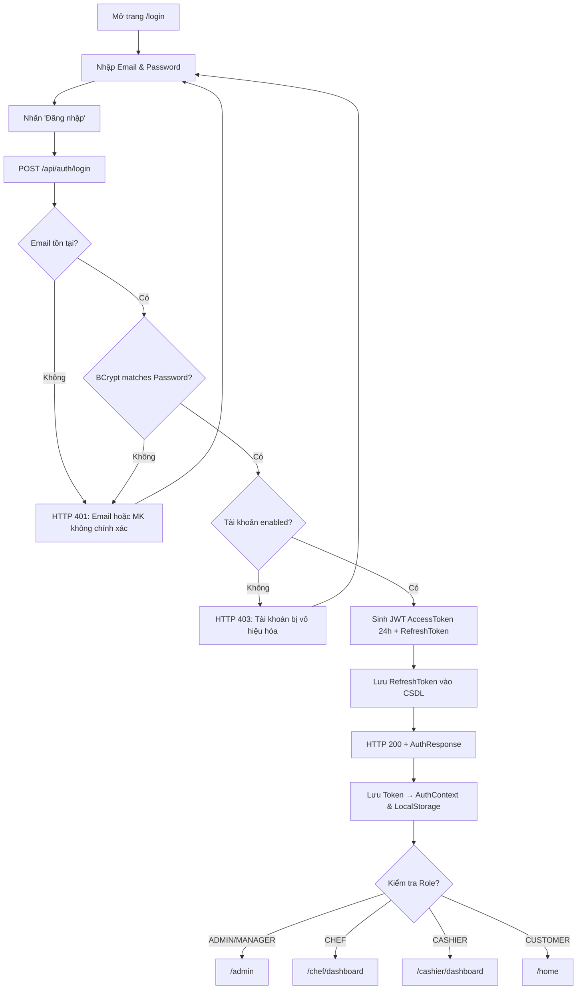

**Biểu đồ tuần tự (Sequence Diagram) - Đăng nhập JWT:**

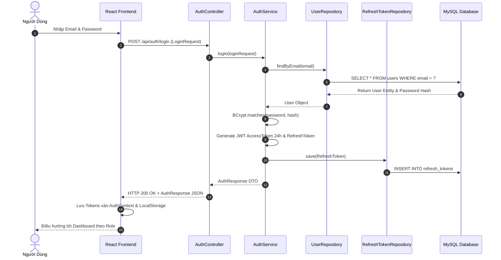

#### 3.2.3. Giao diện

> **📸 Chụp màn hình**: Trang `/login` (`Login.jsx`) - Form đăng nhập Email/Password với nút "Đăng nhập" và link "Quên mật khẩu".

#### 3.2.4. Mô tả chi tiết

| Tên tiếng Việt | Tên tiếng Anh | Loại | Bắt buộc? | Mô tả |
| :--- | :--- | :--- | :---: | :--- |
| Email | `email` | VARCHAR(100) | ✅ | Email đăng nhập, định dạng `@Email` |
| Mật khẩu | `password` | VARCHAR(255) | ✅ | Tối thiểu 6 ký tự |

---

### 3.3. Quên mật khẩu & Xác thực OTP

#### 3.3.1. Đặc tả Use Case

| Thuộc tính | Nội dung |
| :--- | :--- |
| **Use Case ID** | `UC_AUTH_03` |
| **Mô tả** | Người dùng khôi phục mật khẩu thông qua mã OTP gửi qua Email |
| **Tác nhân (Actor(s))** | Tất cả người dùng đã đăng ký |
| **Sự ưu tiên (Priority)** | Cao (High) |
| **Trigger** | Người dùng nhấn link "Quên mật khẩu?" trên trang `/login` |
| **Điều kiện cần (Pre-Condition)** | Email đã tồn tại trong hệ thống |
| **Điều kiện sau (Post-Condition(s))** | Mật khẩu được cập nhật thành công |
| **Luồng cơ bản (Basic Flow)** | 1. Người dùng mở `/forgot-password`, nhập Email. 2. Frontend gửi `POST /api/auth/forgot-password`. 3. Backend sinh OTP 6 chữ số, lưu `otpCode` và `otpExpiry` vào bảng `users`. 4. Backend gửi Email chứa mã OTP qua `MailService`. 5. Người dùng nhập mã OTP nhận được. 6. Frontend gửi `POST /api/auth/verify-otp` xác thực OTP. 7. Người dùng nhập Mật khẩu mới + Xác nhận. 8. Frontend gửi `POST /api/auth/reset-password`. 9. Backend cập nhật mật khẩu mới (BCrypt) + xóa OTP. |
| **Luồng ngoại lệ (Exception Flow)** | 1. Email không tồn tại → Thông báo lỗi. 2. OTP sai hoặc hết hạn → Yêu cầu gửi lại. 3. Mật khẩu mới < 6 ký tự → Validation lỗi. |
| **Ràng buộc (Business Rules)** | OTP có thời hạn giới hạn, chỉ sử dụng 1 lần. |

#### 3.3.2. Sơ đồ luồng chi tiết

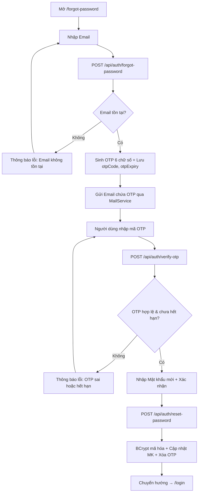

**Biểu đồ tuần tự (Sequence Diagram) - Quên mật khẩu OTP:**

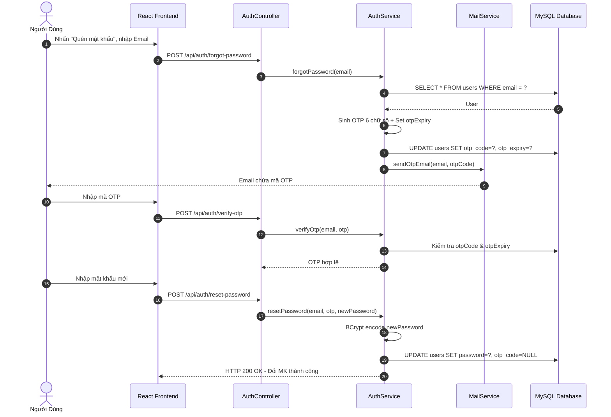

#### 3.3.3. Giao diện

> **📸 Chụp màn hình**: Trang `/forgot-password` (`ForgotPassword.jsx`) - Form 3 bước: Nhập Email → Nhập OTP → Nhập mật khẩu mới.

#### 3.3.4. Mô tả chi tiết

| Tên tiếng Việt | Tên tiếng Anh | Loại | Bắt buộc? | Mô tả |
| :--- | :--- | :--- | :---: | :--- |
| Email | `email` | VARCHAR(100) | ✅ | Email tài khoản cần khôi phục |
| Mã OTP | `otp` | VARCHAR(6) | ✅ | Mã xác thực 6 chữ số gửi qua Email |
| Mật khẩu mới | `newPassword` | VARCHAR(255) | ✅ | Tối thiểu 6 ký tự |
| Xác nhận MK mới | `confirmPassword` | — (Frontend) | ✅ | Phải trùng với mật khẩu mới |

---

### 3.4. Đổi mật khẩu

#### 3.4.1. Đặc tả Use Case

| Thuộc tính | Nội dung |
| :--- | :--- |
| **Use Case ID** | `UC_AUTH_04` |
| **Mô tả** | Người dùng đã đăng nhập đổi mật khẩu tài khoản |
| **Tác nhân (Actor(s))** | Tất cả người dùng đã đăng nhập (Authenticated) |
| **Sự ưu tiên (Priority)** | Trung bình (Medium) |
| **Trigger** | Người dùng nhấn "Đổi mật khẩu" trên trang Hồ sơ |
| **Điều kiện cần (Pre-Condition)** | Người dùng đã đăng nhập (có JWT Token hợp lệ) |
| **Điều kiện sau (Post-Condition(s))** | Mật khẩu được cập nhật. Phiên đăng nhập hiện tại vẫn giữ nguyên. |
| **Luồng cơ bản (Basic Flow)** | 1. Người dùng nhập Mật khẩu cũ, Mật khẩu mới, Xác nhận MK mới. 2. Frontend gửi `POST /api/auth/change-password` với `ChangePasswordRequest`. 3. Backend kiểm tra mật khẩu cũ bằng BCrypt. 4. Backend mã hóa và cập nhật mật khẩu mới. 5. Trả về `HTTP 200 OK`. |
| **Luồng ngoại lệ (Exception Flow)** | 1. MK cũ không đúng → `HTTP 400` + "Mật khẩu cũ không đúng!". 2. MK mới < 6 ký tự → Validation lỗi. |
| **Ràng buộc (Business Rules)** | Mật khẩu cũ phải chính xác trước khi đổi mới. |

#### 3.4.2. Sơ đồ luồng chi tiết

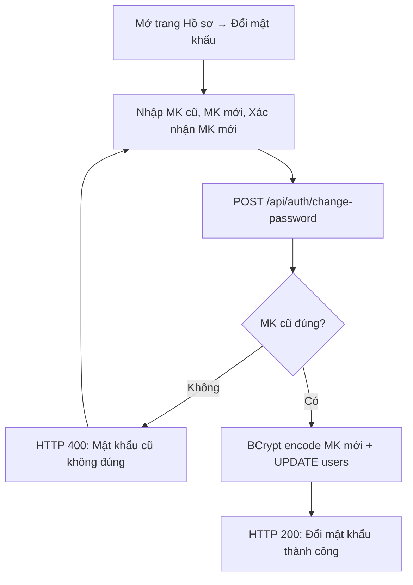

#### 3.4.3. Giao diện

> **📸 Chụp màn hình**: Phần đổi mật khẩu trên trang Hồ sơ cá nhân (`CustomerProfilePage.jsx` hoặc `ChefProfilePage.jsx`).

#### 3.4.4. Mô tả chi tiết

| Tên tiếng Việt | Tên tiếng Anh | Loại | Bắt buộc? | Mô tả |
| :--- | :--- | :--- | :---: | :--- |
| Mật khẩu cũ | `oldPassword` | VARCHAR(255) | ✅ | Mật khẩu hiện tại |
| Mật khẩu mới | `newPassword` | VARCHAR(255) | ✅ | Tối thiểu 6 ký tự |
| Xác nhận MK mới | `confirmPassword` | VARCHAR(255) | ✅ | Phải trùng với MK mới |

---

### 3.5. Xem & Lọc Thực đơn

#### 3.5.1. Đặc tả Use Case

| Thuộc tính | Nội dung |
| :--- | :--- |
| **Use Case ID** | `UC_CUST_01` |
| **Mô tả** | Khách hàng tra cứu thực đơn nhà hàng với bộ lọc đa chiều |
| **Tác nhân (Actor(s))** | Khách hàng (`ROLE_CUSTOMER`), Khách vãng lai |
| **Sự ưu tiên (Priority)** | Rất cao (Critical) |
| **Trigger** | Truy cập đường dẫn `/menu` |
| **Điều kiện cần (Pre-Condition)** | Hệ thống hoạt động. Menu đã được Quản lý cập nhật sẵn. |
| **Điều kiện sau (Post-Condition(s))** | Danh sách món ăn hiển thị theo bộ lọc đã chọn |
| **Luồng cơ bản (Basic Flow)** | 1. Khách mở trang `/menu`. 2. Frontend gọi `GET /api/public/menu?page=0&size=12`. 3. Backend `CustomerMenuService.searchMenu()` truy vấn phân trang. 4. Trả về `Page<Dish>` phân trang. 5. Khách nhập từ khóa / chọn danh mục / chọn khoảng giá. 6. Frontend gọi lại API với params mới. 7. Kết quả cập nhật realtime. |
| **Luồng thay thế (Alternative Flow)** | Lọc: món mới (`isNew=true`), bán chạy (`isBestSeller=true`), đang giảm giá (`hasDiscount=true`) |
| **Luồng ngoại lệ (Exception Flow)** | Không có kết quả → Hiển thị "Không tìm thấy món ăn phù hợp" |
| **Ràng buộc (Business Rules)** | Chỉ hiển thị món có `available = true` và `status = ACTIVE`. |
| **Yêu cầu phi chức năng** | Phân trang tối đa 12 món/trang. Tải trang < 2 giây. |

#### 3.5.2. Sơ đồ luồng chi tiết

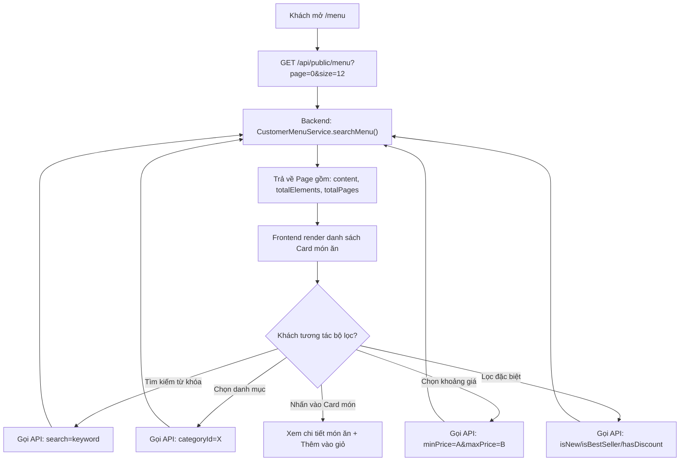

#### 3.5.3. Giao diện

> **📸 Chụp màn hình**: Trang `/menu` (`CustomerMenuPage.jsx`) - Giao diện hiển thị danh sách Card món ăn dạng Grid, thanh tìm kiếm, bộ lọc danh mục (Category), khoảng giá, phân trang.

#### 3.5.4. Mô tả chi tiết

| Tên tiếng Việt | Tên tiếng Anh | Loại | Bắt buộc? | Mô tả |
| :--- | :--- | :--- | :---: | :--- |
| Từ khóa tìm kiếm | `search` | String (QueryParam) | ❌ | Tìm theo tên món ăn |
| Danh mục | `categoryId` | Long (QueryParam) | ❌ | Lọc theo ID danh mục |
| Giá tối thiểu | `minPrice` | BigDecimal (QueryParam) | ❌ | Giá từ bao nhiêu |
| Giá tối đa | `maxPrice` | BigDecimal (QueryParam) | ❌ | Giá đến bao nhiêu |
| Món mới | `isNew` | Boolean (QueryParam) | ❌ | Lọc món mới ra mắt |
| Bán chạy | `isBestSeller` | Boolean (QueryParam) | ❌ | Lọc món bán chạy nhất |
| Đang giảm giá | `hasDiscount` | Boolean (QueryParam) | ❌ | Lọc món đang khuyến mãi |
| Trang | `page` | Integer (QueryParam) | ❌ | Số trang (mặc định: 0) |
| Kích thước trang | `size` | Integer (QueryParam) | ❌ | Số món/trang (mặc định: 12) |

---

### 3.6. Đặt bàn Trực tuyến

#### 3.6.1. Đặc tả Use Case

| Thuộc tính | Nội dung |
| :--- | :--- |
| **Use Case ID** | `UC_CUST_02` |
| **Mô tả** | Khách hàng đặt trước bàn ăn theo thời gian và số lượng khách |
| **Tác nhân (Actor(s))** | Khách hàng (`ROLE_CUSTOMER`), Khách vãng lai |
| **Sự ưu tiên (Priority)** | Cao (High) |
| **Trigger** | Nhấn "Xác nhận Đặt bàn" trên trang `/reservation` |
| **Điều kiện cần (Pre-Condition)** | Có ít nhất 1 bàn ăn `AVAILABLE` |
| **Điều kiện sau (Post-Condition(s))** | Bản ghi `Reservation` mới trạng thái `PENDING` |
| **Luồng cơ bản (Basic Flow)** | 1. Mở `/reservation`. 2. `GET /api/public/reservations/tables` lấy sơ đồ bàn. 3. Nhập: Tên, SĐT, Email, Số người, Thời gian, Chọn bàn. 4. `POST /api/public/reservations`. 5. Backend tạo `Reservation` trạng thái `PENDING`. 6. Thông báo xác nhận. |
| **Luồng thay thế (Alternative Flow)** | Hủy đặt bàn: `PUT /{id}/cancel`. Đổi lịch: `PUT /{id}/reschedule`. |
| **Luồng ngoại lệ (Exception Flow)** | 1. Thời gian quá khứ → Validation lỗi. 2. Số người < 1 → Validation lỗi. |
| **Ràng buộc (Business Rules)** | 1. Thời gian đặt phải trong tương lai. 2. Số người ≥ 1. 3. Trạng thái ban đầu: `PENDING` (cần Admin phê duyệt). |

#### 3.6.2. Sơ đồ luồng chi tiết

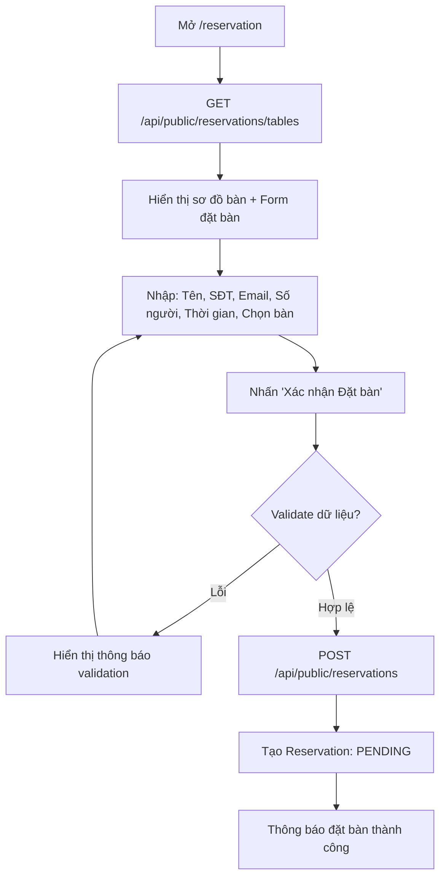

**Biểu đồ tuần tự - Đặt bàn trực tuyến:**

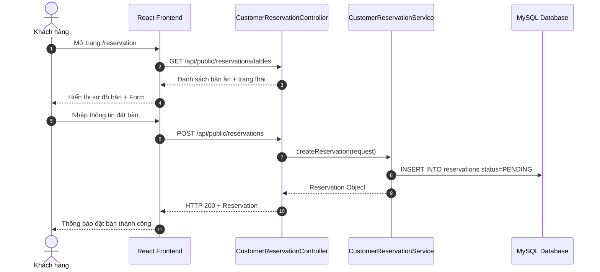

#### 3.6.3. Giao diện

> **📸 Chụp màn hình**: Trang `/reservation` (`CustomerReservationPage.jsx`) - Form đặt bàn trực tuyến hiển thị sơ đồ bàn ăn trực quan, bộ chọn ngày giờ, số người.

#### 3.6.4. Mô tả chi tiết

| Tên tiếng Việt | Tên tiếng Anh | Loại | Bắt buộc? | Mô tả |
| :--- | :--- | :--- | :---: | :--- |
| Tên khách hàng | `customerName` | VARCHAR(100) | ✅ | Họ tên người đặt |
| Số điện thoại | `customerPhone` | VARCHAR(30) | ✅ | SĐT liên hệ |
| Email | `customerEmail` | VARCHAR(100) | ❌ | Email nhận xác nhận |
| Chi nhánh | `branch` | VARCHAR(100) | ❌ | Mặc định: "L'Étoile Tràng Tiền - Hà Nội" |
| Số người | `numberOfPeople` | Integer | ✅ | Tối thiểu 1 (Min=1) |
| Thời gian đặt | `reservationTime` | DateTime | ✅ | Phải trong tương lai |
| Bàn ăn | `diningTableId` | Long | ❌ | Chọn bàn mong muốn |
| Ghi chú | `notes` | TEXT | ❌ | Yêu cầu đặc biệt |

---

### 3.7. Đặt món Giỏ hàng

#### 3.7.1. Đặc tả Use Case

| Thuộc tính | Nội dung |
| :--- | :--- |
| **Use Case ID** | `UC_CUST_03` |
| **Mô tả** | Khách hàng chọn món ăn vào giỏ hàng, chọn bàn / mang về và tạo đơn hàng |
| **Tác nhân (Actor(s))** | Khách hàng (`ROLE_CUSTOMER`) |
| **Sự ưu tiên (Priority)** | Rất cao (Critical) |
| **Trigger** | Khách nhấn "Đặt món" trên trang `/checkout` |
| **Điều kiện cần (Pre-Condition)** | 1. Đã đăng nhập. 2. Giỏ hàng có ít nhất 1 món. |
| **Điều kiện sau (Post-Condition(s))** | 1. `Order` trạng thái `PENDING` được tạo. 2. `OrderItem` cho từng món được tạo. 3. Bàn ăn chuyển sang `OCCUPIED` (nếu ăn tại chỗ). |
| **Luồng cơ bản (Basic Flow)** | 1. Khách thêm món từ `/menu` vào Giỏ hàng (CartContext). 2. Khách mở `/checkout`. 3. Chọn loại: Ăn tại chỗ (`diningTableId`) / Mang về. 4. Nhấn "Đặt món". 5. `POST /api/public/orders`. 6. Backend tạo `Order` + `OrderItem[]`. 7. Trả về `OrderHistoryDTO`. |
| **Luồng ngoại lệ (Exception Flow)** | 1. Giỏ hàng rỗng → Thông báo lỗi. 2. Bàn không khả dụng → Yêu cầu chọn bàn khác. |
| **Ràng buộc (Business Rules)** | 1. Số lượng mỗi món ≥ 1. 2. Giỏ hàng lưu trong `CartContext` (Frontend). 3. `cookingStatus` khởi tạo: `PENDING`. |

#### 3.7.2. Sơ đồ luồng chi tiết

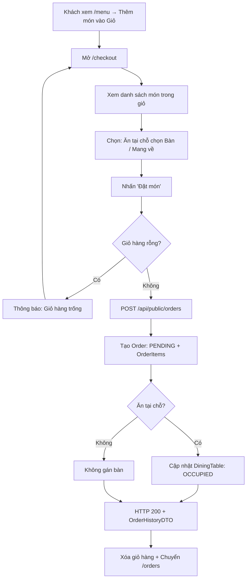

**Biểu đồ hoạt động (Activity Diagram) - Đặt món:**

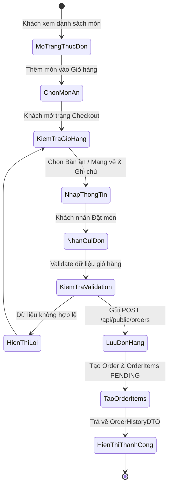

#### 3.7.3. Giao diện

> **📸 Chụp màn hình 1**: Component `CartDrawer.jsx` - Drawer giỏ hàng hiển thị danh sách món, số lượng, đơn giá, tổng tiền.
> **📸 Chụp màn hình 2**: Trang `/checkout` (`CustomerCheckoutPage.jsx`) - Màn hình xác nhận giỏ hàng, chọn bàn ăn / mang về.

#### 3.7.4. Mô tả chi tiết

| Tên tiếng Việt | Tên tiếng Anh | Loại | Bắt buộc? | Mô tả |
| :--- | :--- | :--- | :---: | :--- |
| Mã bàn ăn | `diningTableId` | Long | ❌ | Để trống nếu Mang về |
| Loại đơn | `orderType` | String | ✅ | `DINE_IN` hoặc `TAKE_AWAY` |
| Ghi chú | `note` | TEXT | ❌ | Ghi chú yêu cầu đặc biệt |
| Danh sách món | `items` | Array | ✅ | Mảng {dishId, quantity, note} |
| → Mã món ăn | `items[].dishId` | Long | ✅ | ID món ăn |
| → Số lượng | `items[].quantity` | Integer | ✅ | Tối thiểu 1 |
| → Ghi chú món | `items[].note` | String | ❌ | Ghi chú riêng từng món |

---

### 3.8. Xem lịch sử Đơn hàng

#### 3.8.1. Đặc tả Use Case

| Thuộc tính | Nội dung |
| :--- | :--- |
| **Use Case ID** | `UC_CUST_04` |
| **Mô tả** | Khách hàng xem danh sách đơn hàng đã đặt và theo dõi trạng thái |
| **Tác nhân (Actor(s))** | Khách hàng (`ROLE_CUSTOMER`) |
| **Sự ưu tiên (Priority)** | Cao (High) |
| **Trigger** | Truy cập `/orders` |
| **Điều kiện cần (Pre-Condition)** | Đã đăng nhập |
| **Điều kiện sau (Post-Condition(s))** | Hiển thị danh sách đơn hàng |
| **Luồng cơ bản (Basic Flow)** | 1. Mở `/orders`. 2. `GET /api/public/orders/history`. 3. Hiển thị danh sách đơn + trạng thái. 4. Nhấn vào đơn để xem chi tiết. |
| **Luồng thay thế (Alternative Flow)** | Hủy đơn: `PUT /api/public/orders/{id}/cancel` (chỉ khi `PENDING`). Xác nhận nhận: `PUT /api/public/orders/{id}/confirm-receipt`. |
| **Ràng buộc (Business Rules)** | Chỉ hủy đơn khi trạng thái `PENDING`. |

#### 3.8.2. Giao diện

> **📸 Chụp màn hình**: Trang `/orders` (`CustomerOrderHistoryPage.jsx`) - Danh sách đơn hàng dạng card/bảng với trạng thái, ngày đặt, tổng tiền.

#### 3.8.3. Mô tả chi tiết

| Tên tiếng Việt | Tên tiếng Anh | Loại | Bắt buộc? | Mô tả |
| :--- | :--- | :--- | :---: | :--- |
| Tìm kiếm | `search` | String (QueryParam) | ❌ | Tìm theo mã đơn/tên món |
| Trạng thái | `status` | String (QueryParam) | ❌ | Lọc theo trạng thái đơn |

---

### 3.9. Đánh giá Món ăn

#### 3.9.1. Đặc tả Use Case

| Thuộc tính | Nội dung |
| :--- | :--- |
| **Use Case ID** | `UC_CUST_05` |
| **Mô tả** | Khách hàng gửi đánh giá sao và nhận xét cho món ăn |
| **Tác nhân (Actor(s))** | Khách hàng (`ROLE_CUSTOMER`) |
| **Sự ưu tiên (Priority)** | Trung bình (Medium) |
| **Trigger** | Nhấn "Gửi đánh giá" trên trang `/reviews` |
| **Điều kiện cần (Pre-Condition)** | Đã đăng nhập |
| **Điều kiện sau (Post-Condition(s))** | Bản ghi `CustomerReview` được tạo |
| **Luồng cơ bản (Basic Flow)** | 1. Mở `/reviews`. 2. Chọn món ăn, nhập số sao (1-5), viết nhận xét. 3. `POST /api/customer/reviews`. 4. Backend lưu bản ghi `CustomerReview`. |
| **Ràng buộc (Business Rules)** | Đánh giá từ 1 đến 5 sao. |

#### 3.9.2. Giao diện

> **📸 Chụp màn hình**: Trang `/reviews` (`CustomerReviewsPage.jsx`) - Form đánh giá với bộ chọn sao, ô nhận xét.

#### 3.9.3. Mô tả chi tiết

| Tên tiếng Việt | Tên tiếng Anh | Loại | Bắt buộc? | Mô tả |
| :--- | :--- | :--- | :---: | :--- |
| Mã món ăn | `dishId` | Long | ✅ | ID món ăn được đánh giá |
| Số sao | `rating` | Integer | ✅ | Từ 1 đến 5 |
| Nhận xét | `comment` | TEXT | ❌ | Nội dung nhận xét |

---

### 3.10. Gọi món tại bàn (Phục vụ)

#### 3.10.1. Đặc tả Use Case

| Thuộc tính | Nội dung |
| :--- | :--- |
| **Use Case ID** | `UC_WAIT_01` |
| **Mô tả** | Nhân viên phục vụ tạo và quản lý đơn gọi món tại bàn cho khách |
| **Tác nhân (Actor(s))** | Phục vụ (`ROLE_WAITER`), Admin (`ROLE_ADMIN`), Manager (`ROLE_MANAGER`) |
| **Sự ưu tiên (Priority)** | Rất cao (Critical) |
| **Trigger** | Phục vụ nhấn "Tạo đơn mới" trên giao diện Admin Dashboard |
| **Điều kiện cần (Pre-Condition)** | 1. Đã đăng nhập với role WAITER/ADMIN/MANAGER. 2. Có bàn ăn đang phục vụ khách. |
| **Điều kiện sau (Post-Condition(s))** | 1. `Order` được tạo/cập nhật. 2. Đơn được gửi xuống bếp KDS. |
| **Luồng cơ bản (Basic Flow)** | 1. Phục vụ đăng nhập → Admin Dashboard. 2. `POST /api/waiter/orders` tạo đơn mới (diningTableId, items). 3. Thêm/sửa/xóa món: `POST/PUT/DELETE /api/waiter/orders/{id}/items`. 4. Nhấn "Gửi xuống Bếp": `POST /api/waiter/orders/{id}/send-kitchen`. 5. Đơn hiển thị trên KDS Bếp. |
| **Luồng ngoại lệ (Exception Flow)** | Bàn không tồn tại → Thông báo lỗi. |
| **Ràng buộc (Business Rules)** | Chỉ gửi bếp khi đơn có ít nhất 1 món. |

#### 3.10.2. Sơ đồ luồng chi tiết

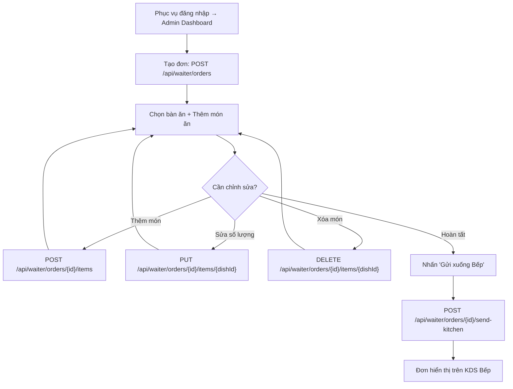

**Biểu đồ tuần tự - Gọi món tại bàn:**

```mermaid
sequenceDiagram
    autonumber
    actor Waiter as Phục Vụ
    participant FE as Admin Dashboard UI
    participant WaitAPI as WaiterOrderController
    participant WaitSVC as WaiterOrderService
    participant DB as MySQL Database

    Waiter->>FE: Tạo đơn mới cho Bàn 05
    FE->>WaitAPI: POST /api/waiter/orders {diningTableId, items}
    WaitAPI->>WaitSVC: createWaiterOrder(request)
    WaitSVC->>DB: INSERT INTO orders + INSERT INTO order_items
    WaitSVC->>DB: UPDATE dining_tables SET status=OCCUPIED
    WaitSVC-->>WaitAPI: OrderHistoryDTO
    WaitAPI-->>FE: HTTP 200 + OrderHistoryDTO

    Waiter->>FE: Thêm món phụ
    FE->>WaitAPI: POST /api/waiter/orders/{id}/items
    WaitAPI->>WaitSVC: addItemToOrder(orderId, item)
    WaitSVC-->>WaitAPI: OrderHistoryDTO cập nhật

    Waiter->>FE: Nhấn "Gửi xuống Bếp"
    FE->>WaitAPI: POST /api/waiter/orders/{id}/send-kitchen
    WaitAPI->>WaitSVC: sendToKitchen(orderId)
    WaitSVC->>DB: UPDATE orders SET status=CONFIRMED
    WaitSVC-->>FE: Đơn hiện trên KDS Bếp
```

#### 3.10.3. Giao diện

> **📸 Chụp màn hình**: Tab "Quản lý Đơn hàng" trên `AdminDashboard.jsx` hoặc trang chuyên biệt `WaiterOrderManagement.jsx`.

#### 3.10.4. Mô tả chi tiết

| Tên tiếng Việt | Tên tiếng Anh | Loại | Bắt buộc? | Mô tả |
| :--- | :--- | :--- | :---: | :--- |
| Mã bàn ăn | `diningTableId` | Long | ✅ | Bàn phục vụ khách |
| Danh sách món | `items` | Array | ✅ | {dishId, quantity, note} |
| → Mã món | `items[].dishId` | Long | ✅ | ID món ăn |
| → Số lượng | `items[].quantity` | Integer | ✅ | Min = 1 |
| → Ghi chú | `items[].note` | String | ❌ | Yêu cầu riêng |

---

### 3.11. Quản lý Sơ đồ Bàn ăn

#### 3.11.1. Đặc tả Use Case

| Thuộc tính | Nội dung |
| :--- | :--- |
| **Use Case ID** | `UC_WAIT_02` |
| **Mô tả** | Xem sơ đồ bàn ăn trực quan, cập nhật trạng thái bàn, gộp bàn |
| **Tác nhân (Actor(s))** | Phục vụ, Admin, Manager |
| **Sự ưu tiên (Priority)** | Cao (High) |
| **Trigger** | Truy cập tab "Quản lý Bàn" trên Dashboard |
| **Luồng cơ bản (Basic Flow)** | 1. Xem sơ đồ bàn ăn phân theo khu vực. 2. Thay đổi trạng thái bàn (AVAILABLE, OCCUPIED, DIRTY...). 3. Gộp bàn: Chọn bàn cha + các bàn con. 4. CRUD bàn ăn mới (Admin). |
| **Ràng buộc (Business Rules)** | Bàn đang `OCCUPIED` không thể xóa. |

#### 3.11.2. Giao diện

> **📸 Chụp màn hình**: Component `TableManagement.jsx` hoặc `WaiterTableManagement.jsx` - Sơ đồ bàn ăn dạng grid/card phân theo khu vực, có mã màu theo trạng thái.

---

### 3.12. Màn hình Hàng đợi Bếp KDS

#### 3.12.1. Đặc tả Use Case

| Thuộc tính | Nội dung |
| :--- | :--- |
| **Use Case ID** | `UC_CHEF_01` |
| **Mô tả** | Đầu bếp xem danh sách đơn hàng cần chế biến trên màn hình KDS |
| **Tác nhân (Actor(s))** | Đầu bếp (`ROLE_CHEF`) |
| **Sự ưu tiên (Priority)** | Rất cao (Critical) |
| **Trigger** | Truy cập `/chef/queue` |
| **Điều kiện cần (Pre-Condition)** | Đã đăng nhập với role CHEF |
| **Điều kiện sau (Post-Condition(s))** | Hiển thị danh sách đơn chờ chế biến |
| **Luồng cơ bản (Basic Flow)** | 1. Mở `/chef/queue`. 2. `GET /api/chef/orders?cookingStatus=PENDING`. 3. Hiển thị card đơn hàng theo thứ tự thời gian. 4. Lọc theo `cookingStatus`, `categoryId`, `search`. |
| **Ràng buộc (Business Rules)** | Đơn mới nhất hiển thị trên cùng. Có đếm ngược thời gian chế biến. |

#### 3.12.2. Giao diện

> **📸 Chụp màn hình**: Trang `/chef/queue` (`ChefCookingQueuePage.jsx`) - Màn hình hàng đợi KDS hiển thị card đơn hàng có đếm ngược thời gian, mã màu (Vàng: Pending, Cam: Cooking, Xanh: Ready).

---

### 3.13. Xác nhận Nấu & Trừ kho Tự động

#### 3.13.1. Đặc tả Use Case

| Thuộc tính | Nội dung |
| :--- | :--- |
| **Use Case ID** | `UC_CHEF_02` |
| **Mô tả** | Đầu bếp xác nhận bắt đầu nấu món, hệ thống tự động trừ kho nguyên liệu |
| **Tác nhân (Actor(s))** | Đầu bếp (`ROLE_CHEF`) |
| **Sự ưu tiên (Priority)** | Rất cao (Critical) |
| **Trigger** | Đầu bếp nhấn nút "Bắt đầu Nấu (Trừ kho)" trên KDS |
| **Điều kiện cần (Pre-Condition)** | 1. Đơn hàng trạng thái `PENDING` hoặc `CONFIRMED`. 2. Nguyên liệu đủ tồn kho. |
| **Điều kiện sau (Post-Condition(s))** | 1. `cookingStatus` = `COOKING`. 2. Tồn kho nguyên liệu giảm theo `DishRecipe`. 3. `InventoryTransaction` loại `STOCK_OUT` được ghi nhận. |
| **Luồng cơ bản (Basic Flow)** | 1. Đầu bếp nhấn "Bắt đầu Nấu" trên KDS. 2. `POST /api/chef/orders/{orderId}/deduct-ingredients`. 3. Backend truy vấn `OrderItem[]` của đơn. 4. Với mỗi `Dish`, truy vấn `dish_recipes` lấy danh sách `Ingredient` + `quantityRequired`. 5. Tính tổng: `quantityRequired × quantity` (số suất). 6. Trừ trực tiếp `ingredients.quantity`. 7. Ghi `InventoryTransaction` (STOCK_OUT). 8. Cập nhật `cookingStatus = COOKING`. 9. Trả về `OrderHistoryDTO`. |
| **Luồng thay thế (Alternative Flow)** | Xem công thức trước khi nấu: `GET /api/chef/orders/{id}/recipe-check` |
| **Luồng ngoại lệ (Exception Flow)** | Kho không đủ nguyên liệu → Cảnh báo nhưng vẫn cho phép nấu. |
| **Ràng buộc (Business Rules)** | 1. Tự động trừ kho dựa trên bảng `dish_recipes`. 2. Ghi log giao dịch kho. |

#### 3.13.2. Sơ đồ luồng chi tiết

```mermaid
flowchart TD
    A["Đầu bếp xem KDS /chef/queue"] --> B["Chọn đơn hàng"]
    B --> C{"Xem công thức trước?"}
    C -->|"Có"| D["GET /api/chef/orders/{id}/recipe-check"]
    D --> E["Hiển thị: Nguyên liệu + Định lượng + Tồn kho"]
    E --> F["Nhấn 'Bắt đầu Nấu'"]
    C -->|"Không"| F
    F --> G["POST /api/chef/orders/{id}/deduct-ingredients"]
    G --> H["Truy vấn OrderItems → dish_recipes"]
    H --> I["Tính: quantityRequired × quantity suất"]
    I --> J["UPDATE ingredients SET quantity = quantity - X"]
    J --> K["INSERT inventory_transactions type=STOCK_OUT"]
    K --> L["UPDATE order_items SET cooking_status=COOKING"]
    L --> M["HTTP 200 + OrderHistoryDTO"]
    M --> N["KDS cập nhật card: Đang Nấu - Cam"]
```

**Biểu đồ tuần tự - Xác nhận Nấu & Trừ kho:**

```mermaid
sequenceDiagram
    autonumber
    actor Chef as Đầu Bếp KDS
    participant FE as Chef KDS UI
    participant ChefAPI as ChefKitchenController
    participant ChefSVC as ChefKitchenService
    participant RecipeRepo as DishRecipeRepository
    participant IngrRepo as IngredientRepository
    participant DB as MySQL Database

    Chef->>FE: Nhấn "Bắt đầu Nấu - Trừ kho"
    FE->>ChefAPI: POST /api/chef/orders/{orderId}/deduct-ingredients
    ChefAPI->>ChefSVC: deductIngredientsAndStartCooking(orderId)
    ChefSVC->>DB: SELECT * FROM order_items WHERE order_id = ?
    DB-->>ChefSVC: List OrderItem

    loop Với mỗi OrderItem (Dish)
        ChefSVC->>RecipeRepo: findByDishId(dishId)
        RecipeRepo->>DB: SELECT * FROM dish_recipes WHERE dish_id = ?
        DB-->>ChefSVC: List DishRecipe (ingredientId, quantityRequired)
        ChefSVC->>ChefSVC: totalNeeded = quantityRequired × quantity
        ChefSVC->>IngrRepo: subtractQuantity(ingredientId, totalNeeded)
        IngrRepo->>DB: UPDATE ingredients SET quantity = quantity - ?
        ChefSVC->>DB: INSERT INTO inventory_transactions type=STOCK_OUT
    end

    ChefSVC->>DB: UPDATE order_items SET cooking_status = COOKING
    ChefSVC-->>ChefAPI: OrderHistoryDTO
    ChefAPI-->>FE: HTTP 200 OK + OrderHistoryDTO
    FE-->>Chef: Card đơn chuyển sang màu Cam - Đang Nấu
```

#### 3.13.3. Giao diện

> **📸 Chụp màn hình**: Trang `/chef/queue` (`ChefCookingQueuePage.jsx`) - Nút "Bắt đầu Nấu (Trừ kho)" trên card đơn hàng, và popup xem công thức định lượng.

#### 3.13.4. Mô tả chi tiết

| Tên tiếng Việt | Tên tiếng Anh | Loại | Bắt buộc? | Mô tả |
| :--- | :--- | :--- | :---: | :--- |
| Mã đơn hàng | `orderId` | Long (PathVar) | ✅ | ID đơn hàng cần nấu |

---

### 3.14. Thông báo Nấu xong

#### 3.14.1. Đặc tả Use Case

| Thuộc tính | Nội dung |
| :--- | :--- |
| **Use Case ID** | `UC_CHEF_03` |
| **Mô tả** | Đầu bếp nhấn "Nấu xong", hệ thống cập nhật trạng thái và phát thông báo |
| **Tác nhân (Actor(s))** | Đầu bếp (`ROLE_CHEF`) |
| **Sự ưu tiên (Priority)** | Cao (High) |
| **Trigger** | Đầu bếp nhấn "Nấu xong" trên KDS |
| **Điều kiện cần (Pre-Condition)** | `cookingStatus` đang là `COOKING` |
| **Điều kiện sau (Post-Condition(s))** | 1. `cookingStatus` = `READY`. 2. `StaffNotification` được tạo gửi tới Phục vụ/Thu ngân. |
| **Luồng cơ bản (Basic Flow)** | 1. Đầu bếp nhấn "Nấu xong". 2. `PUT /api/chef/items/{itemId}/status` body: `{cookingStatus: "READY"}`. 3. Backend cập nhật trạng thái. 4. `POST /api/chef/orders/{id}/notify-waiter`. 5. Backend tạo `StaffNotification` gửi tới `ROLE_WAITER`/`ROLE_CASHIER`. 6. WebSocket phát thông báo realtime. |

#### 3.14.2. Giao diện

> **📸 Chụp màn hình**: Nút "Nấu xong" (màu xanh) trên card đơn hàng KDS, và bell thông báo realtime.

---

### 3.15. Thanh toán POS & Xuất hóa đơn

#### 3.15.1. Đặc tả Use Case

| Thuộc tính | Nội dung |
| :--- | :--- |
| **Use Case ID** | `UC_CASH_01` |
| **Mô tả** | Thu ngân xử lý thanh toán đơn hàng, tính thuế VAT, phí dịch vụ, xuất hóa đơn |
| **Tác nhân (Actor(s))** | Thu ngân (`ROLE_CASHIER`), Admin, Manager |
| **Sự ưu tiên (Priority)** | Rất cao (Critical) |
| **Trigger** | Thu ngân nhấn "Thanh toán & In hóa đơn" trên `/cashier/payments` |
| **Điều kiện cần (Pre-Condition)** | Đơn hàng có món ở trạng thái `READY` hoặc `SERVED` |
| **Điều kiện sau (Post-Condition(s))** | 1. `Invoice` được tạo. 2. `Payment` trạng thái `SUCCESS`. 3. `Order` = `COMPLETED`. 4. Bàn ăn = `AVAILABLE`. |
| **Luồng cơ bản (Basic Flow)** | 1. Thu ngân mở `/cashier/payments`. 2. Chọn đơn hàng cần thanh toán. 3. Nhập PTTT (`CASH`/`QR_BANKING`/`VNPAY`/`MOMO`), VAT%, Phí dịch vụ. 4. Nhấn "Thanh toán". 5. `POST /api/cashier/checkout`. 6. Backend tính: subtotal, discountAmount, vatAmount, serviceFee → grandTotal. 7. Tạo `Invoice` (mã hóa đơn duy nhất). 8. Tạo `Payment` (SUCCESS). 9. Cập nhật `Order` = `COMPLETED`. 10. Giải phóng bàn = `AVAILABLE`. 11. Trả về `InvoiceDTO`. 12. Frontend hiển thị Modal hóa đơn + In POS. |
| **Luồng ngoại lệ (Exception Flow)** | Đơn hàng không tồn tại / đã thanh toán → Thông báo lỗi. |
| **Ràng buộc (Business Rules)** | 1. VAT: 0% - 30%. 2. PTTT: CASH, QR_BANKING, VNPAY, MOMO. 3. Mã hóa đơn duy nhất: `INV-YYYYMMDD-XXX`. |
| **Yêu cầu phi chức năng** | Sử dụng `window.print()` để in hóa đơn. |

#### 3.15.2. Sơ đồ luồng chi tiết

```mermaid
flowchart TD
    A["Mở /cashier/payments"] --> B["GET /api/cashier/orders"]
    B --> C["Hiển thị danh sách đơn chờ thanh toán"]
    C --> D["Chọn đơn hàng"]
    D --> E["Nhập: PTTT, VAT%, Phí dịch vụ"]
    E --> F["Nhấn 'Thanh toán & In hóa đơn'"]
    F --> G["POST /api/cashier/checkout"]
    G --> H["Tính: subtotal - discount + VAT + serviceFee = grandTotal"]
    H --> I["Tạo Invoice mã duy nhất"]
    I --> J["Tạo Payment: SUCCESS"]
    J --> K["UPDATE orders SET status=COMPLETED"]
    K --> L["UPDATE dining_tables SET status=AVAILABLE"]
    L --> M["HTTP 200 + InvoiceDTO"]
    M --> N["Modal hóa đơn + window.print()"]
```

**Biểu đồ tuần tự - Thanh toán POS:**

```mermaid
sequenceDiagram
    autonumber
    actor Cashier as Thu Ngân POS
    participant FE as Cashier UI
    participant CashAPI as CashierController
    participant CashSVC as CashierService
    participant DB as MySQL Database

    Cashier->>FE: Chọn đơn hàng + Nhập PTTT, VAT%
    FE->>CashAPI: POST /api/cashier/checkout (CashierCheckoutRequest)
    CashAPI->>CashSVC: processCheckout(request)
    CashSVC->>DB: SELECT order + order_items
    CashSVC->>CashSVC: Tính subtotal, discount, VAT, serviceFee, grandTotal
    CashSVC->>DB: INSERT INTO invoices (invoice_number=INV-YYYYMMDD-XXX)
    CashSVC->>DB: INSERT INTO payments (status=SUCCESS)
    CashSVC->>DB: UPDATE orders SET status=COMPLETED
    CashSVC->>DB: UPDATE dining_tables SET status=AVAILABLE
    CashSVC-->>CashAPI: InvoiceDTO
    CashAPI-->>FE: HTTP 200 + InvoiceDTO
    FE-->>Cashier: Modal hóa đơn chi tiết + In POS
```

#### 3.15.3. Giao diện

> **📸 Chụp màn hình 1**: Trang `/cashier/payments` (`CashierPaymentsPage.jsx`) - Giao diện quầy POS.
> **📸 Chụp màn hình 2**: Modal in hóa đơn POS chi tiết (Invoice).

#### 3.15.4. Mô tả chi tiết

| Tên tiếng Việt | Tên tiếng Anh | Loại | Bắt buộc? | Mô tả |
| :--- | :--- | :--- | :---: | :--- |
| Mã đơn hàng | `orderId` | Long | ✅ | ID đơn hàng cần thanh toán |
| Phương thức TT | `paymentMethod` | VARCHAR(30) | ✅ | `CASH`, `QR_BANKING`, `VNPAY`, `MOMO` |
| Thuế VAT (%) | `vatPercent` | Double | ❌ | 0% - 30%, mặc định 8% |
| Phí dịch vụ | `serviceFee` | BigDecimal | ❌ | Phí phục vụ thêm |
| Mã Voucher | `voucherCode` | String | ❌ | Mã giảm giá (nếu có) |
| Tên khách hàng | `customerName` | VARCHAR(100) | ❌ | Tên ghi trên hóa đơn |
| SĐT khách | `customerPhone` | VARCHAR(30) | ❌ | SĐT ghi trên hóa đơn |

---

### 3.16. Áp dụng Mã Voucher

#### 3.16.1. Đặc tả Use Case

| Thuộc tính | Nội dung |
| :--- | :--- |
| **Use Case ID** | `UC_CASH_02` |
| **Mô tả** | Thu ngân validate và áp dụng mã giảm giá cho đơn hàng |
| **Tác nhân (Actor(s))** | Thu ngân, Admin, Manager |
| **Sự ưu tiên (Priority)** | Cao (High) |
| **Trigger** | Thu ngân nhập mã Voucher trên quầy POS |
| **Điều kiện cần (Pre-Condition)** | Voucher tồn tại, đang `ACTIVE`, chưa hết hạn, chưa vượt giới hạn sử dụng |
| **Điều kiện sau (Post-Condition(s))** | Tiền giảm giá được tính và áp dụng vào đơn |
| **Luồng cơ bản (Basic Flow)** | 1. Nhập mã voucher + Tổng tiền đơn. 2. `POST /api/cashier/promotions/apply`. 3. Backend validate mã. 4. Tính tiền giảm giá (% hoặc cố định). 5. Trả về số tiền giảm. |
| **Luồng ngoại lệ (Exception Flow)** | 1. Mã không tồn tại → Lỗi. 2. Mã hết hạn / đã hết lượt → Lỗi. 3. Đơn hàng dưới mức tối thiểu → Lỗi. |
| **Ràng buộc (Business Rules)** | Voucher có `discountType`: `PERCENTAGE` hoặc `FIXED_AMOUNT`. Giảm tối đa: `maxDiscountAmount`. |

#### 3.16.2. Giao diện

> **📸 Chụp màn hình**: Phần nhập mã Voucher trên `CashierPaymentsPage.jsx` hoặc `CashierPromotionsPage.jsx`.

---

### 3.17. Tích điểm Thành viên

#### 3.17.1. Đặc tả Use Case

| Thuộc tính | Nội dung |
| :--- | :--- |
| **Use Case ID** | `UC_CASH_03` |
| **Mô tả** | Thu ngân tích điểm thưởng hoặc quy đổi trừ tiền cho khách hàng thành viên |
| **Tác nhân (Actor(s))** | Thu ngân, Admin, Manager |
| **Sự ưu tiên (Priority)** | Trung bình (Medium) |
| **Trigger** | Thu ngân nhập Email khách hàng để tra cứu điểm |
| **Điều kiện cần (Pre-Condition)** | Khách hàng đã đăng ký thành viên |
| **Điều kiện sau (Post-Condition(s))** | Điểm thưởng được tích/trừ. Hạng thành viên được cập nhật nếu đủ điều kiện. |
| **Luồng cơ bản (Basic Flow)** | 1. Nhập Email khách. 2. `POST /api/cashier/customers/points` (action: EARN hoặc REDEEM). 3. Backend tra cứu `Customer` theo Email. 4. Tích điểm hoặc trừ điểm. 5. Cập nhật hạng: `BRONZE` → `SILVER` → `GOLD` → `PLATINUM` → `DIAMOND`. |
| **Ràng buộc (Business Rules)** | 5 cấp hạng thành viên. Trừ điểm không được âm. |

#### 3.17.2. Giao diện

> **📸 Chụp màn hình**: Trang `/cashier/customers` (`CashierCustomersPage.jsx`).

---

### 3.18. Quản lý Thực đơn & Danh mục (Admin)

#### 3.18.1. Đặc tả Use Case

| Thuộc tính | Nội dung |
| :--- | :--- |
| **Use Case ID** | `UC_ADM_01` |
| **Mô tả** | Admin/Manager CRUD thực đơn món ăn và danh mục |
| **Tác nhân (Actor(s))** | Admin (`ROLE_ADMIN`), Manager (`ROLE_MANAGER`) |
| **Sự ưu tiên (Priority)** | Cao (High) |
| **Trigger** | Truy cập tab "Quản lý Thực đơn" trên Admin Dashboard |
| **Luồng cơ bản (Basic Flow)** | 1. Xem danh sách món ăn. 2. Thêm món mới: tên, giá, danh mục, mô tả, hình ảnh, giá vốn, thời gian nấu, calo, độ cay... 3. Sửa thông tin món. 4. Ẩn/Hiện món (`available`). 5. Quản lý danh mục: Thêm/Sửa/Xóa `Category`. |
| **Ràng buộc (Business Rules)** | Tên món duy nhất. Giá ≥ 0. |

#### 3.18.2. Giao diện

> **📸 Chụp màn hình**: Component `MenuManagement.jsx` và `CategoryManagement.jsx` trên Admin Dashboard.

#### 3.18.3. Mô tả chi tiết - Thêm/Sửa món ăn

| Tên tiếng Việt | Tên tiếng Anh | Loại | Bắt buộc? | Mô tả |
| :--- | :--- | :--- | :---: | :--- |
| Tên món | `name` | VARCHAR(100) | ✅ | Tên món ăn, unique |
| Mã món | `code` | VARCHAR(50) | ❌ | Mã định danh nội bộ |
| Danh mục | `categoryId` | Long (FK) | ✅ | Thuộc danh mục nào |
| Giá bán | `price` | DECIMAL(10,2) | ✅ | Min = 0 |
| Giá vốn | `costPrice` | DECIMAL(10,2) | ❌ | Giá nguyên vật liệu |
| Giảm giá | `discount` | DECIMAL(5,2) | ❌ | % chiết khấu |
| Mô tả | `description` | TEXT | ❌ | Mô tả chi tiết |
| Hình ảnh | `image` | VARCHAR(255) | ❌ | URL hình ảnh |
| Thời gian nấu | `prepTime` | Integer (phút) | ❌ | Ước lượng phút nấu |
| Calo | `calories` | Integer | ❌ | Lượng calo |
| Độ cay | `spiciness` | VARCHAR(30) | ❌ | Không cay / Cay nhẹ / Cay vừa / Cay nồng |
| Kích cỡ | `dishSize` | VARCHAR(50) | ❌ | S / M / L / Combo |
| Trạng thái | `status` | VARCHAR(30) | ✅ | ACTIVE / INACTIVE |
| Khả dụng | `available` | Boolean | ✅ | true = Đang bán |

---

### 3.19. Quản lý Kho Nguyên liệu

#### 3.19.1. Đặc tả Use Case

| Thuộc tính | Nội dung |
| :--- | :--- |
| **Use Case ID** | `UC_ADM_02` |
| **Mô tả** | Quản lý danh mục nguyên liệu, nhập/xuất kho, cảnh báo tồn kho |
| **Tác nhân (Actor(s))** | Admin, Manager |
| **Sự ưu tiên (Priority)** | Cao (High) |
| **Trigger** | Truy cập tab "Quản lý Kho" trên Admin Dashboard |
| **Luồng cơ bản (Basic Flow)** | 1. Xem danh sách nguyên liệu + tồn kho. 2. Thêm/Sửa/Xóa nguyên liệu. 3. Nhập kho (`stock-in`). 4. Xuất kho thủ công (`stock-out`). 5. Điều chỉnh tồn (`stock-adjustment`). 6. Xem lịch sử giao dịch kho. 7. Cảnh báo khi `quantity < minQuantity`. |
| **Ràng buộc (Business Rules)** | `minQuantity` là ngưỡng cảnh báo. Mọi giao dịch kho đều ghi `InventoryTransaction`. |

#### 3.19.2. Giao diện

> **📸 Chụp màn hình**: Component `InventoryManagement.jsx` trên Admin Dashboard - Bảng nguyên liệu, nút nhập/xuất kho, lịch sử giao dịch.

---

### 3.20. Quản lý Nhà cung cấp

#### 3.20.1. Đặc tả Use Case

| Thuộc tính | Nội dung |
| :--- | :--- |
| **Use Case ID** | `UC_ADM_03` |
| **Mô tả** | CRUD danh sách nhà cung cấp và đơn nhập hàng |
| **Tác nhân (Actor(s))** | Admin, Manager |
| **Luồng cơ bản (Basic Flow)** | 1. Xem danh sách NCC. 2. Thêm/Sửa/Xóa NCC. 3. Tạo đơn nhập hàng (`PurchaseOrder`). 4. Thêm chi tiết nguyên liệu nhập. |

#### 3.20.2. Giao diện

> **📸 Chụp màn hình**: Component `SupplierManagement.jsx` trên Admin Dashboard.

---

### 3.21. Quản lý Nhân sự

#### 3.21.1. Đặc tả Use Case

| Thuộc tính | Nội dung |
| :--- | :--- |
| **Use Case ID** | `UC_ADM_04` |
| **Mô tả** | Quản lý hồ sơ nhân viên, tạo tài khoản, gán vai trò |
| **Tác nhân (Actor(s))** | Admin, Manager |
| **Luồng cơ bản (Basic Flow)** | 1. Xem danh sách nhân viên. 2. Thêm nhân viên mới (tạo User + Employee liên kết). 3. Sửa thông tin: Lương, Địa chỉ, Ngày sinh, Ngày vào làm. 4. Vô hiệu hóa / Kích hoạt tài khoản. |

#### 3.21.2. Giao diện

> **📸 Chụp màn hình**: Component `EmployeeManagement.jsx` trên Admin Dashboard.

#### 3.21.3. Mô tả chi tiết - Thêm/Sửa Nhân viên

| Tên tiếng Việt | Tên tiếng Anh | Loại | Bắt buộc? | Mô tả |
| :--- | :--- | :--- | :---: | :--- |
| Mã nhân viên | `employeeCode` | VARCHAR(30) | ✅ | Unique |
| Họ tên | `fullName` | VARCHAR(100) | ✅ | Họ tên nhân viên |
| Email | `email` | VARCHAR(100) | ✅ | Tạo tài khoản đăng nhập |
| Vai trò | `roles` | Set<String> | ✅ | Gán vai trò hệ thống |
| Ngày sinh | `birthday` | LocalDate | ❌ | Ngày tháng năm sinh |
| Giới tính | `gender` | VARCHAR(20) | ❌ | MALE / FEMALE / OTHER |
| Địa chỉ | `address` | VARCHAR(255) | ❌ | Địa chỉ thường trú |
| Lương | `salary` | DECIMAL(12,2) | ❌ | Mức lương cơ bản |
| Ngày vào làm | `hireDate` | LocalDate | ❌ | Ngày bắt đầu làm việc |
| Trạng thái | `status` | VARCHAR(30) | ✅ | ACTIVE / INACTIVE |

---

### 3.22. Quản trị Tài khoản & RBAC

#### 3.22.1. Đặc tả Use Case

| Thuộc tính | Nội dung |
| :--- | :--- |
| **Use Case ID** | `UC_ADM_05` |
| **Mô tả** | Admin quản trị tài khoản người dùng, vai trò và quyền hạn chi tiết |
| **Tác nhân (Actor(s))** | Admin (`ROLE_ADMIN`) |
| **Sự ưu tiên (Priority)** | Cao (High) |
| **Trigger** | Truy cập tab "Quản lý Người dùng" / "Quản lý Vai trò" trên Admin Dashboard |
| **Luồng cơ bản (Basic Flow)** | 1. Xem danh sách User. 2. Tạo/Sửa/Khóa tài khoản. 3. Gán/Gỡ vai trò. 4. Quản lý danh sách Role: Thêm/Sửa/Xóa. 5. Gán Permission cho Role. |
| **Ràng buộc (Business Rules)** | Chỉ `ROLE_ADMIN` mới có quyền quản trị RBAC. |

#### 3.22.2. Giao diện

> **📸 Chụp màn hình**: Component `UserManagement.jsx` và `RoleManagement.jsx` trên Admin Dashboard.

---

### 3.23. Báo cáo Doanh thu & Analytics

#### 3.23.1. Đặc tả Use Case

| Thuộc tính | Nội dung |
| :--- | :--- |
| **Use Case ID** | `UC_ADM_06` |
| **Mô tả** | Xem thống kê doanh thu, món bán chạy, báo cáo kho, nhân sự, khách hàng |
| **Tác nhân (Actor(s))** | Admin, Manager, Cashier |
| **Sự ưu tiên (Priority)** | Cao (High) |
| **Trigger** | Truy cập tab "Báo cáo" trên Dashboard |
| **Luồng cơ bản (Basic Flow)** | 1. Chọn loại báo cáo: Doanh thu, Kho, Món ăn, Nhân sự, Khách hàng, Lợi nhuận. 2. Chọn khoảng thời gian (startDate, endDate). 3. Xem biểu đồ + bảng dữ liệu. 4. Xuất file Excel. |
| **API liên quan** | `GET /api/admin/reports/revenue`, `/inventory`, `/food`, `/employee`, `/customer`, `/profit`, `/export/excel` |

#### 3.23.2. Giao diện

> **📸 Chụp màn hình**: Component `ReportManagement.jsx` trên Admin Dashboard - Biểu đồ doanh thu, bảng thống kê.

---

### 3.24. Quản lý Đặt bàn (Admin)

#### 3.24.1. Đặc tả Use Case

| Thuộc tính | Nội dung |
| :--- | :--- |
| **Use Case ID** | `UC_ADM_07` |
| **Mô tả** | Admin xem tất cả yêu cầu đặt bàn, phê duyệt/từ chối, check-in/check-out |
| **Tác nhân (Actor(s))** | Admin (`ROLE_ADMIN`) |
| **Sự ưu tiên (Priority)** | Cao (High) |
| **Trigger** | Truy cập tab "Quản lý Đặt bàn" trên Admin Dashboard |
| **Luồng cơ bản (Basic Flow)** | 1. Xem danh sách Reservation (lọc theo status, thời gian). 2. Phê duyệt: `PUT /{id}/approve` → `APPROVED`. 3. Từ chối: `PUT /{id}/reject` → `REJECTED`. 4. Check-in: `PUT /{id}/check-in?tableId=X` → `CHECKED_IN` + Bàn `OCCUPIED`. 5. Check-out: `PUT /{id}/check-out` → `CHECKED_OUT`. |
| **Luồng ngoại lệ (Exception Flow)** | Phê duyệt reservation khi bàn đã bị chiếm → Cảnh báo. |

#### 3.24.2. Sơ đồ luồng chi tiết

```mermaid
flowchart TD
    A["Admin mở Quản lý Đặt bàn"] --> B["GET /api/admin/reservations?status=PENDING"]
    B --> C["Hiển thị danh sách yêu cầu"]
    C --> D{"Hành động?"}
    D -->|"Phê duyệt"| E["PUT /{id}/approve → APPROVED"]
    D -->|"Từ chối"| F["PUT /{id}/reject → REJECTED"]
    D -->|"Hủy"| G["PUT /{id}/cancel → CANCELLED"]
    E --> H["Khách tới nhà hàng"]
    H --> I["PUT /{id}/check-in?tableId=X → CHECKED_IN"]
    I --> J["Bàn → OCCUPIED"]
    J --> K["Khách ra về"]
    K --> L["PUT /{id}/check-out → CHECKED_OUT"]
```

#### 3.24.3. Giao diện

> **📸 Chụp màn hình**: Component `ReservationManagement.jsx` trên Admin Dashboard.

---

## PHẦN 4: CÁC COMPONENT, THÔNG BÁO, CẢNH BÁO

### 4.1 Danh sách Component giao diện chính

| STT | Component | File | Mô tả |
| :---: | :--- | :--- | :--- |
| 1 | CustomerNavbar | `CustomerNavbar.jsx` | Thanh điều hướng khách hàng (Menu, Đặt bàn, Giỏ hàng, Hồ sơ) |
| 2 | ChefNavbar | `ChefNavbar.jsx` | Thanh điều hướng đầu bếp (Dashboard, Queue, Orders) |
| 3 | CashierNavbar | `CashierNavbar.jsx` | Thanh điều hướng thu ngân (Dashboard, Orders, Payments) |
| 4 | ManagerNavbar | `ManagerNavbar.jsx` | Thanh điều hướng quản lý |
| 5 | WaiterNavbar | `WaiterNavbar.jsx` | Thanh điều hướng phục vụ |
| 6 | CartDrawer | `CartDrawer.jsx` | Drawer giỏ hàng slide-in hiển thị món đã chọn |
| 7 | CustomerBanner | `CustomerBanner.jsx` | Banner quảng cáo trang chủ khách hàng |
| 8 | CustomerFooter | `CustomerFooter.jsx` | Footer trang khách hàng |
| 9 | NotificationDropdown | `NotificationDropdown.jsx` | Dropdown thông báo realtime (bell icon) |
| 10 | RouteGuard | `RouteGuard.jsx` | PrivateRoute & PublicOnlyRoute bảo vệ routing |
| 11 | RevenueChart | `RevenueChart.jsx` | Biểu đồ doanh thu trên Dashboard |

### 4.2 Danh sách Component quản trị (Admin Dashboard Tabs)

| STT | Component | File | Mô tả |
| :---: | :--- | :--- | :--- |
| 1 | MenuManagement | `MenuManagement.jsx` | CRUD thực đơn món ăn |
| 2 | CategoryManagement | `CategoryManagement.jsx` | CRUD danh mục |
| 3 | TableManagement | `TableManagement.jsx` | Quản lý sơ đồ bàn ăn |
| 4 | InventoryManagement | `InventoryManagement.jsx` | Quản lý kho nguyên liệu |
| 5 | SupplierManagement | `SupplierManagement.jsx` | Quản lý nhà cung cấp |
| 6 | EmployeeManagement | `EmployeeManagement.jsx` | Quản lý nhân sự |
| 7 | UserManagement | `UserManagement.jsx` | Quản trị tài khoản |
| 8 | RoleManagement | `RoleManagement.jsx` | Quản lý vai trò & quyền |
| 9 | CustomerManagement | `CustomerManagement.jsx` | Quản lý thông tin khách hàng |
| 10 | PromotionManagement | `PromotionManagement.jsx` | Quản lý chương trình khuyến mãi |
| 11 | ReservationManagement | `ReservationManagement.jsx` | Quản lý đặt bàn |
| 12 | KitchenManagement | `KitchenManagement.jsx` | Quản lý bếp |
| 13 | ReportManagement | `ReportManagement.jsx` | Báo cáo & Analytics |
| 14 | AdminNotificationManagement | `AdminNotificationManagement.jsx` | Quản lý thông báo nội bộ |

### 4.3 Danh sách mẫu Thông báo (Toast / Alert Messages)

| STT | Mã thông báo | Loại | Nội dung thông báo | Trigger |
| :---: | :--- | :---: | :--- | :--- |
| 1 | MSG_AUTH_01 | ✅ Success | "Đăng ký thành công! Vui lòng đăng nhập." | Đăng ký thành công |
| 2 | MSG_AUTH_02 | ❌ Error | "Email đã được sử dụng!" | Email trùng khi đăng ký |
| 3 | MSG_AUTH_03 | ❌ Error | "Email hoặc mật khẩu không chính xác!" | Đăng nhập sai |
| 4 | MSG_AUTH_04 | ❌ Error | "Tài khoản của bạn đã bị vô hiệu hóa!" | Tài khoản bị khóa |
| 5 | MSG_AUTH_05 | ✅ Success | "Đổi mật khẩu thành công!" | Đổi MK thành công |
| 6 | MSG_AUTH_06 | ❌ Error | "Mật khẩu cũ không đúng!" | Sai MK cũ khi đổi |
| 7 | MSG_OTP_01 | ✅ Success | "Mã OTP đã được gửi tới email!" | Gửi OTP thành công |
| 8 | MSG_OTP_02 | ❌ Error | "Mã OTP không hợp lệ hoặc đã hết hạn!" | OTP sai/hết hạn |
| 9 | MSG_ORDER_01 | ✅ Success | "Đặt món thành công!" | Tạo đơn thành công |
| 10 | MSG_ORDER_02 | ⚠️ Warning | "Giỏ hàng trống! Vui lòng thêm món." | Giỏ hàng rỗng |
| 11 | MSG_CHEF_01 | ✅ Success | "Đã bắt đầu nấu và trừ kho thành công!" | Trừ kho thành công |
| 12 | MSG_CHEF_02 | 🔔 Notify | "Món ăn đã sẵn sàng phục vụ!" | Đầu bếp nấu xong |
| 13 | MSG_CASH_01 | ✅ Success | "Thanh toán thành công! Hóa đơn đã được tạo." | Checkout POS thành công |
| 14 | MSG_CASH_02 | ❌ Error | "Mã voucher không hợp lệ hoặc đã hết hạn!" | Voucher lỗi |
| 15 | MSG_INV_01 | ⚠️ Warning | "Nguyên liệu {name} sắp hết! Tồn kho: {qty}" | Tồn kho < minQuantity |
| 16 | MSG_RES_01 | ✅ Success | "Đặt bàn thành công! Vui lòng chờ xác nhận." | Đặt bàn thành công |

### 4.4 Danh sách Cảnh báo hệ thống (System Alerts)

| STT | Loại | Điều kiện kích hoạt | Đối tượng nhận |
| :---: | :--- | :--- | :--- |
| 1 | Cảnh báo tồn kho thấp | `ingredients.quantity < ingredients.minQuantity` | Admin, Manager |
| 2 | Đơn hàng mới tại KDS | Đơn mới gửi xuống bếp | Chef (WebSocket) |
| 3 | Món nấu xong | `cookingStatus` = `READY` | Waiter, Cashier |
| 4 | Yêu cầu đặt bàn mới | `Reservation` mới trạng thái `PENDING` | Admin |
| 5 | Token JWT hết hạn | AccessToken expired | Frontend (redirect /login) |

---

## PHẦN 5: LINK ISSUE

| STT | Mã Issue | Tên Issue | Trạng thái | Ghi chú |
| :---: | :--- | :--- | :--- | :--- |
| 1 | *(Chưa tạo)* | *(Dự án chưa sử dụng Jira)* | — | Cần thiết lập hệ thống quản lý Issue nếu triển khai production |

---

## PHỤ LỤC A: DANH MỤC BẢNG BIỂU

| STT | Tên bảng | Vị trí | Mô tả nội dung |
| :---: | :--- | :--- | :--- |
| 1 | Bảng thuật ngữ viết tắt | Phần 1.4 | 15 thuật ngữ |
| 2 | Bảng phạm vi phân hệ | Phần 1.2 | 7 phân hệ + số chức năng |
| 3 | Bảng quan hệ đối tượng | Phần 2.1 | 26 mối quan hệ thực thể |
| 4 | Bảng tổng hợp Use Case | Phần 2.2 | 24 Use Case |
| 5 | Bảng luồng End-to-End | Phần 2.3 | 10 bước luồng chính |
| 6 | Bảng trạng thái Order | Phần 2.4 | 7 trạng thái đơn hàng |
| 7 | Bảng trạng thái OrderItem | Phần 2.4 | 4 trạng thái cookingStatus |
| 8 | Bảng trạng thái DiningTable | Phần 2.4 | 7 trạng thái bàn ăn |
| 9 | Bảng trạng thái Reservation | Phần 2.4 | 6 trạng thái đặt bàn |
| 10 | Bảng vai trò hệ thống | Phần 2.5.1 | 6 vai trò + mô tả |
| 11 | Ma trận phân quyền chức năng | Phần 2.5.1 | 20 chức năng × 6 vai trò |
| 12 | Bảng phân quyền dữ liệu | Phần 2.5.2 | 6 vai trò + phạm vi |
| 13 | Bảng danh sách chức năng tổng hợp | Phần 3 | 24 chức năng chi tiết |
| 14 | 24 bảng Đặc tả Use Case | Phần 3.1 – 3.24 | Mỗi UC có bảng riêng |
| 15 | 24 bảng Mô tả chi tiết trường | Phần 3.x.4 | Trường dữ liệu từng UC |
| 16 | Bảng danh sách Component | Phần 4.1 | 11 component giao diện |
| 17 | Bảng Component Admin | Phần 4.2 | 14 component quản trị |
| 18 | Bảng mẫu thông báo | Phần 4.3 | 16 mẫu thông báo |
| 19 | Bảng cảnh báo hệ thống | Phần 4.4 | 5 loại cảnh báo |
| 20 | Bảng API Endpoints | Phụ lục C | 72 API endpoints |
| 21 | Bảng CSDL chi tiết | Phụ lục D | 26 bảng thực thể |

---

## PHỤ LỤC B: DANH MỤC SƠ ĐỒ & HÌNH ẢNH

| STT | Tên sơ đồ / Hình ảnh | Loại | Vị trí | Ghi chú chụp ảnh |
| :---: | :--- | :--- | :--- | :--- |
| 1 | Sơ đồ ERD (Entity Relationship Diagram) | Mermaid erDiagram | Phần 2.1 | Render từ Mermaid hoặc vẽ lại bằng draw.io |
| 2 | Sơ đồ Use Case tổng thể | Mermaid graph | Phần 2.2 | Render từ Mermaid |
| 3 | Sơ đồ luồng nghiệp vụ End-to-End | Mermaid flowchart | Phần 2.3 | Render từ Mermaid |
| 4 | Sơ đồ trạng thái Order | Mermaid stateDiagram | Phần 2.4 | Render từ Mermaid |
| 5 | Sơ đồ trạng thái OrderItem | Mermaid stateDiagram | Phần 2.4 | Render từ Mermaid |
| 6 | Sơ đồ trạng thái DiningTable | Mermaid stateDiagram | Phần 2.4 | Render từ Mermaid |
| 7 | Sơ đồ trạng thái Reservation | Mermaid stateDiagram | Phần 2.4 | Render từ Mermaid |
| 8 | Sơ đồ Site Map | Mermaid graph | Phần 2.6 | Render từ Mermaid |
| 9 | Flowchart: Đăng ký tài khoản | Mermaid flowchart | Phần 3.1.2 | Render từ Mermaid |
| 10 | Flowchart: Đăng nhập JWT | Mermaid flowchart | Phần 3.2.2 | Render từ Mermaid |
| 11 | Sequence: Đăng nhập JWT | Mermaid sequenceDiagram | Phần 3.2.2 | Render từ Mermaid |
| 12 | Flowchart: Quên mật khẩu OTP | Mermaid flowchart | Phần 3.3.2 | Render từ Mermaid |
| 13 | Sequence: Quên mật khẩu OTP | Mermaid sequenceDiagram | Phần 3.3.2 | Render từ Mermaid |
| 14 | Flowchart: Đổi mật khẩu | Mermaid flowchart | Phần 3.4.2 | Render từ Mermaid |
| 15 | Flowchart: Xem & Lọc thực đơn | Mermaid flowchart | Phần 3.5.2 | Render từ Mermaid |
| 16 | Flowchart: Đặt bàn trực tuyến | Mermaid flowchart | Phần 3.6.2 | Render từ Mermaid |
| 17 | Sequence: Đặt bàn trực tuyến | Mermaid sequenceDiagram | Phần 3.6.2 | Render từ Mermaid |
| 18 | Flowchart: Đặt món giỏ hàng | Mermaid flowchart | Phần 3.7.2 | Render từ Mermaid |
| 19 | Activity: Đặt món giỏ hàng | Mermaid stateDiagram | Phần 3.7.2 | Render từ Mermaid |
| 20 | Flowchart: Gọi món tại bàn | Mermaid flowchart | Phần 3.10.2 | Render từ Mermaid |
| 21 | Sequence: Gọi món tại bàn | Mermaid sequenceDiagram | Phần 3.10.2 | Render từ Mermaid |
| 22 | Flowchart: Xác nhận Nấu & Trừ kho | Mermaid flowchart | Phần 3.13.2 | Render từ Mermaid |
| 23 | Sequence: Xác nhận Nấu & Trừ kho | Mermaid sequenceDiagram | Phần 3.13.2 | Render từ Mermaid |
| 24 | Flowchart: Thanh toán POS | Mermaid flowchart | Phần 3.15.2 | Render từ Mermaid |
| 25 | Sequence: Thanh toán POS | Mermaid sequenceDiagram | Phần 3.15.2 | Render từ Mermaid |
| 26 | Flowchart: Quản lý Đặt bàn Admin | Mermaid flowchart | Phần 3.24.2 | Render từ Mermaid |
| 27 | **📸 Giao diện: /register** | Screenshot | Phần 3.1.3 | Chụp trang Register.jsx |
| 28 | **📸 Giao diện: /login** | Screenshot | Phần 3.2.3 | Chụp trang Login.jsx |
| 29 | **📸 Giao diện: /forgot-password** | Screenshot | Phần 3.3.3 | Chụp trang ForgotPassword.jsx |
| 30 | **📸 Giao diện: /menu** | Screenshot | Phần 3.5.3 | Chụp trang CustomerMenuPage.jsx |
| 31 | **📸 Giao diện: /reservation** | Screenshot | Phần 3.6.3 | Chụp trang CustomerReservationPage.jsx |
| 32 | **📸 Giao diện: CartDrawer** | Screenshot | Phần 3.7.3 | Chụp component CartDrawer.jsx |
| 33 | **📸 Giao diện: /checkout** | Screenshot | Phần 3.7.3 | Chụp trang CustomerCheckoutPage.jsx |
| 34 | **📸 Giao diện: /orders** | Screenshot | Phần 3.8.2 | Chụp trang CustomerOrderHistoryPage.jsx |
| 35 | **📸 Giao diện: /reviews** | Screenshot | Phần 3.9.2 | Chụp trang CustomerReviewsPage.jsx |
| 36 | **📸 Giao diện: WaiterOrderManagement** | Screenshot | Phần 3.10.3 | Chụp component trên AdminDashboard |
| 37 | **📸 Giao diện: TableManagement** | Screenshot | Phần 3.11.2 | Chụp sơ đồ bàn ăn |
| 38 | **📸 Giao diện: /chef/queue** | Screenshot | Phần 3.12.2 | Chụp trang ChefCookingQueuePage.jsx |
| 39 | **📸 Giao diện: Nấu & Trừ kho** | Screenshot | Phần 3.13.3 | Chụp nút + popup công thức trên KDS |
| 40 | **📸 Giao diện: /cashier/payments** | Screenshot | Phần 3.15.3 | Chụp quầy POS CashierPaymentsPage.jsx |
| 41 | **📸 Giao diện: Modal hóa đơn** | Screenshot | Phần 3.15.3 | Chụp Modal in hóa đơn POS |
| 42 | **📸 Giao diện: MenuManagement** | Screenshot | Phần 3.18.2 | Chụp component quản lý thực đơn |
| 43 | **📸 Giao diện: InventoryManagement** | Screenshot | Phần 3.19.2 | Chụp component quản lý kho |
| 44 | **📸 Giao diện: SupplierManagement** | Screenshot | Phần 3.20.2 | Chụp component quản lý NCC |
| 45 | **📸 Giao diện: EmployeeManagement** | Screenshot | Phần 3.21.2 | Chụp component quản lý nhân sự |
| 46 | **📸 Giao diện: UserManagement** | Screenshot | Phần 3.22.2 | Chụp component quản trị user |
| 47 | **📸 Giao diện: ReportManagement** | Screenshot | Phần 3.23.2 | Chụp biểu đồ báo cáo |
| 48 | **📸 Giao diện: ReservationManagement** | Screenshot | Phần 3.24.3 | Chụp component quản lý đặt bàn |

---

## PHỤ LỤC C: DANH MỤC TOÀN BỘ API ENDPOINTS

### C.1 Auth APIs (`/api/auth`) — 9 Endpoints

| STT | Method | Endpoint | Security | Request | Response |
| :---: | :---: | :--- | :--- | :--- | :--- |
| 1 | `POST` | `/api/auth/register` | PermitAll | `RegisterRequest` | `ApiResponse<Void>` |
| 2 | `POST` | `/api/auth/login` | PermitAll | `LoginRequest` | `ApiResponse<AuthResponse>` |
| 3 | `POST` | `/api/auth/refresh` | PermitAll | `TokenRefreshRequest` | `ApiResponse<AuthResponse>` |
| 4 | `POST` | `/api/auth/logout` | Authenticated | `TokenRefreshRequest` | `ApiResponse<Void>` |
| 5 | `POST` | `/api/auth/forgot-password` | PermitAll | `ForgotPasswordRequest` | `ApiResponse<Void>` |
| 6 | `POST` | `/api/auth/verify-otp` | PermitAll | `VerifyOtpRequest` | `ApiResponse<Void>` |
| 7 | `POST` | `/api/auth/reset-password` | PermitAll | `ResetPasswordRequest` | `ApiResponse<Void>` |
| 8 | `POST` | `/api/auth/change-password` | Authenticated | `ChangePasswordRequest` | `ApiResponse<Void>` |
| 9 | `GET` | `/api/auth/me` | Authenticated | — | `ApiResponse<UserProfileResponse>` |

### C.2 Public Menu APIs (`/api/public/menu`) — 4 Endpoints

| STT | Method | Endpoint | Security | Params / Body | Response |
| :---: | :---: | :--- | :--- | :--- | :--- |
| 10 | `GET` | `/api/public/menu` | PermitAll | `search, categoryId, minPrice, maxPrice, isNew, isBestSeller, hasDiscount, page, size, sort` | `ApiResponse<Page<Dish>>` |
| 11 | `GET` | `/api/public/menu/categories` | PermitAll | — | `ApiResponse<List<Category>>` |
| 12 | `GET` | `/api/public/menu/tables` | PermitAll | — | `ApiResponse<List<TableResponse>>` |
| 13 | `GET` | `/api/public/menu/{id}` | PermitAll | PathVar: `id` | `ApiResponse<Dish>` |

### C.3 Public Reservation APIs (`/api/public/reservations`) — 5 Endpoints

| STT | Method | Endpoint | Security | Params / Body | Response |
| :---: | :---: | :--- | :--- | :--- | :--- |
| 14 | `GET` | `/api/public/reservations/tables` | PermitAll | — | `ApiResponse<List<TableResponse>>` |
| 15 | `POST` | `/api/public/reservations` | PermitAll | `CustomerReservationRequest` | `ApiResponse<Reservation>` |
| 16 | `GET` | `/api/public/reservations/history` | PermitAll | `search` | `ApiResponse<List<Reservation>>` |
| 17 | `PUT` | `/api/public/reservations/{id}/cancel` | PermitAll | PathVar: `id` | `ApiResponse<Reservation>` |
| 18 | `PUT` | `/api/public/reservations/{id}/reschedule` | PermitAll | `CustomerReservationRescheduleRequest` | `ApiResponse<Reservation>` |

### C.4 Public Order APIs (`/api/public/orders`) — 5 Endpoints

| STT | Method | Endpoint | Security | Params / Body | Response |
| :---: | :---: | :--- | :--- | :--- | :--- |
| 19 | `POST` | `/api/public/orders` | PermitAll | `CustomerOrderRequest` | `ApiResponse<OrderHistoryDTO>` |
| 20 | `GET` | `/api/public/orders/{id}` | PermitAll | PathVar: `id` | `ApiResponse<OrderHistoryDTO>` |
| 21 | `GET` | `/api/public/orders/history` | PermitAll | `search, status` | `ApiResponse<List<OrderHistoryDTO>>` |
| 22 | `PUT` | `/api/public/orders/{id}/cancel` | PermitAll | PathVar: `id` | `ApiResponse<OrderHistoryDTO>` |
| 23 | `PUT` | `/api/public/orders/{id}/confirm-receipt` | PermitAll | PathVar: `id` | `ApiResponse<OrderHistoryDTO>` |

### C.5 Waiter Order APIs (`/api/waiter/orders`) — 6 Endpoints

| STT | Method | Endpoint | Security | Params / Body | Response |
| :---: | :---: | :--- | :--- | :--- | :--- |
| 24 | `GET` | `/api/waiter/orders` | WAITER, ADMIN, MANAGER | — | `ApiResponse<List<OrderHistoryDTO>>` |
| 25 | `POST` | `/api/waiter/orders` | WAITER, ADMIN, MANAGER | `CustomerOrderRequest` | `ApiResponse<OrderHistoryDTO>` |
| 26 | `POST` | `/api/waiter/orders/{id}/items` | WAITER, ADMIN, MANAGER | `OrderItemRequest` | `ApiResponse<OrderHistoryDTO>` |
| 27 | `DELETE` | `/api/waiter/orders/{id}/items/{dishId}` | WAITER, ADMIN, MANAGER | PathVars | `ApiResponse<OrderHistoryDTO>` |
| 28 | `PUT` | `/api/waiter/orders/{id}/items/{dishId}` | WAITER, ADMIN, MANAGER | `{quantity, note}` | `ApiResponse<OrderHistoryDTO>` |
| 29 | `POST` | `/api/waiter/orders/{id}/send-kitchen` | WAITER, ADMIN, MANAGER | PathVar: `id` | `ApiResponse<OrderHistoryDTO>` |

### C.6 Chef Kitchen APIs (`/api/chef`) — 8 Endpoints

| STT | Method | Endpoint | Security | Params / Body | Response |
| :---: | :---: | :--- | :--- | :--- | :--- |
| 30 | `GET` | `/api/chef/dashboard/stats` | PermitAll | — | `ApiResponse<ChefDashboardDTO>` |
| 31 | `GET` | `/api/chef/orders` | PermitAll | `cookingStatus, categoryId, search` | `ApiResponse<List<OrderHistoryDTO>>` |
| 32 | `GET` | `/api/chef/completed` | PermitAll | — | `ApiResponse<List<OrderHistoryDTO>>` |
| 33 | `PUT` | `/api/chef/items/{itemId}/status` | PermitAll | `{cookingStatus}` | `ApiResponse<OrderHistoryDTO>` |
| 34 | `PUT` | `/api/chef/orders/{id}/status` | PermitAll | `{status}` | `ApiResponse<OrderHistoryDTO>` |
| 35 | `GET` | `/api/chef/orders/{id}/recipe-check` | PermitAll | PathVar: `id` | `ApiResponse<List<OrderRecipeCheckDTO>>` |
| 36 | `POST` | `/api/chef/orders/{id}/deduct-ingredients` | PermitAll | PathVar: `id` | `ApiResponse<OrderHistoryDTO>` |
| 37 | `POST` | `/api/chef/orders/{id}/notify-waiter` | PermitAll | PathVar: `id` | `ApiResponse<OrderHistoryDTO>` |

### C.7 Cashier POS APIs (`/api/cashier`) — 5 Endpoints

| STT | Method | Endpoint | Security | Params / Body | Response |
| :---: | :---: | :--- | :--- | :--- | :--- |
| 38 | `GET` | `/api/cashier/orders` | CASHIER, ADMIN, MANAGER | — | `ApiResponse<List<OrderHistoryDTO>>` |
| 39 | `POST` | `/api/cashier/checkout` | CASHIER, ADMIN, MANAGER | `CashierCheckoutRequest` | `ApiResponse<InvoiceDTO>` |
| 40 | `POST` | `/api/cashier/promotions/apply` | CASHIER, ADMIN, MANAGER | `{voucherCode, orderAmount}` | `ApiResponse<Map>` |
| 41 | `POST` | `/api/cashier/customers/points` | CASHIER, ADMIN, MANAGER | `{customerEmail, points, action}` | `ApiResponse<Map>` |
| 42 | `GET` | `/api/cashier/reports/shift` | CASHIER, ADMIN, MANAGER | — | `ApiResponse<CashierShiftReportDTO>` |

### C.8 Admin Reservation APIs (`/api/admin/reservations`) — 10 Endpoints

| STT | Method | Endpoint | Security | Params / Body | Response |
| :---: | :---: | :--- | :--- | :--- | :--- |
| 43 | `GET` | `/api/admin/reservations` | ADMIN | `search, status, startTime, endTime` | `ApiResponse<List<ReservationResponse>>` |
| 44 | `GET` | `/api/admin/reservations/{id}` | ADMIN | PathVar | `ApiResponse<ReservationResponse>` |
| 45 | `POST` | `/api/admin/reservations` | ADMIN | `ReservationRequest` | `ApiResponse<ReservationResponse>` |
| 46 | `PUT` | `/api/admin/reservations/{id}` | ADMIN | `ReservationRequest` | `ApiResponse<ReservationResponse>` |
| 47 | `DELETE` | `/api/admin/reservations/{id}` | ADMIN | PathVar | `ApiResponse<Void>` |
| 48 | `PUT` | `/api/admin/reservations/{id}/approve` | ADMIN | PathVar | `ApiResponse<ReservationResponse>` |
| 49 | `PUT` | `/api/admin/reservations/{id}/reject` | ADMIN | PathVar | `ApiResponse<ReservationResponse>` |
| 50 | `PUT` | `/api/admin/reservations/{id}/cancel` | ADMIN | PathVar | `ApiResponse<ReservationResponse>` |
| 51 | `PUT` | `/api/admin/reservations/{id}/check-in` | ADMIN | `tableId` param | `ApiResponse<ReservationResponse>` |
| 52 | `PUT` | `/api/admin/reservations/{id}/check-out` | ADMIN | PathVar | `ApiResponse<ReservationResponse>` |

### C.9 Inventory APIs — 11 Endpoints

| STT | Method | Endpoint | Security | Params / Body | Response |
| :---: | :---: | :--- | :--- | :--- | :--- |
| 53 | `GET` | `/api/admin/inventory/ingredients` | PermitAll | `search` | `ApiResponse<List<Ingredient>>` |
| 54 | `GET` | `/api/admin/inventory/ingredients/{id}` | PermitAll | PathVar | `ApiResponse<Ingredient>` |
| 55 | `POST` | `/api/admin/inventory/ingredients` | PermitAll | `Ingredient` | `ApiResponse<Ingredient>` |
| 56 | `PUT` | `/api/admin/inventory/ingredients/{id}` | PermitAll | `Ingredient` | `ApiResponse<Ingredient>` |
| 57 | `DELETE` | `/api/admin/inventory/ingredients/{id}` | PermitAll | PathVar | `ApiResponse<Void>` |
| 58 | `POST` | `/api/admin/inventory/ingredients/{id}/stock-in` | PermitAll | `IngredientStockRequest` | `ApiResponse<Ingredient>` |
| 59 | `POST` | `/api/admin/inventory/ingredients/{id}/stock-out` | PermitAll | `IngredientStockRequest` | `ApiResponse<Ingredient>` |
| 60 | `POST` | `/api/admin/inventory/ingredients/{id}/stock-adjustment` | PermitAll | `IngredientStockRequest` | `ApiResponse<Ingredient>` |
| 61 | `GET` | `/api/admin/inventory/ingredients/{id}/dishes` | PermitAll | PathVar | `ApiResponse<List<Dish>>` |
| 62 | `GET` | `/api/admin/inventory/history` | PermitAll | — | `ApiResponse<List<InventoryTransaction>>` |
| 63 | `GET` | `/api/admin/inventory/history/{ingredientId}` | PermitAll | PathVar | `ApiResponse<List<InventoryTransaction>>` |

### C.10 Report APIs (`/api/admin/reports`) — 7 Endpoints

| STT | Method | Endpoint | Security | Params / Body | Response |
| :---: | :---: | :--- | :--- | :--- | :--- |
| 64 | `GET` | `/api/admin/reports/revenue` | ADMIN, MANAGER, CASHIER | `startDate, endDate` | `ApiResponse<RevenueReportDTO>` |
| 65 | `GET` | `/api/admin/reports/inventory` | ADMIN, MANAGER, CASHIER | — | `ApiResponse<InventoryReportDTO>` |
| 66 | `GET` | `/api/admin/reports/food` | ADMIN, MANAGER, CASHIER | `startDate, endDate` | `ApiResponse<FoodReportDTO>` |
| 67 | `GET` | `/api/admin/reports/employee` | ADMIN, MANAGER, CASHIER | — | `ApiResponse<EmployeeReportDTO>` |
| 68 | `GET` | `/api/admin/reports/customer` | ADMIN, MANAGER, CASHIER | — | `ApiResponse<CustomerReportDTO>` |
| 69 | `GET` | `/api/admin/reports/profit` | ADMIN, MANAGER, CASHIER | `startDate, endDate` | `ApiResponse<ProfitReportDTO>` |
| 70 | `GET` | `/api/admin/reports/export/excel` | ADMIN, MANAGER, CASHIER | `type, startDate, endDate` | `byte[] CSV File Download` |

### C.11 Staff Notification APIs — 2 Endpoints

| STT | Method | Endpoint | Security | Params / Body | Response |
| :---: | :---: | :--- | :--- | :--- | :--- |
| 71 | `POST` | `/api/staff-notifications/send` | PermitAll | `StaffNotification body` | `ApiResponse<StaffNotification>` |
| 72 | `GET` | `/api/staff-notifications` | PermitAll | `role` | `ApiResponse<List<StaffNotification>>` |

**Tổng cộng: 72 API Endpoints**

---

## PHỤ LỤC D: THIẾT KẾ CƠ SỞ DỮ LIỆU CHI TIẾT

### D.1 Bảng `users` — Tài khoản người dùng

| Tên Cột | Kiểu Dữ Liệu | Ràng Buộc | Diễn Giải |
| :--- | :--- | :--- | :--- |
| `id` | BIGINT | PK, AUTO_INCREMENT | Mã định danh |
| `email` | VARCHAR(100) | NOT NULL, UNIQUE | Email đăng nhập |
| `password` | VARCHAR(255) | NOT NULL | Hash BCrypt |
| `full_name` | VARCHAR(100) | NOT NULL | Họ tên |
| `phone` | VARCHAR(20) | NULL | SĐT |
| `gender` | VARCHAR(10) | NULL | Giới tính |
| `avatar_url` | VARCHAR(255) | NULL | Ảnh đại diện |
| `enabled` | BOOLEAN | NOT NULL, DEFAULT true | Kích hoạt |
| `otp_code` | VARCHAR(6) | NULL | Mã OTP |
| `otp_expiry` | DATETIME | NULL | Hết hạn OTP |
| `created_at` | DATETIME | NOT NULL | Ngày tạo |
| `updated_at` | DATETIME | NULL | Ngày cập nhật |

### D.2 Bảng `roles` — Vai trò

| Tên Cột | Kiểu Dữ Liệu | Ràng Buộc | Diễn Giải |
| :--- | :--- | :--- | :--- |
| `id` | BIGINT | PK, AUTO_INCREMENT | Mã vai trò |
| `name` | VARCHAR(50) | NOT NULL, UNIQUE | Tên vai trò |

### D.3 Bảng `permissions` — Quyền hạn

| Tên Cột | Kiểu Dữ Liệu | Ràng Buộc | Diễn Giải |
| :--- | :--- | :--- | :--- |
| `id` | BIGINT | PK, AUTO_INCREMENT | Mã quyền |
| `name` | VARCHAR(100) | NOT NULL, UNIQUE | Tên quyền |
| `description` | VARCHAR(255) | NULL | Mô tả |

### D.4 Bảng `customers` — Khách hàng thành viên

| Tên Cột | Kiểu Dữ Liệu | Ràng Buộc | Diễn Giải |
| :--- | :--- | :--- | :--- |
| `id` | BIGINT | PK, AUTO_INCREMENT | Mã khách hàng |
| `full_name` | VARCHAR(100) | NOT NULL | Họ tên |
| `phone` | VARCHAR(20) | NOT NULL, UNIQUE | SĐT |
| `email` | VARCHAR(100) | NULL | Email |
| `avatar` | VARCHAR(255) | NULL | Ảnh đại diện |
| `address` | VARCHAR(255) | NULL | Địa chỉ |
| `membership` | BOOLEAN | NOT NULL, DEFAULT false | Thành viên |
| `points` | INTEGER | NOT NULL, DEFAULT 0 | Điểm tích lũy |
| `member_rank` | VARCHAR(20) | NOT NULL, DEFAULT 'BRONZE' | Hạng: BRONZE/SILVER/GOLD/PLATINUM/DIAMOND |
| `created_at` | DATETIME | NOT NULL | Ngày tạo |

### D.5 Bảng `employees` — Nhân viên

| Tên Cột | Kiểu Dữ Liệu | Ràng Buộc | Diễn Giải |
| :--- | :--- | :--- | :--- |
| `id` | BIGINT | PK, AUTO_INCREMENT | Mã NV |
| `employee_code` | VARCHAR(30) | NOT NULL, UNIQUE | Mã nhân viên |
| `user_id` | BIGINT | FK → users(id), NOT NULL | Liên kết tài khoản |
| `birthday` | DATE | NULL | Ngày sinh |
| `gender` | VARCHAR(20) | NULL | Giới tính |
| `address` | VARCHAR(255) | NULL | Địa chỉ |
| `salary` | DECIMAL(12,2) | NULL | Lương |
| `hire_date` | DATE | NULL | Ngày vào làm |
| `status` | VARCHAR(30) | NOT NULL | ACTIVE/INACTIVE |
| `avatar` | VARCHAR(255) | NULL | Ảnh |

### D.6 Bảng `categories` — Danh mục món ăn

| Tên Cột | Kiểu Dữ Liệu | Ràng Buộc | Diễn Giải |
| :--- | :--- | :--- | :--- |
| `id` | BIGINT | PK, AUTO_INCREMENT | Mã danh mục |
| `name` | VARCHAR(100) | NOT NULL, UNIQUE | Tên danh mục |
| `description` | TEXT | NULL | Mô tả |
| `active` | BOOLEAN | NOT NULL, DEFAULT true | Trạng thái |

### D.7 Bảng `dishes` — Món ăn

| Tên Cột | Kiểu Dữ Liệu | Ràng Buộc | Diễn Giải |
| :--- | :--- | :--- | :--- |
| `id` | BIGINT | PK, AUTO_INCREMENT | Mã món |
| `name` | VARCHAR(100) | NOT NULL, UNIQUE | Tên món |
| `category_id` | BIGINT | FK → categories(id), NOT NULL | Danh mục |
| `price` | DECIMAL(10,2) | NOT NULL | Giá bán |
| `discount` | DECIMAL(5,2) | DEFAULT 0 | % giảm giá |
| `description` | TEXT | NULL | Mô tả |
| `image` | VARCHAR(255) | NULL | URL hình ảnh |
| `code` | VARCHAR(50) | NULL | Mã món |
| `cost_price` | DECIMAL(10,2) | NULL | Giá vốn |
| `ingredients` | TEXT | NULL | Mô tả nguyên liệu |
| `prep_time` | INTEGER | NULL | Thời gian nấu (phút) |
| `calories` | INTEGER | NULL | Calo |
| `spiciness` | VARCHAR(30) | NULL | Độ cay |
| `dish_size` | VARCHAR(50) | NULL | Kích cỡ |
| `notes` | TEXT | NULL | Ghi chú |
| `status` | VARCHAR(30) | NOT NULL, DEFAULT 'ACTIVE' | ACTIVE/INACTIVE |
| `available` | BOOLEAN | NOT NULL, DEFAULT true | Đang bán |

### D.8 Bảng `dining_tables` — Bàn ăn

| Tên Cột | Kiểu Dữ Liệu | Ràng Buộc | Diễn Giải |
| :--- | :--- | :--- | :--- |
| `id` | BIGINT | PK, AUTO_INCREMENT | Mã bàn |
| `table_code` | VARCHAR(50) | NULL | Mã ký hiệu |
| `table_number` | VARCHAR(50) | NOT NULL, UNIQUE | Số bàn |
| `area` | VARCHAR(50) | NOT NULL | Khu vực |
| `capacity` | INTEGER | NOT NULL | Sức chứa |
| `table_type` | VARCHAR(50) | DEFAULT 'Thường' | Loại bàn |
| `notes` | TEXT | NULL | Ghi chú |
| `assigned_staff` | VARCHAR(100) | NULL | NV phụ trách |
| `current_customer` | VARCHAR(150) | NULL | Khách hiện tại |
| `reservation_time` | VARCHAR(100) | NULL | Thời gian đặt |
| `special_requests` | TEXT | NULL | Yêu cầu đặc biệt |
| `status` | VARCHAR(30) | NOT NULL, DEFAULT 'AVAILABLE' | Trạng thái |
| `parent_table_id` | BIGINT | FK → dining_tables(id), NULL | Bàn cha (gộp) |

### D.9 Bảng `orders` — Đơn hàng

| Tên Cột | Kiểu Dữ Liệu | Ràng Buộc | Diễn Giải |
| :--- | :--- | :--- | :--- |
| `id` | BIGINT | PK, AUTO_INCREMENT | Mã đơn |
| `order_date` | DATETIME | NOT NULL | Ngày đặt |
| `total_amount` | DECIMAL(10,2) | NOT NULL | Tổng tiền |
| `status` | VARCHAR(30) | NOT NULL | Trạng thái đơn |
| `customer_id` | BIGINT | FK → users(id), NULL | Mã khách |
| `dining_table_id` | BIGINT | FK → dining_tables(id), NULL | Mã bàn |

### D.10 Bảng `order_items` — Chi tiết đơn hàng

| Tên Cột | Kiểu Dữ Liệu | Ràng Buộc | Diễn Giải |
| :--- | :--- | :--- | :--- |
| `id` | BIGINT | PK, AUTO_INCREMENT | Mã chi tiết |
| `order_id` | BIGINT | FK → orders(id), NOT NULL | Mã đơn |
| `dish_id` | BIGINT | FK → dishes(id), NOT NULL | Mã món |
| `quantity` | INTEGER | NOT NULL | Số lượng |
| `price` | DECIMAL(10,2) | NOT NULL | Đơn giá |
| `cooking_status` | VARCHAR(30) | NOT NULL, DEFAULT 'PENDING' | Trạng thái chế biến |
| `note` | TEXT | NULL | Ghi chú |

### D.11 Bảng `invoices` — Hóa đơn

| Tên Cột | Kiểu Dữ Liệu | Ràng Buộc | Diễn Giải |
| :--- | :--- | :--- | :--- |
| `id` | BIGINT | PK, AUTO_INCREMENT | Mã hóa đơn |
| `invoice_number` | VARCHAR(50) | NOT NULL, UNIQUE | Số hóa đơn |
| `order_id` | BIGINT | FK → orders(id), NOT NULL, UNIQUE | Mã đơn |
| `customer_name` | VARCHAR(100) | NULL | Tên khách |
| `customer_phone` | VARCHAR(30) | NULL | SĐT khách |
| `subtotal` | DECIMAL(12,2) | NOT NULL | Tạm tính |
| `discount_amount` | DECIMAL(12,2) | DEFAULT 0 | Giảm giá |
| `service_fee` | DECIMAL(12,2) | DEFAULT 0 | Phí dịch vụ |
| `vat_amount` | DECIMAL(12,2) | DEFAULT 0 | Thuế VAT |
| `grand_total` | DECIMAL(12,2) | NOT NULL | Tổng thanh toán |
| `payment_method` | VARCHAR(30) | NULL | PTTT |
| `issued_at` | DATETIME | NOT NULL | Ngày phát hành |

### D.12 Bảng `payments` — Thanh toán

| Tên Cột | Kiểu Dữ Liệu | Ràng Buộc | Diễn Giải |
| :--- | :--- | :--- | :--- |
| `id` | BIGINT | PK, AUTO_INCREMENT | Mã thanh toán |
| `order_id` | BIGINT | FK → orders(id), NOT NULL | Mã đơn |
| `payment_method` | VARCHAR(30) | NOT NULL | CASH/QR_BANKING/VNPAY/MOMO |
| `amount` | DECIMAL(12,2) | NOT NULL | Số tiền |
| `transaction_id` | VARCHAR(100) | NULL | Mã giao dịch |
| `payment_status` | VARCHAR(30) | NOT NULL, DEFAULT 'SUCCESS' | PENDING/SUCCESS/FAILED |
| `payment_time` | DATETIME | NOT NULL | Thời gian TT |
| `notes` | TEXT | NULL | Ghi chú |

### D.13 Bảng `ingredients` — Nguyên liệu

| Tên Cột | Kiểu Dữ Liệu | Ràng Buộc | Diễn Giải |
| :--- | :--- | :--- | :--- |
| `id` | BIGINT | PK, AUTO_INCREMENT | Mã NL |
| `name` | VARCHAR(100) | NOT NULL, UNIQUE | Tên nguyên liệu |
| `unit` | VARCHAR(30) | NOT NULL | Đơn vị tính |
| `min_quantity` | DOUBLE | NOT NULL | Ngưỡng cảnh báo |
| `quantity` | DOUBLE | NOT NULL | Tồn kho hiện tại |

### D.14 Bảng `dish_recipes` — Công thức định lượng

| Tên Cột | Kiểu Dữ Liệu | Ràng Buộc | Diễn Giải |
| :--- | :--- | :--- | :--- |
| `id` | BIGINT | PK, AUTO_INCREMENT | Mã công thức |
| `dish_id` | BIGINT | FK → dishes(id), NOT NULL | Mã món |
| `ingredient_id` | BIGINT | FK → ingredients(id), NOT NULL | Mã nguyên liệu |
| `quantity_required` | DOUBLE | NOT NULL | Định lượng/suất |
| `unit` | VARCHAR(20) | NOT NULL | Đơn vị |

### D.15 Bảng `inventory_transactions` — Giao dịch kho

| Tên Cột | Kiểu Dữ Liệu | Ràng Buộc | Diễn Giải |
| :--- | :--- | :--- | :--- |
| `id` | BIGINT | PK, AUTO_INCREMENT | Mã giao dịch |
| `ticket_code` | VARCHAR(50) | NULL | Mã phiếu |
| `ingredient_id` | BIGINT | FK → ingredients(id), NOT NULL | Mã NL |
| `type` | VARCHAR(30) | NOT NULL | STOCK_IN/STOCK_OUT/ADJUSTMENT |
| `quantity` | DOUBLE | NOT NULL | Số lượng |
| `unit_price` | DECIMAL(15,2) | NULL | Đơn giá |
| `supplier_name` | VARCHAR(150) | NULL | NCC |
| `performed_by` | VARCHAR(100) | NULL | Người thực hiện |
| `transaction_date` | DATETIME | NOT NULL | Ngày giao dịch |
| `expiry_date` | DATE | NULL | Hạn sử dụng |
| `note` | VARCHAR(500) | NULL | Ghi chú |

### D.16 Bảng `reservations` — Đặt bàn

| Tên Cột | Kiểu Dữ Liệu | Ràng Buộc | Diễn Giải |
| :--- | :--- | :--- | :--- |
| `id` | BIGINT | PK, AUTO_INCREMENT | Mã đặt bàn |
| `customer_name` | VARCHAR(100) | NOT NULL | Tên khách |
| `customer_phone` | VARCHAR(30) | NOT NULL | SĐT |
| `customer_email` | VARCHAR(100) | NULL | Email |
| `branch` | VARCHAR(100) | DEFAULT 'L''Étoile...' | Chi nhánh |
| `number_of_people` | INTEGER | NOT NULL | Số người |
| `reservation_time` | DATETIME | NOT NULL | Thời gian |
| `dining_table_id` | BIGINT | FK → dining_tables(id), NULL | Mã bàn |
| `status` | VARCHAR(30) | NOT NULL, DEFAULT 'PENDING' | Trạng thái |
| `notes` | TEXT | NULL | Ghi chú |

### D.17 Bảng `promotions` — Khuyến mãi

| Tên Cột | Kiểu Dữ Liệu | Ràng Buộc | Diễn Giải |
| :--- | :--- | :--- | :--- |
| `id` | BIGINT | PK, AUTO_INCREMENT | Mã KM |
| `code` | VARCHAR(50) | NOT NULL, UNIQUE | Mã voucher |
| `description` | VARCHAR(255) | NULL | Mô tả |
| `discount_type` | VARCHAR(20) | NOT NULL | PERCENTAGE/FIXED_AMOUNT |
| `discount_value` | DECIMAL(12,2) | NOT NULL | Giá trị giảm |
| `min_order_value` | DECIMAL(12,2) | NULL | Đơn tối thiểu |
| `max_discount_amount` | DECIMAL(12,2) | NULL | Giảm tối đa |
| `usage_limit` | INTEGER | NULL | Giới hạn lượt |
| `used_count` | INTEGER | DEFAULT 0 | Đã sử dụng |
| `start_date` | DATETIME | NOT NULL | Ngày bắt đầu |
| `end_date` | DATETIME | NOT NULL | Ngày kết thúc |
| `status` | VARCHAR(20) | DEFAULT 'ACTIVE' | ACTIVE/EXPIRED/DISABLED |
| `created_at` | DATETIME | NOT NULL | Ngày tạo |

### D.18 Bảng `suppliers` — Nhà cung cấp

| Tên Cột | Kiểu Dữ Liệu | Ràng Buộc | Diễn Giải |
| :--- | :--- | :--- | :--- |
| `id` | BIGINT | PK, AUTO_INCREMENT | Mã NCC |
| `name` | VARCHAR(100) | NOT NULL | Tên NCC |
| `contact_person` | VARCHAR(100) | NULL | Người liên hệ |
| `phone` | VARCHAR(20) | NULL | SĐT |
| `email` | VARCHAR(100) | NULL | Email |

### D.19 Bảng `staff_notifications` — Thông báo nội bộ

| Tên Cột | Kiểu Dữ Liệu | Ràng Buộc | Diễn Giải |
| :--- | :--- | :--- | :--- |
| `id` | BIGINT | PK, AUTO_INCREMENT | Mã TB |
| `sender_name` | VARCHAR(100) | NOT NULL | Người gửi |
| `sender_role` | VARCHAR(50) | NOT NULL | Vai trò gửi |
| `target_role` | VARCHAR(50) | NOT NULL | Vai trò nhận (ALL/ROLE_*) |
| `title` | VARCHAR(200) | NOT NULL | Tiêu đề |
| `message` | TEXT | NOT NULL | Nội dung |
| `urgent` | BOOLEAN | DEFAULT false | Khẩn cấp |
| `is_read` | BOOLEAN | NOT NULL, DEFAULT false | Đã đọc |
| `is_confirmed` | BOOLEAN | NOT NULL, DEFAULT false | Đã xác nhận |
| `confirmed_by_email` | VARCHAR(100) | NULL | Email xác nhận |
| `confirmed_by_name` | VARCHAR(100) | NULL | Tên xác nhận |
| `confirmed_at` | DATETIME | NULL | Ngày xác nhận |
| `items_details` | TEXT | NULL | Chi tiết món |
| `admin_response` | TEXT | NULL | Phản hồi Admin |
| `created_at` | DATETIME | NOT NULL | Ngày tạo |

**Tổng cộng: 26 bảng thực thể CSDL MySQL** (bao gồm thêm: `user_roles`, `role_permissions`, `refresh_tokens`, `customer_reviews`, `favorites`, `point_transactions`, `purchase_orders`, `purchase_order_items`, `notifications`)

---

*Kết thúc Tài liệu Đặc tả Nghiệp vụ Hệ thống Quản lý Nhà hàng RMS.*
*Phiên bản 1.0 — Biên soạn dựa trên Single Source of Truth (Mã nguồn thực tế) — 27/07/2026.*
*Người thực hiện: Lê Nhật Linh.*
