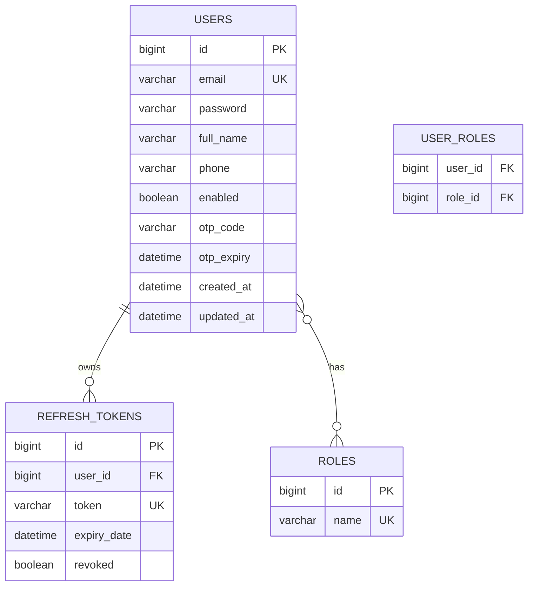

# Module 01 — Authentication & Authorization

## 1. Phân tích nghiệp vụ

Hệ thống có bốn vai trò: `ROLE_ADMIN`, `ROLE_MANAGER`, `ROLE_STAFF` và `ROLE_CUSTOMER`. Người dùng tự đăng ký chỉ nhận `ROLE_CUSTOMER`; tài khoản nhân viên và quản trị phải do quy trình quản trị tạo để tránh tự nâng quyền.

Người dùng đăng nhập bằng email/mật khẩu. Mật khẩu được băm BCrypt, access token JWT có thời hạn 15 phút và refresh token có thời hạn 7 ngày. Refresh token chỉ được lưu tại cơ sở dữ liệu, bị xoay vòng ở mỗi lần làm mới access token, bị xóa khi đăng xuất/đổi mật khẩu/đặt lại mật khẩu.

Quên mật khẩu tạo OTP sáu chữ số, hết hạn sau 5 phút. Chỉ hash BCrypt của OTP được lưu; endpoint yêu cầu OTP luôn trả thông điệp chung để không tiết lộ email đã đăng ký.

## 2. ERD



`users.email`, `roles.name`, `refresh_tokens.token` là duy nhất. `user_roles` là bảng nối many-to-many do JPA tạo.

## 3. Thiết kế backend

| Lớp | Trách nhiệm |
|---|---|
| Entity | `User`, `Role`, `RefreshToken`; ánh xạ các bảng MySQL. |
| DTO | Request xác thực, `AuthResponse`, `UserProfileResponse`, `ApiResponse<T>`. |
| Repository | Truy xuất user theo email, role theo tên, refresh token theo giá trị token. |
| Service | Quy tắc đăng ký, xác thực, refresh/rotate, logout, OTP và mật khẩu. |
| Security | `JwtUtils`, `AuthTokenFilter`, `CustomUserDetailsService`, `SecurityConfig`. |
| Controller | REST API `/api/auth/*`; chỉ controller xử lý HTTP. |
| Exception | `GlobalExceptionHandler` đưa mọi phản hồi lỗi về một mẫu. |

Các request được xác thực bằng Jakarta Validation. Dữ liệu trả về luôn theo dạng:

```json
{ "success": true, "message": "Login successful!", "data": {} }
```

## 4. API REST

| Method | Endpoint | Bảo vệ | Mô tả |
|---|---|---|---|
| POST | `/api/auth/register` | Public | Đăng ký customer |
| POST | `/api/auth/login` | Public | Nhận access/refresh token |
| POST | `/api/auth/refresh` | Public | Xoay refresh token và cấp access token mới |
| POST | `/api/auth/logout` | Bearer | Xóa refresh token hiện tại |
| GET | `/api/auth/me` | Bearer | Lấy hồ sơ đang đăng nhập |
| POST | `/api/auth/change-password` | Bearer | Đổi mật khẩu và hủy các phiên |
| POST | `/api/auth/forgot-password` | Public | Gửi OTP nếu email tồn tại |
| POST | `/api/auth/verify-otp` | Public | Kiểm tra OTP |
| POST | `/api/auth/reset-password` | Public | Đặt lại mật khẩu bằng OTP |

Ví dụ login:

```json
POST /api/auth/login
{ "email": "admin@restaurant.com", "password": "adminpassword" }
```

## 5. Frontend React

`AuthContext` là nguồn trạng thái đăng nhập duy nhất. Axios gắn bearer token vào request và tự gọi `/api/auth/refresh` khi nhận 401; nếu refresh thất bại, session cục bộ bị xóa. `PrivateRoute`, `PublicOnlyRoute`, `RoleRoute` bảo vệ route. Login, Register và Forgot Password có thiết kế responsive, dùng màu thương hiệu `#4A121A`, `#1B3B2B`, `#C5A059`, `#FAF7F2`, `#FFFFFF`.

Search, filter, sort và pagination không phù hợp với module xác thực vì không có danh sách dữ liệu người dùng công khai. Chúng nên được đặt trong module quản trị người dùng sau này.

## 6. Chạy dự án

1. Tạo MySQL database (ứng dụng cũng có thể tự tạo `restaurant_db`).
2. Thiết lập JDK 17, sau đó đặt biến môi trường: `DB_USERNAME`, `DB_PASSWORD`, `JWT_SECRET` (tối thiểu 32 byte); tùy chọn `MAIL_USERNAME`, `MAIL_PASSWORD`.
3. Chạy backend: `restaurant-backend\\gradlew.bat bootRun`.
4. Chạy frontend: `cd restaurant-frontend && npm.cmd install && npm.cmd run dev`.
5. Mở `http://localhost:5173`. API mặc định là `http://localhost:8080`; có thể đổi bằng `VITE_API_URL`.

> Tài khoản seed dùng cho local development: `admin@restaurant.com` / `adminpassword`. Hãy đổi hoặc xóa seed trước khi triển khai thật.
