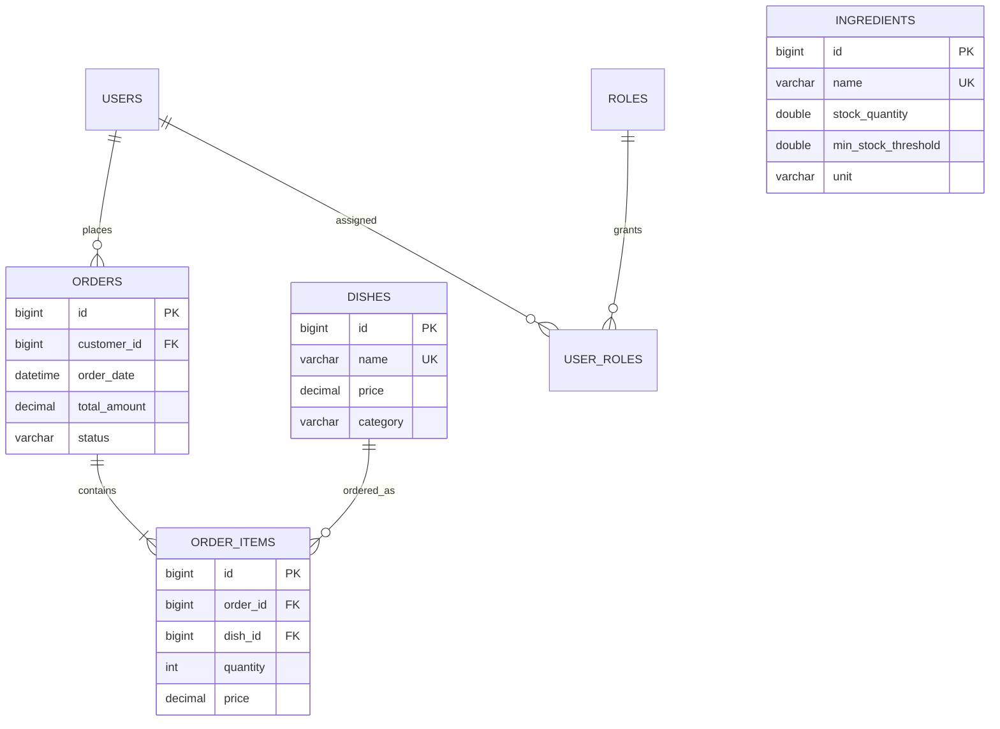

# Module 02 — Admin Dashboard

## 1. Phân tích nghiệp vụ

Dashboard là màn hình chỉ dành cho `ROLE_ADMIN`, giúp quản trị viên nắm được tình hình vận hành mà không phải duyệt từng đơn. Doanh thu chỉ tính đơn `COMPLETED`; đơn `IN_SERVICE` phản ánh đơn đang phục vụ. Khách hàng là user có `ROLE_CUSTOMER`; nhân viên là user có `ROLE_ADMIN`, `ROLE_MANAGER` hoặc `ROLE_STAFF`.

Danh sách món bán chạy tính tổng số lượng và doanh thu từ order item của các đơn hoàn thành. Khách hàng nổi bật được xếp theo tổng chi tiêu. Cảnh báo nguyên liệu xuất hiện khi `stockQuantity <= minStockThreshold`.

## 2. ERD



## 3. Backend

Entities dùng bởi module: `Order`, `OrderItem`, `Dish`, `Ingredient`, `User`, `Role`. Repository truy vấn tổng doanh thu, doanh thu theo thời gian, đơn theo trạng thái, top món, top khách và tồn kho thấp. `DashboardService` chỉ phối hợp nghiệp vụ/read model; `AdminDashboardController` chỉ nhận HTTP.

API:

```text
GET /api/admin/dashboard?months=6&topLimit=20
Authorization: Bearer <access-token-admin>
```

- `months`: 3–12, mặc định 6.
- `topLimit`: 5–50, mặc định 20.
- Chỉ `ROLE_ADMIN` được gọi (`@PreAuthorize("hasRole('ADMIN')")`).
- Response chuẩn: `{ success, message, data }`.

`DashboardQuery` dùng Jakarta Validation; lỗi validation và lỗi quyền đều được xử lý theo `GlobalExceptionHandler`/Spring Security response chuẩn.

## 4. Frontend

`AdminDashboard` gọi API qua Axios interceptor (tự gắn JWT/refresh token). Giao diện gồm các card doanh thu/đơn/người dùng, Chart.js revenue trend, bảng top món có search/filter/sort/pagination, danh sách top khách và tồn kho thấp. Layout dùng Tailwind responsive, nền `#FAF7F2`, surface trắng, primary `#4A121A`, secondary `#1B3B2B`, accent `#C5A059`.

Pagination phù hợp cho danh sách top món. Các card KPI và chart là dữ liệu tổng hợp nên không phân trang.
